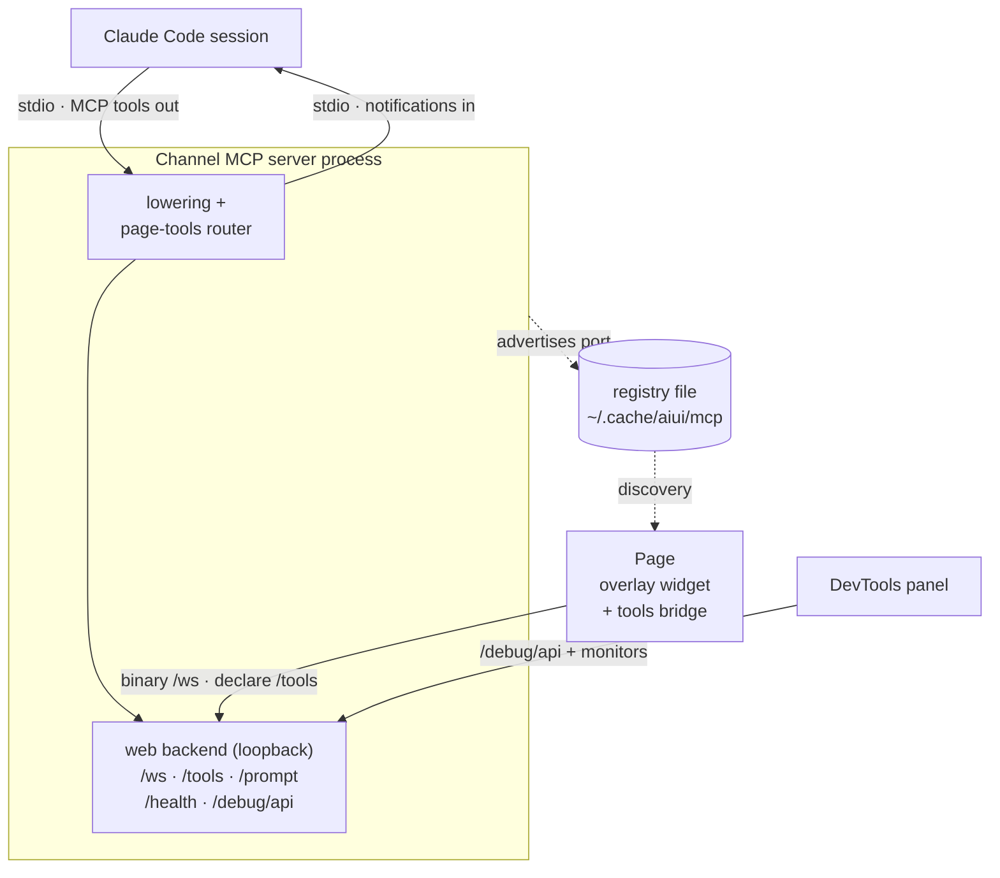

# The Channel MCP Server

Everything in aiui converges on one process: the **custom channel MCP server**
(`aiui-claude-channel mcp`). Claude Code spawns it over stdio at launch, and from then on it is
both the session's inbound feed and the local hub every other piece talks to — the intent tool in
your page, the page-tools bridge, the DevTools panel, the trace debugger. This page is how that
process works; [Prompt Lowering](./prompt-lowering) covers the *compiler* that runs inside it,
and the [websocket protocol reference](/packages/aiui-claude-channel/websocket-protocol) covers
the wire in detail.

## The process model

`aiui claude` launches Claude Code with `--dangerously-load-development-channels` and registers
the channel as an MCP server, so Claude Code spawns it as a child process speaking MCP over
stdio. Two consequences shape everything else:

- **Into the session: one-way notifications.** The channel pushes text with a
  `notifications/claude/channel` MCP notification; the session sees it as a `<channel>` block —
  context to read and act on, nothing to call back into. Lowered prompts arrive this way, with
  extra metadata (like attachment file paths) riding as attributes next to the body tokens that
  reference them.
- **Out of the session: MCP tools.** The same server declares tools the agent can call —
  `page_tools_list` / `page_tools_call` (drive tools that live *in a web page*, see below) and
  `channel_reload` (hot-reload the server's own lowering layer after editing its source).

Beside the stdio connection, the server opens a **web backend** on an OS-assigned port — bound to
loopback by default, or to the host interface when the user chose the trusted-LAN posture
(`channel.bind: "host"` / `--aiui-bind host`; see [Read before running](./warning)). That port is
the address of the whole aiui world for this session.

The session talks to the process over stdio (tools out, notifications in); everything else — the
page's overlay widget and tools bridge, the DevTools panel — reaches it through the loopback web
backend, whose port they discover via the on-disk registry (below):



## Discovery: the registry

Each running server advertises itself in a small on-disk registry
(`~/.cache/aiui/mcp/<pid>.json`): a stable `tag`, its `pid`, the `ppid` of the Claude Code
session that owns it, the web backend `port`, and the launch `cwd`. Entries are removed on exit
and pruned when stale. This is how `aiui vite` finds the right server for a project (exporting
the port to the dev server as `VITE_AIUI_PORT`), how the `aiuiDevOverlay()` plugin seeds it into
pages (`window.__AIUI__.port`), and how CLI helpers like `aiui-claude-channel quick` pick a
server to push a test prompt into.

## The surfaces

| Surface | Speaks | Purpose |
| --- | --- | --- |
| `/ws` | binary frames | The intent protocol: a client's hello picks a **format** (`text-concat`, `intent-v1`), then each thread streams events, audio, and screenshots to that format's lowering processor. |
| `/tools` | JSON frames | The page-tools bridge: pages declare their `agentToolkit` tools here; the directory backs the `page_tools_*` MCP tools, and calls route back to the live page function. |
| `/session` | JSON frames | The **session bus**: several browser views of one session share arming + the prompt preview and pass code contributions between tabs. See [Multi-View Sessions](/guide/multi-view-sessions). |
| `POST /prompt` | JSON | Push plain text into the session — the simplest integration and the end-to-end smoke test. |
| `GET /health` | JSON | Liveness, plus page-tools and session summaries; served with a permissive CORS header so pages can probe capability before dialing a websocket. |
| `/debug/api/*` | JSON + blobs | The lowering-trace **API** (the channel serves no HTML — viewers are frontend processes: `aiui debug`, the plugin's `/__aiui/debug` page, the DevTools panel). `/debug/api/channels` lists the machine's registry so a viewer can switch channels; `/debug/api/info` also reports launch info (how the session browser is wired, whether an OpenAI key passed preflight). |

## Lowering, traces, and what reaches the session

Each `/ws` thread is fed to its format's **stream processor** — the lowering pipeline. For the
multimodal `intent-v1` format the processor works *incrementally*: transcription and correction
diffs run as events arrive (server-side, because `OPENAI_API_KEY` lives with the channel
process, never in the page), screenshots are saved to the trace blob store the moment their
bytes land, and a speculative compose keeps the final prompt one cheap step away. On `fin` the
composed prompt — body text with `{shot_N}` tokens, file paths in metadata — is pushed into the
session as a notification.

Every stage is recorded by the tracing layer into the project-local cache
(`.aiui-cache/traces/<id>/`), which is what the trace debugger renders — the shared `debug-ui`
viewer, whether opened via `aiui debug`, the `/__aiui/debug` page, or the DevTools panel's
Intent pane — including mid-turn, since stages land as they happen. An abandoned thread (page
closed mid-turn) is torn down and its trace marked `abandoned`.

## Hot reload

The server can rebuild its lowering layer **in place**: the `channel_reload` MCP tool (or
`POST /debug/api/reload`) re-imports the format/processor modules fresh and swaps them in. The
MCP stdio connection, the HTTP server, and the port all survive; live websockets are deliberately
dropped — clients are built for it (the tools bridge reconnects and re-registers within seconds;
an in-flight intent thread is abandoned and the overlay recovers the turn). The fresh layer is
built *before* the swap, so a syntax error in a just-edited file rejects the reload and leaves
the running server untouched. This is what makes pair-programming *on the channel itself*
practical: edit, `channel_reload`, try again — no session restart.

## Sidecars

The channel is also a generic **host** for other session backends. A **sidecar** is an extra HTTP
(and optional websocket) surface the channel mounts alongside its own — so one session process, on
one port, can serve more than the intent pipeline. The first is the
[code reader](./code-reader)'s backend; the second is the
[iPad paint stream](./paint-stream) (always on — it rides the same port, and whether a second
device can reach it is the channel bind's decision, not the sidecar's). A git viewer would be
the next.

The channel stays **sidecar-agnostic**: it takes no dependency on any concrete sidecar and hardcodes
no names. The launcher (`aiui claude`) decides which to run and hands the channel a JSON array of
descriptors on `aiui-claude-channel mcp --sidecars <json>` (the standalone debug server takes the
same flag, `serve --sidecars <json>` — how the workbench's channel hosts the code reader). Each
descriptor names an importable module and the export to call as a factory:

```ts
interface SidecarDescriptor {
  name: string;      // stable id, used in logs and the CLI flags (e.g. "code")
  module: string;    // an importable specifier the channel `import()`s
  export?: string;   // the factory export to call; defaults to "default"
  options?: unknown; // passed opaquely to the factory (e.g. { root: "/proj" })
}
```

At startup the channel dynamic-imports each `module`, calls `mod[export ?? "default"](options)`, and
mounts the returned sidecar on its Express app. It never resolves a bare specifier from its own
isolated `node_modules`, so the launcher hands it an **absolute** `module` path — the launcher, not
the channel, depends on the sidecar package.

**Mount ordering is deliberate.** The channel's own routes go on first and always win: `/health`,
`POST /prompt`, and the `/ws` / `/tools` / `/session` websocket upgrades. A sidecar confines itself to
its own base path (the code reader: everything under `/__aiui_code`), is offered every websocket
upgrade the channel didn't claim (return `true` to take the socket), and is disposed on shutdown.

**One bad sidecar can't sink the session.** A descriptor that fails to import, whose export isn't
callable, that throws, or that returns something that isn't a sidecar is **logged to stderr and
skipped** — the channel starts anyway. (Malformed `--sidecars` JSON is tolerated the same way.)

Which sidecars are on for a launch — and the `--aiui-sidecar` / `--aiui-no-sidecar` flags that
override auto-detection — is the launcher's call. The auto-detect policy (`resolveSidecars`) is
exported from the aiui package so other supervisors can reuse it verbatim — the workbench does, for
its debug channel. See [The Code Reader](./code-reader) for the worked example (the `Sidecar`
interface lives in `packages/aiui-claude-channel/src/sidecar.ts`; the descriptor loader in
`load-sidecars.ts`).

## Keys and degradation

Model-backed lowering (transcription, correction, speech) uses `OPENAI_API_KEY` from the
environment `aiui claude` ran in. The launcher preflights it (a status-only check; see
[Configuration](./config#the-intent-pipeline-openai-key)) and the result travels to
`/debug/api/info` — the key itself never leaves the process. Without a valid key the channel
still runs everything else and every model-backed path fails *loudly* with what to do about it;
nothing silently degrades.

## Trust model

Loopback only, no authentication, spawned into a session that may be running with permissions
skipped — the channel is a **development tool** with the same posture as the rest of aiui.
Read [⚠️ Read Before Running](./warning) before running any of it.
