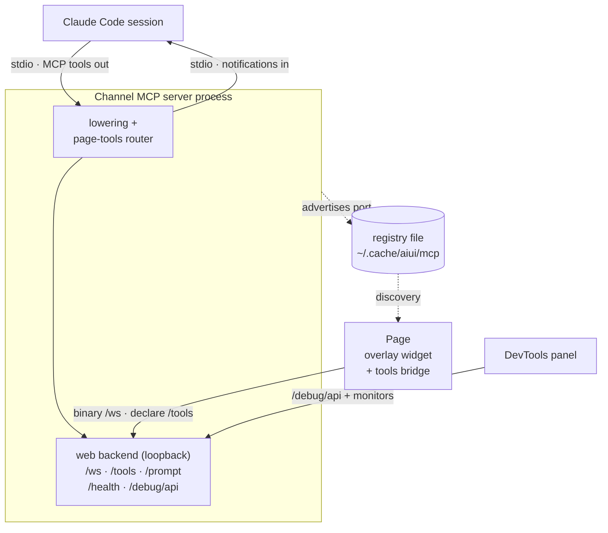

# The Channel MCP Server

Everything in aiui converges on one process: the **custom channel MCP server**
(`aiui-claude-channel mcp`). Claude Code spawns it over stdio at launch, and from then on it is
both the session's inbound feed and the local hub every other piece talks to — the intent tool in
your page, the page-tools bridge, the DevTools panel, the trace debugger. This page is how that
process works; [Prompt Lowering](./prompt-lowering) covers the *compiler* that runs inside it,
and the [websocket protocol reference](/packages/aiui-claude-channel/websocket-protocol) covers
the wire in detail.

## The process model

`aiui claude` launches Claude Code with `--dangerously-load-development-channels` and registers
the channel as an MCP server, so Claude Code spawns it as a child process speaking MCP over
stdio. Two consequences shape everything else:

- **Into the session: one-way notifications.** The channel pushes text with a
  `notifications/claude/channel` MCP notification; the session sees it as a `<channel>` block —
  context to read and act on, nothing to call back into. Lowered prompts arrive this way, with
  extra metadata (like attachment file paths) riding as attributes next to the body tokens that
  reference them.
- **Out of the session: MCP tools.** The same server declares tools the agent can call —
  `page_tools_list` / `page_tools_call` (drive tools that live *in a web page*, see below) and
  `channel_reload` (hot-reload the server's own lowering layer after editing its source).

Beside the stdio connection, the server opens a **web backend** on an OS-assigned port — bound to
loopback by default, or to the host interface when the user chose the trusted-LAN posture
(`channel.bind: "host"` / `--aiui-bind host`; see [Read before running](./warning)). That port is
the address of the whole aiui world for this session.

The session talks to the process over stdio (tools out, notifications in); everything else — the
page's overlay widget and tools bridge, the DevTools panel — reaches it through the loopback web
backend, whose port they discover via the on-disk registry (below):



## Discovery: the registry

Each running server advertises itself in a small on-disk registry
(`~/.cache/aiui/mcp/<pid>.json`): a stable `tag`, its `pid`, the `ppid` of the Claude Code
session that owns it, the web backend `port`, and the launch `cwd`. Entries are removed on exit
and pruned when stale. This is how the standalone intent panel's dev launcher and `aiui debug`
pick a channel to attach to (exporting its port to Vite as `VITE_AIUI_PORT`), how the `aiui()`
plugin seeds the source root into pages (`window.__AIUI__.sourceRoot`), and how CLI helpers like
`aiui-claude-channel quick` pick a server to push a test prompt into.

## The surfaces

| Surface | Speaks | Purpose |
| --- | --- | --- |
| `/ws` | binary frames | The intent protocol: a client's hello picks a **format** (`text-concat`, `intent-v1`), then each thread streams events, audio, and screenshots to that format's lowering processor. |
| `/tools` | JSON frames | The page-tools bridge: pages declare their `agentToolkit` tools here; the directory backs the `page_tools_*` MCP tools, and calls route back to the live page function. |
| `/session` | JSON frames | The **session bus**: external views contribute to the running turn (today: the [VS Code extension](./vscode)'s code selections, over the bus's HTTP surface). |
| `POST /prompt` | JSON | Push plain text into the session — the simplest integration and the end-to-end smoke test. |
| `GET /health` | JSON | Liveness, plus page-tools and session summaries; served with a permissive CORS header so pages can probe capability before dialing a websocket. |
| `/debug/api/*` | JSON + blobs | The lowering-trace **API**. `/debug/api/channels` lists the machine's registry so a viewer can switch channels; `/debug/api/info` also reports launch info (how the session browser is wired, whether an OpenAI key passed preflight). |
| `GET /` → `/__aiui` | HTML | The **console** — the channel's own dashboard (channel + launch + connected-Chrome info, and links to the pencil client, the standalone panel, and the trace debugger at `/__aiui/debug`). Served by the `aiui-console` sidecar; the channel serves no HTML of its own. `aiui debug` opens it in the session browser. |

## Lowering, traces, and what reaches the session

Each `/ws` thread is fed to its format's **stream processor** — the lowering pipeline. For the
multimodal `intent-v1` format the processor works *incrementally*: transcription and correction
diffs run as events arrive (server-side, because the vendor keys live with the channel
process, never in the page), screenshots are saved to the trace blob store the moment their
bytes land, and a speculative compose keeps the final prompt one cheap step away. On `fin` the
composed prompt — body text with `{shot_N}` tokens, file paths in metadata — is pushed into the
session as a notification.

Every stage is recorded by the tracing layer into the project's user-level cache
(`~/.cache/aiui/projects/<slug>-<hash>/traces/<id>/`, keyed by the project's absolute path — the
project tree itself stays pristine), which is what the trace debugger renders — the shared `debug-ui`
viewer, whether opened via `aiui debug`, the `/__aiui/debug` page, or the DevTools panel's
Intent pane — including mid-turn, since stages land as they happen. An abandoned thread (page
closed mid-turn) is torn down and its trace marked `abandoned`.

## Hot reload

The server can rebuild its lowering layer **in place**: the `channel_reload` MCP tool (or
`POST /debug/api/reload`) re-imports the format/processor modules fresh and swaps them in. The
MCP stdio connection, the HTTP server, and the port all survive; live websockets are deliberately
dropped — clients are built for it (the tools bridge reconnects and re-registers within seconds;
an in-flight intent thread is abandoned and the overlay recovers the turn). The fresh layer is
built *before* the swap, so a syntax error in a just-edited file rejects the reload and leaves
the running server untouched. This is what makes pair-programming *on the channel itself*
practical: edit, `channel_reload`, try again — no session restart.

## Sidecars

The channel is also a **host** for other session backends. A **sidecar** is an extra HTTP (and
optional websocket) surface the channel mounts alongside its own — so one session process, on one
port, can serve more than the intent pipeline. Three ship today, and **every channel hosts all
three**: the detached intent client panel (`/intent/`), the remote command bar (`/bar/`), and the
remote pencil (`/pencil/`). Each rides the same port, so hosting one costs nothing; whether a
second device can *reach* it is the [channel bind](./config)'s decision, not the sidecar's.

The channel composes them by **ordinary import**. It depends on the three sidecar packages and
builds them in one place (`standard-sidecars.ts` → `standardSidecars(root)`), calling each
package's `sidecar` factory directly:

```ts
import { pencilSidecar } from "@habemus-papadum/aiui-pencil/sidecar";
// … intent, bar
export const standardSidecars = (root: string): Sidecar[] => [intentSidecar({ root }), /* … */];
```

Both channel entry points use it: the real `aiui-claude-channel mcp` (spawned by `aiui claude`) and
the standalone debug server (`aiui-claude-channel serve`, behind `aiui mcp serve`) each host the
same set, rooted at their cwd — so a debug channel is configured exactly like a real session's.
(Programmatically, `runMcp` / `runServe` accept a `sidecars: Sidecar[]` and fall back to
`standardSidecars`; that seam is how the tests stay hermetic.)

> This used to be indirect — the launcher passed a JSON array of descriptors on `--sidecars` and
> the channel dynamic-imported each by absolute path, so it could depend on no sidecar. That
> existed only because the sidecar packages were unpublished dev-deps; now that they are published,
> the channel simply imports them, and `--sidecars` / the `--aiui-sidecar` / `--aiui-no-sidecar`
> toggles are gone. The `channel.bind` posture is the only knob — it decides reachability, not
> which sidecars exist.

**Mount ordering is deliberate.** The channel's own routes go on first and always win: `/health`,
`POST /prompt`, and the `/ws` / `/tools` / `/session` websocket upgrades. A sidecar confines itself
to its own base path, is offered every websocket upgrade the channel didn't claim (return `true`
to take the socket), and is disposed on shutdown.

**One bad sidecar can't sink the session.** A sidecar whose `mount` throws is **logged to stderr
and skipped** — the channel starts anyway. (The `Sidecar` interface lives in
`packages/aiui-claude-channel/src/sidecar.ts`.)

## Keys and degradation

Model-backed lowering (transcription, correction, speech) resolves its vendor keys **at boot,
in the channel's own process**: the OS vault when installed, the environment first in a source
checkout (see [Configuration](./config#vendor-api-keys-openai--gemini--elevenlabs)). The
launcher preflights the resolved OpenAI key (a status-only check) and the result travels to
`/debug/api/info` — the key itself never leaves the process. Without a valid key the channel
still runs everything else and every model-backed path fails *loudly* with what to do about it;
nothing silently degrades.

## Trust model

Loopback only, no authentication, spawned into a session that may be running with permissions
skipped — the channel is a **development tool** with the same posture as the rest of aiui.
Read [⚠️ Read Before Running](./warning) before running any of it.
