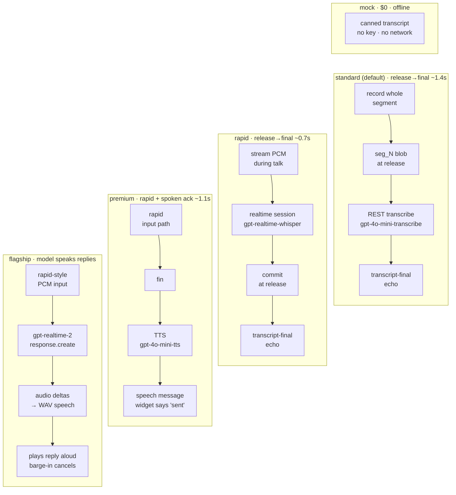

# Using the intent overlay

The intent overlay is the default modality of the [web intent tool](./web-intent-tool): a
floating widget over your app that collects a **multimodal turn** — dictation, pen ink,
region screenshots, and a select-and-speak correction loop — and streams it to the running
channel, where it is [lowered](./prompt-lowering) into a prompt for your Claude Code session.
Text is still there as an escape hatch, but the overlay is the thing you reach for when
"make *this* wider" is easier said than typed.

This page is **how to use it** — the keys, the turn lifecycle, the correction loop, and the
knobs. The [Web Intent Tool](./web-intent-tool) page is the design (how the three pieces —
collection, lowering, debugging — fit together and how a modality plugs in); this page assumes
you already have the tool mounted (see [Getting Started](./getting-started)) and want to drive it.


## Arming: the overlay stays out of your way until you call it

The overlay does nothing to your keyboard until you **arm** it. Arm and disarm with the
backtick key `` ` `` (or the **✳** arm button in the corner). While disarmed, every key belongs
to the page; while armed, the keymap below takes over — except that it never swallows keys aimed
at a text field (inputs, textareas, `contenteditable` editors like ProseMirror/CodeMirror/Monaco,
ARIA textboxes), so arming inside an editor-heavy app is safe.

Backtick is the default because it collides rarely, but it is not fixed: a host app can rebind
or disable keyboard arming through the pipeline config (`arming.key`, `arming.enabled` — see
[Configuring the pipeline](#configuring-the-pipeline)) when the default gesture is wrong for
its surface.

## The keymap

Minimalist by design — one hand, no chords:

| Key       | Action |
| --------- | ------ |
| `` ` ``   | arm / disarm the overlay (also the **✳ aiui** button) |
| **Space** | talk — *hold*-to-talk (default) or press-to-*toggle*, per config |
| *drag*    | ink — no key; while armed, dragging draws |
| **S**     | hold + drag = region screenshot · tap = whole viewport |
| **C**     | clear ink |
| **E**     | correct mode — select transcript text, then speak or type the fix |
| **K**     | quick config — the [tier strip](#quick-config-the-k-strip): switch tiers, save/reset, open the editor |
| **Enter** | send — finalize and lower the turn |
| **Esc**   | step out one level (see the escape ladder below) |

K is deliberately the only key configuration costs this layer: the tier digits, save, reset,
and the advanced editor all live *inside* the strip it opens, which shows its own bindings.

## A turn, start to finish

There is **no "begin" gesture**. A turn's *thread* opens implicitly on the first contentful
act while armed — a talk-start, an ink stroke, or a shot — and stays open as you add to it.
It closes when you:

- **Enter** — *send*: the accumulated turn is lowered and pushed into the session;
- **Esc** — *cancel*: the thread is dropped and nothing is sent (see the ladder);
- **auto-end** — an optional idle timeout (off by default) closes the thread after N silent
  seconds. Useful if you dislike reaching for Enter; risky if you pause to think mid-turn.

**The escape ladder.** `Esc` steps out exactly one level at a time, so a mis-step is one tap
to undo rather than a full reset: `correct mode → ink → cancel the thread → disarm`. Press it
until you're where you want to be.

## Talking (dictation)

Hold **Space** and speak; releasing it ends the segment. Hold-to-talk is the default because a
key-release is a clean, pause-bounded segment boundary — exactly the unit speech-to-text wants —
and because a walkie-talkie key can't be left open by accident. Press-to-toggle is available as a
config choice if holding a key while you also draw or shoot feels awkward.

The transcript **preview** streams above the widget as you go, with shot thumbnails inline. How
live it feels depends on which transcriber runs (see [What runs where](#what-runs-where-the-channel-real-vs-mock)):
the default channel-side REST transcriber has no partials, so the preview fills in all at once when
the segment's transcript lands; the **experimental** `openai-realtime` transcriber streams partial
deltas *while you speak* (the preview fills as you talk); the mock streams word-by-word.

## Ink

While armed, **dragging draws** — a quick circle around the thing you're talking about, no key
required. Ink is treated as a *gesture, not a document*: strokes fade after a few seconds
(configurable; set the fade to 0 to keep them until you press **C** to clear). The exception is a
screenshot: if a shot captures a region while your ink is still on screen, the stroke is
composited **into the PNG** and travels with the pixels it annotated.

## Screenshots

Hold **S** and drag a rectangle for a region shot, or tap **S** for the whole viewport. The
first shot of a session asks once for screen-capture permission — pick **"This Tab"** — and every
later shot is an instant frame grab.

Each shot also **locates the components** under its rectangle: the overlay hit-tests the captured
region against the source-location annotations your app carries (`data-source-loc`, i.e.
`file:line:col`, and `data-cell` dataflow ids — see [Frontend for Agents](./frontend-for-agents))
and records which components sit there. So a shot arrives at the session as *both* an image and a
list like `SpectrumPlot @ src/ui/plot.tsx:20` — the picture and the code that drew it.

If you deny capture (or the browser can't grant it), shots **degrade gracefully**: the turn still
carries the rectangle and the located components, just no pixels.

Every shot appears in the transcript preview as a yellow-outlined thumbnail: **hover** for a
full-size peek, and hover's **✕** retracts it from the turn — took the wrong screenshot, remove
it before sending. Retraction is an event like everything else (`shot-drop`), so the channel's
lowering drops the image too; the original shot stays visible in the trace.

## The correction meta-loop

Speech-to-text mangles domain words — and the overlay makes fixing them a first-class gesture
rather than a retype. Press **E** to enter correct mode: the preview expands and the transcript
becomes **selectable text**. Select the wrong words with an ordinary text selection (no special
gesture), then either **speak** the fix (the next segment auto-submits as the correction when it
ends) or type it into the inline box.

A correction is a **patch, not a string replace** — which is what lets it be smarter than
"swap these characters." The transcript (one segment per line), your selection, and the
instruction go to the corrector, which answers with a diff; the overlay flashes the change
inline (pink deletions, green additions) for a beat, then settles on the clean text. Two things
follow from corrections being patches:

- **The corrector reads two instruction modes.** A *replacement* is verbatim content for the
  selected span — select "curb", say "curve", the span is swapped and nothing else is touched.
  A *description* instead *talks about* the change — *"no, it's not beat, it's Vite, the
  frontend build tool."* Here the selection is only the example occurrence: the corrector infers
  the intended edit, fixes **every** affected occurrence across the whole transcript, and uses the
  explanatory context (that it's spelled "Vite", that it's a build tool) without letting it leak
  into the text.
- **Corrections compound and never silently vanish.** Each fix patches the *already-corrected*
  transcript, so a later correction can target text an earlier one produced. If a patch can't be
  produced or won't apply, the overlay falls back to a plain replacement of the selected text —
  the correction still lands.

## What runs where: the channel (real) vs mock

The two model-backed steps — transcription and the correction diff — each run in one of two
places, chosen by config. **The real, channel-side path is the default**; mock is the explicit
offline choice.

- **`openai` (channel-side) — the default.** The real transcription and correction run in the
  **channel process**, not the page: when a talk segment or a correction request reaches the
  channel it calls OpenAI and echoes the result back to the widget to merge into its preview.
  It's a REST round-trip with no partials, so a segment's transcript fills in all at once, on the
  order of ~1–1.5 s after you release Space (that latency floor is what the audio-stack work is
  measuring). The key lives with the channel — read from `OPENAI_API_KEY` in the environment
  `aiui claude` runs in, **never** from the page or `config.json` — and `aiui claude`
  [preflights it](./config#the-intent-pipeline-openai-key) at launch. If the channel has no key
  (or a stale one), the step does **not** silently fall back: the widget's status says
  transcription or correction is *unavailable* and how to fix it. The overlay still mounts and
  everything else — ink, shots, composing, sending — keeps working.
- **`mock` (local, offline, no key) — for development.** Transcription streams canned phrases (with
  injectable typos, so the correction loop has something to fix) and corrections are built locally;
  nothing leaves the browser. It's the explicit offline/dev choice — set `transcriber: "mock"` and
  `corrector: "mock"` (see [Configuring the pipeline](#configuring-the-pipeline)) — and it's what
  the [intent workbench lab](https://github.com/habemus-papadum/pdum_aiui/tree/main/packages/aiui-dev-overlay/workbench)
  defaults to, so the whole loop runs there with no channel and no key.

### Realtime transcription (experimental)

`transcriber: "openai-realtime"` swaps the REST round-trip for a **streaming** session: instead of
recording a whole segment and uploading it, the page streams PCM to a per-thread realtime session
the channel holds open, and partial transcript deltas echo back **while you speak** — the preview
fills as you talk, and the final lands a fraction of a second after you release Space rather than
after the ~1–1.5 s REST floor. It is the same `openai` posture in every other way (the key lives in
the channel; a keyless channel or an upstream error degrades *loudly* — the widget says so, never a
silent switch to mock). It's opt-in and still a spike: it needs the mic **and** an `AudioWorklet`
(so it can't start in a context that lacks either — again, said out loud, no silent fallback), and
its models/latency are still being measured (the workbench bench's realtime leg). Knobs:
`realtimeModel` (default `gpt-realtime-whisper`) and `realtimeDelay`
(`minimal`…`xhigh`, a latency/accuracy trade-off). The `rapid`, `premium`, and `flagship`
[tiers](#tiers-one-dial-for-the-whole-ladder) set these (and their spoken-audio siblings) for you —
this subsection is the manual path.

When you **send**, the whole turn is lowered in the channel into a single prompt: the dictated
text, the corrections applied, and each screenshot placed at its position in the prose as a
`{shot_N}` token, with the image's on-disk path carried alongside so the session can open it. The
tab and source context that every intent submission carries (see
[the web intent tool](./web-intent-tool#what-rides-the-hello-tab-identity-and-source-location))
is prefixed just as it is for text. Every stage of that lowering is recorded as a **trace** you
can inspect in the debugger:


## Tiers: one dial for the whole ladder

The pipeline has a dozen model knobs — transcriber, transcription model, corrector, TTS, realtime
voice — and `tier` is a single **cost-sized dial** over all of them: pick a rung and the tier
expands into the fine-grained fields for you.

The five rungs, cheapest first:

| `tier` | Backend | $/active-hr (~10 min speech) | What you feel |
| --- | --- | --- | --- |
| `mock` | mock STT + mock corrector | $0 | canned transcript; no key, no network — pure offline dev. |
| `standard` *(default)* | `gpt-4o-mini-transcribe` + `gpt-4o-mini` | ~$0.03 (cents) | dictate, and it catches up ~1.4 s after you release. Today's behavior, unchanged. |
| `rapid` | `gpt-realtime-whisper` (streaming STT) + `gpt-4o-mini` | ~$0.17 (dimes) | same silence, but the final snaps in ~2× faster (~655 ms). No partials, no voice back. |
| `premium` | `rapid` + `gpt-4o-mini-tts` spoken acks | ~$0.18 (dimes) | it says "sent" back to you — keep your eyes on the app, not the preview. |
| `flagship` | `gpt-realtime-2` (audio+text conversational) | ~$1–6 (dollars) | spoken answers, barge-in, model turn-detection. Text is still the source of truth. |

`tier` defaults to `standard` — an absent tier *is* standard — which reproduces today's exact
REST-mini behavior, so there is zero billing surprise for anyone who never touches it.

What actually changes per rung is the audio path — how your voice reaches the channel, and
whether anything is spoken back. `rapid` swaps the release-time blob upload for PCM streamed while
you talk; `premium` adds a spoken ack after send; `flagship` swaps in a model that answers aloud
(its input transcription still feeds the prompt, so text stays the source of truth):



**The merge rule: preset first, then your explicit knobs.** The effective config is
`DEFAULT ← tier preset ← explicit fine fields` — the tier preset fills in over the defaults, and
your explicit fields (the Vite `intent` option unioned with any gear-panel/agent overrides) fill
in over the preset. A tier only *supplies* the fields it owns; anything you name explicitly still
wins. So `{ tier: "flagship", model: "whisper-1" }` runs the flagship voice model but pins `model`
to `whisper-1`. Switching `tier` **re-derives** the fields that tier owns — you don't inherit the
old tier's fields frozen in.

**Setting it — four doors, one validated path.** Set `tier` any of the ways you set the other
knobs:

- the Vite option — `aiuiDevOverlay({ intent: { tier: "premium" } })`;
- the [**K strip**](#quick-config-the-k-strip) — a digit while armed, session-scoped;
- the gear (**⚙ advanced config**) panel — edit `tier` in the JSON;
- the agent's `aiui_overlay set_config` tool — `{ config: { tier: "flagship" } }`.

All four go through the same validated config path.

## Quick config: the K strip

Press **K** while armed and a small strip opens above the HUD — the keyboard-speed door to the
tier dial, built for the "let me try this segment on `rapid`" moment when reaching for the Vite
config or the JSON editor would break your flow. The strip is its own documentation:

```
TIER   session — unsaved
[1 mock] [2 standard] [3 rapid] [4 premium] [5 flagship]
S save for site · R reset to file · G editor · Esc close
```

- **1–5** pick a tier, cheapest first — the same ladder as the table above, so the digit *is*
  the price dial. The switch is **session-scoped**: it takes effect immediately but persists
  nowhere, and a reload returns you to the file (Vite) config plus whatever you saved earlier.
  Your explicit fine fields still win over the preset, exactly as everywhere else.
- **Mid-thread, the switch waits.** A thread's opening hello already told the channel which
  pipeline to run, so a tier picked while a thread is open applies **when that thread closes**
  (send or cancel) — the strip says so, and the next thread's hello carries it. No thread open →
  it applies on the spot.
- **S** saves the current config for this site (the same per-origin browser storage the gear
  panel writes, as the same minimal delta). **R** resets to the file config, clearing both the
  session layer and the saved one. **G** jumps to the fine-grained door: the gear panel's JSON
  editor over the full effective config.
- **Esc** (or **K** again) closes the strip — it never steps out of your turn. Everything
  unrelated keeps working while it's open: Space still talks, Enter still sends. Disarming
  closes it.

The layering, in full: `DEFAULT ← tier preset ← Vite intent ← saved overrides ← session`. The
strip's digits write only the last layer; **S** folds it into the saved one; **R** empties both.

**Degradation is loud — a paid tier never quietly downgrades.** A keyless `premium` says *"spoken
confirmation unavailable — no OPENAI_API_KEY (premium tier)"* rather than silently becoming
`rapid`; a keyless `flagship` says flagship needs `OPENAI_API_KEY` rather than falling back to
REST. Same posture the pipeline already takes for keyless transcription (see
[What runs where](#what-runs-where-the-channel-real-vs-mock)).

**What it feels like in practice** (measured live, 2026-07-05, against real OpenAI calls). On
`premium`, the spoken "sent" ack lands ~1.1 s after you send (~14 KB per ack). On `flagship`, your
transcript — the IR the prompt is lowered from — lands ~0.5–0.9 s after you release, and the
model's spoken reply is playable ~1.4–1.6 s after release, at ~0.6–0.8¢ per spoken turn for short
utterances.

**Flagship reaches nothing on the page yet.** v1 ships `realtimeTools: "none"` — the voice model
can talk and be interrupted (barge-in ducks/cancels the reply the moment you talk over it) but has
no page tools; wiring the conversational model to on-page actions is a later, separately-reviewed
phase.

## Configuring the pipeline

Everything above is governed by one object, `IntentPipelineConfig`, deliberately **wider than
the visible UI**. It began as the workbench's settings drawer — every contested interaction
choice as a knob — and graduates here as a superset: the same knobs, plus research knobs that
ride along so they can be measured before they're designed for.

**Where the knobs live.** You set them in config, not through the widget. Client-side choices
(talk mode, ink fade, arming rebind, transcriber/corrector choice) ride the modality options —
`aiuiDevOverlay({ intent: { … } })` in your Vite config, or the `mountIntentTool` options
outside Vite. The fields the **channel** honors — `transcriber`, `model`, `corrector`,
`correctionModel`, `correctionPolicy`, and the `passes` switches — travel to the server on the
connection's hello, so the lowering reads exactly the configuration the client declared and the
trace records the whole thing.

**Minimal visible UI, one power tool.** The shipping widget's visible surface is the arm button,
a state readout, a mic level meter, the transcript preview, a keymap reminder — and a gear
(**⚙ advanced config**) opening a raw-JSON editor over the *full effective* config. The editor is
strictly validated like `config.json` (an unknown key or wrong type rejects loudly, naming the
key — nothing is silently dropped), applies live where a knob is read dynamically (talk mode, ink
fade, arming rebind; transcriber/corrector changes take effect on the next talk), and persists
only your overrides per origin (reset clears them). The next thread's hello carries the effective
config, so traces always record what actually ran. A *curated* settings row of on-screen toggles
is still deliberately deferred — which knobs earn visible UI is exactly what the lab's T1–T7
dogfooding decides.

The knobs, with their defaults:

| Field | Default | What it does |
| --- | --- | --- |
| `tier` | `standard` | The cost dial — one preset over the model knobs below; see [Tiers](#tiers-one-dial-for-the-whole-ladder). |
| `talkMode` | `hold` | Space is hold-to-talk (`hold`) or press-to-toggle (`toggle`). |
| `inkFadeSec` | `6` | Seconds until ink fades; `0` keeps strokes until you clear them. |
| `autoEndSec` | `0` | Idle seconds before a turn auto-ends; `0` means explicit Enter only. |
| `transcriber` | `openai` | `openai` (channel-side REST — the default), `openai-realtime` (experimental streaming, partials as you speak), `openai-voice` (the flagship conversational session — streams PCM like `openai-realtime`, but the channel holds a `gpt-realtime-2` model that answers aloud; its input transcription still feeds the lowered prompt), or `mock` (local, offline). |
| `model` | `gpt-4o-mini-transcribe` | OpenAI transcription model (when `transcriber: openai`). |
| `realtimeModel` | `gpt-realtime-whisper` | Realtime transcription model (when `transcriber: openai-realtime`). |
| `realtimeDelay` | *(model default)* | Realtime latency/accuracy trade-off: `minimal`…`xhigh` (when `transcriber: openai-realtime`). |
| `audioBack` | `off` | Spoken audio back to you: `off` (silent), `acks` (premium — short TTS confirmations), `voice` (flagship — native conversational speech). Also the client-side mute — set `off` to silence audio-back regardless of tier. |
| `correctionPolicy` | `replace` | A correction rewrites the transcript (`replace`) or rides along as a note for the lowering model (`note`). |
| `corrector` | `openai` | `openai` (a chat model writes the diff — the default) or `mock` (local patch, offline). |
| `correctionModel` | `gpt-4o-mini` | Chat model that emits the correction patch (when `corrector: openai`). |
| `arming` | `{ key: "`", enabled: true }` | The arm/disarm key, and whether keyboard arming is on at all. |

The spoken-audio tiers carry a small cluster of fine fields you normally never set by hand — `tier`
fills them in — but they're there to override one when you want: `ttsModel` (premium TTS model,
default `gpt-4o-mini-tts`) and `ttsVoice` (its voice id); and, for flagship, `realtimeVoiceModel`
(default `gpt-realtime-2`), `realtimeVoice` (voice id, e.g. `cedar`/`marin`), `realtimeTools`
(`"none"` in v1 — the flagship model gets no page tools yet), and `realtimeReasoning`
(`minimal`|`low`|`medium`|`high`, the flagship reasoning effort — carried in config, not yet wired
to the wire in v1).

Research knobs ship **without UI** and default off: `passes` (the lowering's condition/polish
slots — `silenceTrim`, `imageDownscale`), `silenceGate` (client-side dead-air trimming before a
segment is sent), and `priming` (keyword sources fed to the transcriber as a bias). They exist so
the pipeline is already shaped for behavior the lab is still measuring.

## See also

- [The Web Intent Tool](./web-intent-tool) — the design behind the overlay: modalities,
  lowering, traces, and how a modality plugs in.
- [The intent pipeline (OpenAI key)](./config#the-intent-pipeline-openai-key) — the key story
  and launch preflight.
- [Prompt Lowering](./prompt-lowering) — why lowering exists and where it's going.
