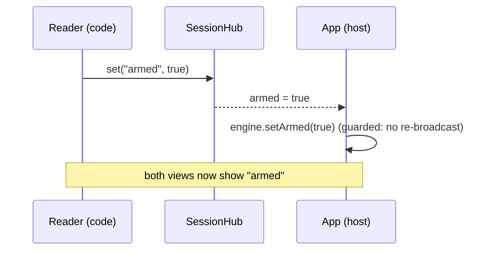

# Multi-View Sessions

One Claude Code session, several browser tabs. The app you're building in one tab, its
[code reader](/packages/aiui-code/) in another, a future git viewer or
[iPad surface](#the-general-pattern) in a third — all looking at the **same running session** and
all building the **same prompt**. You arm the overlay once and every view knows it's armed; you
select code in the reader and it lands in the turn you're dictating in the app tab; the
prompt-so-far is visible everywhere.

This page explains the **session bus** that makes that work, and how to give a new view a seat at
the session.

## Why a bus

The [web intent tool](/guide/web-intent-tool) lives in the page it instruments — great for "make
*this* wider" while looking at the thing. But some context isn't in the app: the **source** behind
a component, a **diff**, a **notebook cell's** definition. You want to look at the UI and the code
*at the same time*, which means two tabs — and the moment there are two tabs, they need to agree on
one thing above all: **is the session armed, and what is the prompt so far?**

The design decision is a **single-owner turn with a contribution bus**, not a co-authored document:

- **One view hosts the turn** — the app tab's multimodal overlay owns the `Engine` (the
  append-only event log + thread state machine described in [Web Intent Tool](/guide/web-intent-tool)).
  It is the single writer of the prompt.
- **Other views are contributors** — the reader doesn't host its own turn; it *contributes* to the
  host's. A contribution is "this code is selected," delivered as a message the host folds into its
  prompt exactly like a spoken sentence.

This is deliberately simpler than a CRDT of co-authors, and it matches the interaction: you're
still dictating one turn; the second tab just feeds it.

## The session *is* the channel

There is one [channel](/guide/channel) process per Claude Code session, bound to one loopback port.
So the port already identifies the session — every browser view that dials it is, by definition, a
peer of the same session. The bus adds one websocket endpoint to the channel, `/session`, and a
small relay behind it (`SessionHub`).

```text
                    channel process  (= one session, one port)
                    ┌─────────────────────────────────────────┐
   app tab   ──ws──▶│  /session          SessionHub            │
   (host)          ◀│    · armed  (shared, last-writer-wins)   │
                    │    · preview (shared, last-writer-wins)  │
   reader   ──ws──▶ │    · contribution (transient publish)    │
   (contributor)   ◀│    · peers (who's connected)             │
                    └─────────────────────────────────────────┘
```

The hub is deliberately dumb: it **relays and caches opaque JSON**. It does not know what `armed`
means or what a contribution is — it caches "shared state" slots so a late-joining tab catches up,
fans "transient publishes" out to the other views, and tracks who's connected. All the meaning
lives in the views.

Two message shapes ride the bus:

- **Shared state** (`set(slot, value)` / `on(slot, cb)` / `get(slot)`) — last-writer-wins slots the
  hub caches and rebroadcasts. `armed` (a boolean) and `preview` (`{ text, threadOpen, armed }`)
  are the two the intent tool uses. A view that joins late is sent a **snapshot** of every slot, so
  it opens already in sync.
- **Transient publishes** (`publish(topic, payload)` / `onPublish(topic, cb)`) — one-shot messages
  fanned to the other views, never cached. A code selection contributed to the turn rides this.

::: tip The one rule
`on(slot, …)` fires on every remote change (and once per slot when the join snapshot lands). A
handler that reacts to a slot **must not blindly re-`set` it** — apply the remote value, don't
rebroadcast it, or two views ping-pong forever. The host guards its arming echo with exactly this
care (an `applyingRemoteArm` flag).
:::

## Arming, synced

Arming is a shared boolean. Toggle it anywhere — the app overlay's arm button, the reader's session
panel — and it reaches every view:



The host applies a remote arm to its `Engine` and, because the `Engine` is what actually opens
threads and composes prompts, the whole turn machinery comes along. A contribution that arrives
while the session is idle **arms it first** — selecting code and sending it *is* intent.

## The prompt, visible to both

As the host builds its turn it broadcasts a compact `preview` — the composed prompt text so far —
into the shared `preview` slot. Every view can render it read-only. Dictate in the app tab and the
sentence appears in the reader's panel; contribute a selection from the reader and a compact
`[code: file:lines “excerpt…”]` marker appears in the mirror (the app tab's own preview shows it
as a chip — the code excerpt with its location beside it). It's one prompt, mirrored.

Only the **host** writes `preview` (an idle contributor never does), so there's no race on the slot.

## Code mode

In the app tab's intent tool, a **⧉ Code** button opens the reader in a second tab. Turn it on with
[`code: true`](#configuration): the app's own dev server then serves the reader at `/__aiui/code`
(no separate reader process) and shows the button. The two tabs now share the session. In the reader
you're not painting or dictating — **you're selecting code and talking**:

- Select a range in the editor. The reader's **session panel** shows the location, an excerpt, and
  whether it'll be *inlined* or *added to context*.
- Hit **Add to prompt →**. The selection is published as a contribution; the host folds it into the
  turn.

### Selection → context

A selection travels **structured** — the raw code plus its locator, as a `code-selection` event on
the turn's stream — and *how it reads in the prompt is decided at lowering time*, not by the
contributing view. The host's preview shows it as a chip (`⧉ web/src/vec3.ts:21`, hover for the
code), the lowering trace records the selection itself as a named stage, and corrections can never
rewrite contributed code as if it were speech. At compose time the short/long rule
(`SHORT_SELECTION_CHARS`, 240) renders it:

- **Short selection** → **inlined**: the location and the code go straight into the prompt —
  `` Regarding `web/src/vec3.ts:21`: `class Vec3 { … }` ``.
- **Long selection** → **added to context** under a header with a line count and a fenced block:

  ````text
  Regarding `web/src/vec3.ts:5-13` (9 lines):
  ```
  <the selected code>
  ```
  ````

Its cousin from the app tab — text highlighted on the *page* before arming — rides the same stream
as an `app-selection` event and lowers into the prompt's context preamble ("It concerns this
on-screen selection: …"); see [the web intent tool](/guide/web-intent-tool) for that flow.

## Host vs. contributor

A view's role is a config decision, made where it mounts the overlay:

| | **Host** (the app tab) | **Contributor** (the reader) |
|---|---|---|
| Mounts | the full intent tool (`Engine`, ink, talk, shots) | the session bus + a session panel only |
| Owns the turn? | yes — single writer of the prompt | no — publishes contributions to the host |
| `session.role` | `"app"` (default) | `"code"` |
| `intentTool` | `true` (default) | `false` |

A contributor **must not** host a turn. Its armed overlay would drop an ink-capture layer over the
code UI and swallow your clicks, and a second host would fight the first for the `preview` slot.
`intentTool: false` is precisely "join the bus, don't host": it keeps the port injection, the
[page-tools bridge](/guide/web-intent-tool), and `installSessionBus`, and skips only
`mountIntentTool`.

## Configuration

The [`aiuiDevOverlay()`](/guide/web-intent-tool) Vite plugin wires the bus. Every served page joins
by default (role `"app"`).

**The app (host)** — serve the reader and show the Code button:

```ts
// app vite.config.ts
aiuiDevOverlay({
  // …locator, format, etc.
  code: true, // serve the reader at /__aiui/code + show the ⧉ Code button
})
```

That's the whole reader setup: the app's own dev server serves the reader page at `/__aiui/code`
(no separate reader process), and its bootstrap joins the session bus as a `code`-role contributor
for you — `intentTool: false`, a `SessionPanel`, no competing turn host. See
[The Code Reader](./code-reader) for how that reader is wired.

**A custom contributor** — the same pattern for a *new* view (a git viewer, an iPad surface) you
build yourself: join under its role, don't host a turn.

```ts
// git-viewer vite.config.ts
aiuiDevOverlay({
  session: { role: "git" }, // identify to the app tab
  intentTool: false,        // bus + panel only, no competing turn host
})
```

Bus options at a glance:

- `session: { role, label }` — how this view identifies to its peers. Default role `"app"`.
- `session: false` — skip the bus entirely (single-view app).
- `intentTool: false` — contributor view: bus + bridge, no turn host.
- `code: true` — serve the bundled [code reader](./code-reader) at `/__aiui/code` and show the
  host's ⧉ Code button.

Launch the dev server through `aiui vite` (or with `VITE_AIUI_PORT` set) so the app tab and the
reader tab it serves point at the same channel — that shared port is what puts them in the same
session.

## The general pattern

Nothing above is code-reader-specific. The bus is a generic "views of one session share state and
talk to each other" substrate:

- A **git viewer** could join as role `"git"` and contribute a hunk the same way the reader
  contributes a selection — no change to the reader, no change to the host.
- The [iPad painting surface](./paint-stream) needs the same **arming sync** across
  devices; it's another peer on the same `armed` slot.

To add a view: mount `installSessionBus({ role })` (the Vite plugin does this for you), read
`armed` / `preview` off the bus for a synced UI, and `publish` a
[contribution](#selection-context) when the user wants to feed the turn. The
[`SESSION_CONTRIBUTION_TOPIC`](/packages/aiui-dev-overlay/) contract is shared, and a contributor
sends the *raw* selection (text + locator) — rendering is the lowering's job, so every
contributor's selection reads the same in the prompt without any formatting code of its own.

A contributor doesn't have to be a browser view holding a socket. The channel's web backend
exposes the bus to external same-host tools: `GET /session/peers` lists the connected views, and
`POST /session/publish` injects a server-originated publish (`from: "server"`), targeted at one
view's `clientId`, a role, or everyone — acked with who it reached, nacked when nothing matched.
The **VS Code extension** (`packages/aiui-vscode`) is the first such provider: it discovers
channels through the on-disk registry, shows a status-bar picker over each channel's `app` tabs,
and sends the editor selection as the same `SelectionContribution` the reader publishes.

## Where the code lives

- **Channel** — `SessionHub` (`packages/aiui-claude-channel/src/session-hub.ts`) and the
  `/session` route in `web.ts`. Transport-agnostic and unit-tested without a socket.
- **Bus client** — `installSessionBus` (`packages/aiui-dev-overlay/src/session-bus.ts`), installed
  at `window.__AIUI__.session`; the `/health` capability probe, reconnect, and the tiny pub/sub API.
- **Contribution contract** — `session-contrib.ts` (topic, `SelectionContribution`,
  `contributionToText`, `isShortSelection`) — shared by host and contributor.
- **Host wiring** — the multimodal modality (`multimodal/modality.ts`): applies remote arm,
  broadcasts `preview`, ingests contributions via `Engine.contribute`.
- **Contributor UI** — the reader's `SessionPanel`
  (`packages/aiui-dev-overlay/src/reader/SessionPanel.tsx`; it lives in the overlay, not
  aiui-code, which stays session-agnostic).
