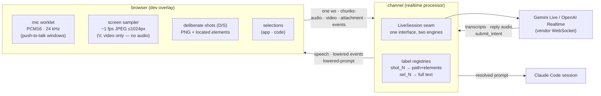

# Live Mode: the Realtime Engines

The live tiers (**6**/**7** in the [tier strip](./intent-overlay#quick-config-the-k-strip)) invert
the pipeline's usual division of labor. In transcription mode *you* compose the turn and
`composeIntent` lowers it; in live mode a realtime model is a **co-composer**: it hears the mic
continuously, sees labeled screenshots and (on Gemini) ~1 fps ambient video, answers aloud, and
when you press Enter it — not the channel — writes the prompt, via a `submit_intent` function
call. The channel then resolves that composition and injects it into the Claude Code session
like any other turn.

This page is the conceptual map: how our framework runs a live turn, what the two vendor
engines (Gemini Live, OpenAI Realtime) actually receive on the wire, where they are identical,
where they differ, and the gotchas the implementation paid for. Design history lives in the
repo at `packages/aiui-dev-overlay/handoff/transcription-and-realtime-submodes.md`; the
implementation is `packages/aiui-claude-channel/src/{live-session,gemini-live,openai-live}.ts`
and the realtime processor in `intent-v1.ts`.

::: tip Both engines are WebSockets
A common misreading: OpenAI's Realtime API is **not** REST. Both vendors hold one long-lived,
stateful WebSocket per thread — audio streams up in small increments as you speak, and nothing
already sent is ever re-uploaded. What differs is the *state model on top of the socket*
(streams vs. a conversation of items — see below), not the transport. REST appears in this
project only in the **transcription** tiers (`standard`/`premium`), where a finished segment's
audio blob goes to a REST STT endpoint.
:::

## The framework, end to end

One client WebSocket carries the turn to the channel as typed chunks: `audio` (raw PCM frames
while Space is held), `video` (the sampler's JPEG frames), `attachment` (deliberate shot PNGs),
and `events` (the engine stream — thread lifecycle, shot metadata, selections). The processor
drives a vendor engine through the **`LiveSession` seam** — `activityStart` / `appendAudio` /
`activityEnd`, `injectLabeledImage`, `appendVideoFrame`, `injectContextText`, `nudgeSubmit`,
`drainToolCall` — so nothing outside the two engine files knows a vendor dialect. Each engine
declares `LiveCapabilities` (`video`, `imageInjection: "stream" | "turn-item"`), the honest
record of what the model could actually see.

**Audio comes only from the microphone.** The screen share is captured with
`getDisplayMedia({ video: true, audio: false })`; its sole consumer is the frame sampler.
Push-to-talk is both the audio source and the **turn boundary** — both vendors run with
server-side voice detection off (manual VAD), so a "turn" is exactly your Space window.

### Withhold and re-attach

The live model is deliberately shown *less* than the prompt will contain:

- A deliberate shot arrives as the text label `[image shot_3]` paired with the pixels. The
  shot's file path, located elements, and cell metadata are **withheld** — kept channel-side in
  a registry keyed by the label.
- A selection arrives as a bracketed text item —
  `[selection sel_2: "clipped 160-char excerpt…" — on-screen selection authored at src/…]` —
  injected *silently* (it must never make the model start talking). The full text and
  attribution stay in the registry; a re-selection reuses its id (`updated`), a drop injects an
  explicit retraction.
- Ambient video frames are **unlabeled and unreferenceable by design** — they exist to show
  the model what the screen looks like, not to be cited. (Every 10th frame is persisted to the
  trace so the debugger can show what the model saw.)

At commit, the model's `submit_intent({ segments })` interleaves cleaned-up text with **bare
ids** (`"shot_3"`, `"sel_2"`, `"code_1"`), and `resolveSegments` re-attaches everything
withheld: a shot id becomes the same `<screenshot path=…><element…><cell…/></element>` block
transcription mode renders; a selection id becomes the full short-inline/long-fenced rendering.
An id the model invented renders visibly as `[image shot_9 — not found]`; a **retracted**
selection the model referenced anyway resolves to *nothing* (the human took it back) and is
reported in the trace.

### The commit gate and the fin ladder

The model is instructed to call `submit_intent` **only** after one exact client message — the
nudge sentinel ("The user pressed send — call submit_intent now…"). Enter (fin) injects that
sentinel, then the processor drains the tool call with a timeout. If the model composed:
resolve, acknowledge the call, wrap with the context preamble, and inject into the session. If
it didn't (timeout, empty segments): **fall back loudly** to `composeIntent` over the chronicle
— the transcripts the channel kept — so a turn is never silently lost. Either way the final
prompt is also pushed to the client as a `lowered-prompt` message, and the session closes: one
thread, one vendor socket.

::: warning The overlay doesn't show the final prompt (yet)
The `lowered-prompt` push exists on the wire, but the overlay currently ignores it by design.
The place to see the composed prompt today is the **trace debugger** (the widget's 🔍): the
trace records the chronicle, the raw `submit_intent` segments, the resolved body with a
per-reference table (did `shot_3` resolve? was `sel_2` retracted-but-cited?), the final
prompt, and per-turn cost.
:::

### What flows back

- **User transcripts** — *both* vendors run input transcription as part of the session, so
  what you said comes back as text with no separate STT call and merges into the engine stream
  (the preview fills in exactly like transcription mode). Shape differs, content doesn't:
  Gemini streams `inputTranscription` fragments flushed at `turnComplete`; OpenAI sends one
  `…transcription.completed` per committed buffer. Reply transcripts arrive the same way
  (`outputTranscription` / transcript deltas), so the chronicle records both sides of the
  conversation.
- **Reply audio** arrives as base64 PCM deltas, is buffered per turn/response, WAV-wrapped, and
  pushed to the browser as a `speech` message the overlay plays (barge-in interrupts playback;
  Gemini's `interrupted` signal also discards the half-spoken reply).
- **Usage** arrives per response and is priced into the trace's cost ledger.

## Identical across both vendors

The engines share everything above the dialect: mic-only PCM16 at 24 kHz (base64 over the
socket), manual VAD with push-to-talk boundaries, the same `submit_intent` tool schema, the
same composer persona (one authoritative instruction text embedding the nudge verbatim), the
same label grammar, silent context injection, the drain-and-resolve pipeline, WAV-wrapped reply
clips, and per-turn usage accounting. The unit tests drive both through the same injectable
fake-socket seam.

## Gemini Live — the reference engine

A raw WebSocket to `v1beta BidiGenerateContent` (API key on the query string — deliberately
**not** the `@google/genai` SDK; see gotchas). One `setup` frame configures everything: audio
output, input+output transcription, manual VAD, the tool, session resumption, and
**sliding-window context compression** (so a long session survives the API's session caps).
Then the session is a set of **media streams**:

- `realtimeInput.audio` — mic PCM, framed by explicit `activityStart`/`activityEnd` signals.
- `realtimeInput.video` — image frames: ambient JPEGs at ~1 fps, and labeled shots (the
  `[image shot_N]` text frame immediately followed by the PNG frame). There is **no
  interleaving structure** between audio and video — they are independent stream fields on one
  socket; temporal alignment is the model's problem.
- `clientContent` turns with `turnComplete: false` — the silent context append (selections).

Replies come back as `serverContent` — input/output transcription fragments and audio parts —
bounded by `turnComplete` (Gemini has no response ids). Capabilities:
`{ video: true, imageInjection: "stream" }`.

## OpenAI Realtime — the degraded engine

Also a WebSocket — `wss://api.openai.com/v1/realtime?model=…`, bearer-authed, configured by one
`session.update`. But where Gemini is streams into a session, OpenAI is a **stateful
conversation of items** over the socket:

- Audio is *incremental but buffered*: `input_audio_buffer.append` per frame while you talk,
  then `input_audio_buffer.commit` + `response.create` at talk-end. The server holds the
  buffer; nothing is resent.
- Images and text join as `conversation.item.create` **items** — a labeled shot is one item
  with an `input_text` part (`[image shot_N]`) and an `input_image` data-URL part. Items never
  auto-trigger a response, which is exactly what silent selection injection relies on.
- Replies are keyed by response id: `response.output_audio.delta` (base64 PCM chunks, buffered
  and WAV-wrapped at `response.done`), transcript deltas, and `response.done` carrying usage
  and — at commit time — the `function_call` item with the composition.

**No video.** `appendVideoFrame` is a no-op (`{ video: false, imageInjection: "turn-item" }`);
the processor traces the drop once and tells the user. Ambient frames *could* be injected as
image items on a cadence — the wire allows it — but every item appends permanently to the
conversation and is re-billed as input on every subsequent response, and OpenAI has no
equivalent of Gemini's sliding-window compression: at 1 fps the context (and the bill) would
compound per turn. The capability seam is where a throttled middle ground would slot if that
trade ever changes.

## Turns and cost

Within one live thread, **every talk-window end is a turn** on both vendors — and that is not
only the Space release: the overlay's **silence endpointer auto-splits** a hold (or a
toggle-mode session) after ~900 ms of quiet, and each split's `talk-end` closes the activity
window too. Every window close solicits a spoken reply (OpenAI:
`input_audio_buffer.commit` + `response.create`, both explicit; Gemini: the `activityEnd`
signal plays the same role under manual VAD) — so in practice the model gets a turn at every
pause in your speech, not just when you let go. The vendor holds the whole conversation server-side — so the wire stays cheap
(only new audio/frames go up), but **billing is per response over the accumulated
conversation**: each reply re-reads everything so far (instructions, all prior audio, every
image) as input tokens.

The growth curves differ, and that's the practical vendor gap:

- **Gemini**: the setup requests `contextWindowCompression: { slidingWindow: {} }`, so in a
  long session the retained context gets trimmed and per-turn input **plateaus**. (In a short
  session compression may never engage — the vendors then look similar.) Note that while you
  share, the ~1 fps ambient frames keep joining the context *between* talk windows too — they
  are part of what every later turn re-reads, which is exactly what the sliding window bounds.
- **OpenAI**: no compression knob — the conversation grows without bound for the session's
  life (cached-input pricing discounts the re-read prefix, softening the slope without capping
  it). This, more than the wire, is why ambient frames-as-items would be prohibitive.

That cost structure is also why the composer persona is kept terse and selection labels are
clipped to 160 chars: both are re-billed every turn. Costs arrive per response
(`usageMetadata` / `response.done.usage`), are priced against the provider's catalog, and
accumulate in the trace — the cost ledger is the empirical view of the growth curve.

## Gotchas — the field ledger

- **Gemini's window rule (undocumented):** a manual-VAD activity window must **open with
  audio** — a text label or video frame sent inside a window before any audio hard-closes the
  socket with `1007`. The `WindowOrderingGuard` queues non-audio frames until the window's
  first audio chunk.
- **Gemini answers bare text immediately** under manual VAD — so silent context (selections)
  must ride `clientContent` with `turnComplete: false`, never `realtimeInput.text`. The nudge
  *wants* an answer, so it uses the bare-text form on purpose.
- **Raw WebSocket, not the `@google/genai` SDK:** the SDK's wire transformer silently drops
  `realtimeInputConfig` from the setup frame, which makes manual VAD impossible (activity
  signals then die with `1007`).
- **Gemini states its faults in the close frame** (`reason` carries "API key not valid…");
  OpenAI in `error` events and rejected-handshake HTTP bodies. Both are captured and surfaced —
  a bare "session closed" would discard the actual cause.
- **Audio rate:** the client captures 24 kHz; Gemini natively wants 16 kHz but accepts any
  *declared* rate (`audio/pcm;rate=24000`) and resamples server-side — verified live, so there
  is no channel-side resampler.
- **OpenAI GA vs. Beta shape:** the Beta wire shape (`OpenAI-Beta: realtime=v1`,
  `transcription_session.update`) is disabled upstream; the GA shape (`session.update` with a
  nested typed session, bearer-only auth) is what runs.
- **OpenAI items never auto-trigger a response** — every reply needs an explicit
  `response.create`. Forgetting the first fact breaks silent injection; forgetting the second
  makes the model permanently silent.
- **Session lifetime:** Gemini enforces session caps and warns via `goAway`; setup requests a
  resumption handle, but reconnect-on-GoAway is not implemented — the warning is surfaced and
  the session ends with the thread.
- **Retraction is advisory in-conversation, enforced in the prompt:** the conversation is
  append-only (the model *saw* the retracted selection; it gets a "disregard it" item), but the
  committed body honors the retraction mechanically at resolve time.
- **Ambient frames are not referenceable** — only deliberate shots and selections carry ids.
  If the model should be able to cite it, take a shot.

Usage-level docs for the live tiers (what the keys do, what it costs per hour) live in
[Using the Intent Overlay](./intent-overlay#live-tiers-67--experimental). Open directions —
labeled ambient frames, frame capture for the non-live tiers with lowering-time coalescing,
and a reframing of what realtime models are actually *for* — are recorded in
[Ambient Frames & the Role of Realtime](../proposals/ambient-frames-and-live-reframing.md).
