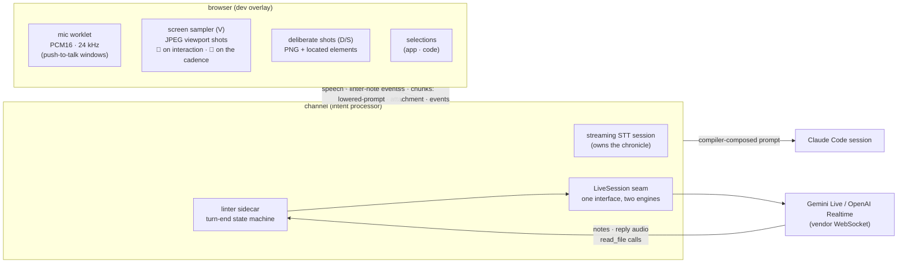

# Live Mode: the Realtime Engines

A realtime model joins the pipeline in exactly one role: the [**prompt
linter**](./prompt-linting) (`linter: "openai" | "gemini"` — the **L** chip in the
[config strip](./intent-overlay#quick-config-the-k-strip)). It hears the mic continuously,
sees labeled screenshots, selections, and (while you share) sampled screen frames, and at each
pause speaks one short observation about the briefing you're composing. It **never composes**:
the compiler (`composeIntent`) assembles the prompt in every configuration, and everything the
linter produces is advisory — notes, tool calls, trace stages.

> **Historical note — the composer era.** These engines originally powered a "realtime
> submode" (the old `live-gemini`/`live-openai` tiers) in which the model was the
> *co-composer*: it heard the same inputs and, on Enter, wrote the prompt itself via a
> `submit_intent` function call the channel then resolved. That inversion was removed — the
> model-composed prompt sat in tension with the pipeline's inspectability (the compiler is
> deterministic, replayable, and diffable; a model composition is none of those), and the
> useful part of the live session turned out to be its *judgment*, not its prose. The pivot is
> recorded in [Realtime Models as Prompt Linters](../proposals/realtime_prompt_linter_design.md)
> (the design) and [the pivot plan](../proposals/realtime_pivot_plan.md); legacy hellos naming
> the old tiers are translated onto the linter (the trace records each coercion).

This page is the conceptual map of **our framework**: how the linter runs from mic to 💡 note.
The vendor wire dialects — what Gemini and OpenAI actually receive, and the wire-level gotchas
— are their own page: [Gemini & OpenAI Realtime: the Wire](./realtime-vendors). (Short
version: **both are WebSockets** — the differences are state models, not transports.) The
implementation is `packages/aiui-claude-channel/src/{linter-sidecar,live-session,gemini-live,openai-live,linter-tools}.ts`.

## The framework, end to end

One client WebSocket carries the turn to the channel as typed chunks: `audio` (raw PCM frames
while Space is held), `attachment` (shot images — S/D captures and the share's sampled frames
alike), and `events` (the engine stream — thread lifecycle, shot metadata, selections). The
**streaming STT session** transcribes; the **linter sidecar** — constructed only when
`linter != "off"` — observes the same inputs through the **`LiveSession` seam**
(`activityStart` / `appendAudio` / `activityEnd`, `injectLabeledImage`, `appendVideoFrame`,
`injectContextText`, `cancelActiveResponse`), so nothing outside the two engine files knows a
vendor dialect. Each engine declares `LiveCapabilities` (`video`,
`imageInjection: "stream" | "turn-item"`), the honest record of *how* the model came to see an
image.

**Audio comes only from the microphone.** The screen share is captured with
`getDisplayMedia({ video: true, audio: false })` — the document's one
[display-capture grant](./screen-capture), shared with the shot tool. Push-to-talk is both
the audio source and the **turn boundary** — both vendors run with server-side voice
detection off (manual VAD), so a linter turn is bounded by your Space windows.

### The share's frames are shots

Pressing **V** starts a share and immediately takes one whole-viewport shot — the same
artifact the S key produces, JPEG instead of PNG. Every frame after it is another shot: it
shows in the transcript preview where it was taken, the compiler inlines it into the prompt at
that position (annotated `capture="on-change"` or, in machine-gun mode, `capture="continuous"
at="5.0s"` — the offset from the share's first frame), and the linter receives it as a labeled
image like any other shot. There is no second kind of visual context; a share is a stream of
screenshots you didn't have to keep pressing S for.

Two capture modes, toggled live from the HUD (beside the cadence slider) or persisted as
`videoMode`:

- **🦉 smart** (the default): a tick captures **only if you interacted with the app** since
  the last frame — a click, a key, a scroll, a drag, an iPad stroke. A still screen sends
  nothing, so leaving the share on while you think is free. (A bare mouse-move deliberately
  does not count; nothing on screen changed. An app animating *on its own* also doesn't — take
  a shot, or switch modes.)
- **🔫 continuous** (machine-gun): every tick captures, clockwork on the cadence slider
  (`videoFrameIntervalMs`, default one frame per 5 s). For narrating something that moves
  without you touching it.

The share's first frame always fires in either mode — turning it on is the interaction.

### The turn-end lint sequence

The linter must judge the transcription the **compiler will actually use** — not just its own
hearing — so a talk window doesn't end the linter's turn by itself:

1. **Space release** commits the STT segment and arms a wait in the sidecar.
2. When that segment's `transcript-final` lands (≤ 2.5 s), the sidecar injects
   `[transcript seg_N: "…"]` as **silent context**, then ends the vendor turn — the model
   lints hearing and transcript together, and can flag where they diverge.
3. The timeout ends the turn without the transcript (traced as `linter transcript timeout`); a
   late final still injects silently, so the next lint sees it.
4. **Talking again before the lint fires merges** the windows — one longer turn, no boundary.
   Talking *over* a lint cancels it upstream (`cancelActiveResponse` on OpenAI; Gemini's own
   barge-in) — a human talking wants to keep briefing, not listen.

### What the linter is shown (and what is withheld)

The linter sees *less* than the prompt will contain, deliberately:

- A shot — deliberate or a sampled share frame — arrives as the text label `[image shot_3]`
  paired with the pixels; the shot's file path and element/cell metadata never leave the
  channel. **Every** frame persists to the trace, so what the model saw is fully reviewable.
- A selection arrives as a bracketed, **clipped** text item —
  `[selection sel_2: "160-char excerpt…" — on-screen selection authored at src/…]` — injected
  silently (it must never make the model start talking). A re-selection reuses its id
  (`updated`); a drop injects an explicit retraction (`disregard it`).

### What flows back

- **Linter notes** — the model's reply transcript becomes a `linter-note` event: merged into
  the chronicle, pushed to the overlay (a 💡 chip in the preview + the status line), recorded
  in the trace. Never composed into the prompt.
- **Reply audio** arrives as base64 PCM deltas, is buffered per turn, WAV-wrapped, and pushed
  as a `speech` message the overlay plays (respecting `audioBack: "off"`).
- **`read_file` calls** — the one tool. The sidecar executes it (anything readable, resolved
  against the prompt cwd, 32 KB cap, binary-sniffed), answers the model, and records
  `linter-tool-call` / `linter-tool-result` events plus the full content read in the trace.
  The vendor resume rule lives in the engines: Gemini resumes on `toolResponse`; OpenAI needs
  `function_call_output` **then** `response.create`.
- **Usage** arrives per response and is priced into the trace's cost ledger
  (`cost: linter response` cards).

There is **no vendor input transcription** in the linter session — the STT session owns the
chronicle, and the `[transcript seg_N]` items carry the text. Double-transcribing the same
audio would double the cost for a worse record.

## The two engines, briefly

Both engines implement the same seam with the same tool, persona, and label grammar; they
differ in state model and injection grade. **Gemini Live** (the reference) is media *streams*
into a session — audio, image frames, silent context — with session resumption and
sliding-window context compression; `{ video: true, imageInjection: "stream" }`. **OpenAI
Realtime** is a *conversation of items* — buffered audio commits, images as turn-boundary
`input_image` items, a sub-100 ms commit floor (a tapped window is cleared, never committed) —
`{ video: true, imageInjection: "turn-item" }`. **Both vendors see the share's frames** —
they arrive through `injectLabeledImage` like any shot, so nothing is Gemini-only. The full
wire dialects, message-by-message, with the vendor gotcha ledger: [Gemini & OpenAI Realtime:
the Wire](./realtime-vendors).

## Turns and cost

Within one thread, **every pause is a potential lint** — each talk-window end (plus its
transcript injection) solicits one spoken response. The vendor holds the whole conversation
server-side, so the wire stays cheap (only new audio/frames go up), but **billing is per
response over the accumulated conversation**: each lint re-reads everything so far
(instructions, all prior audio, every image) as input tokens.

The growth curves differ, and that's the practical vendor gap:

- **Gemini**: the setup requests `contextWindowCompression: { slidingWindow: {} }`, so in a
  long session the retained context gets trimmed and per-turn input **plateaus**. While you
  share, sampled frames keep joining the context between talk windows too — part of what every
  later lint re-reads, which is exactly what the sliding window bounds.
- **OpenAI**: no compression knob — the conversation grows without bound for the session's
  life (cached-input pricing discounts the re-read prefix, softening the slope without capping
  it). This is why the frame cadence defaults to one per **five seconds**, and why smart mode
  is the default: a share over a still screen adds **zero** frames to what every later lint
  re-reads. Machine-gun mode is the deliberate opt-in to the growth.

That cost structure is also why the [linter persona](./prompt-linting#the-prompt) is kept
terse, selection labels are clipped to 160 chars, and `read_file` caps at 32 KB: all are
re-billed every turn. Costs arrive per response (`usageMetadata` / `response.done.usage`), are
priced against the provider's catalog, and accumulate in the trace — the cost ledger is the
empirical view of the growth curve.

## Gotchas — the framework ledger

(Wire-level vendor gotchas — Gemini's audio-first window rule, the SDK trap, GA-vs-Beta
shapes, close-frame semantics — live on [the wire page](./realtime-vendors#wire-gotchas--the-vendor-field-ledger).)

- **The lint judges the transcript, not just the audio.** The `[transcript seg_N]` injection
  precedes the turn end by design; a lint that fired on hearing alone couldn't catch the
  compiler using a different text than what was meant.
- **Retraction is advisory in-conversation:** the conversation is append-only (the model *saw*
  the retracted selection; it gets a "disregard it" item). The prompt side needs no
  enforcement — the compiler folds drops mechanically.
- **Sampled frames ARE referenceable** — each is a `shot_N` like any deliberate capture, so
  the linter can cite one and the ✕ on its preview thumb retracts it. (Before the
  frames-are-shots pivot they were unlabeled ambient `video` chunks; that chunk kind survives
  in the protocol only for older overlays.)
- **Keyless linting degrades loudly, once** — "dictation still works" is part of the error
  text, and it does.

Usage-level docs (the L chip, the video slider, what the linter says) live in
[Prompt Linting](./prompt-linting). Open directions are recorded as proposals:
[Ambient Frames & the Role of Realtime](../proposals/ambient-frames-and-live-reframing.md)
(labeled ambient frames; frame capture for the non-live configurations with lowering-time
coalescing).
