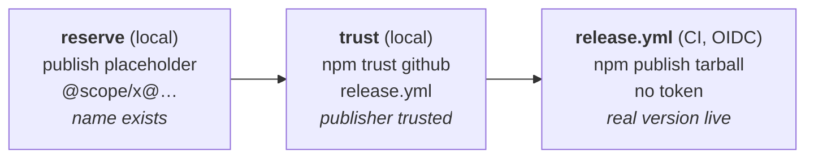

# Releasing & Publishing

Publishing to npm uses **[trusted publishing](https://docs.npmjs.com/trusted-publishers/) (OIDC)** —
the release workflow authenticates as its own GitHub Actions identity, so there is **no `NPM_TOKEN`
secret anywhere**. Each package is configured once to *trust* this repo's `release.yml`; after that,
releases publish over a short-lived, cryptographically-scoped token minted per run.

## The model

npm won't let you attach a trusted publisher to a package that doesn't exist yet. So bringing a
package onto npm is **two deliberately separate steps**, both run **locally with your own npm login**
(they may prompt for 2FA) — never from CI:

1. **Reserve** the name — publish a tiny placeholder so the name exists.
2. **Trust** this repo — register `habemus-papadum/pdum_aiui` · `release.yml` as an allowed publisher.

Only after both does the CI release workflow publish real versions.



## Provisioning commands

| Command | What it does |
| --- | --- |
| `pnpm npm:list` | Lists the packages `release.yml` would publish (everything not `--no-publish`). |
| `pnpm npm:reserve [slug…]` | Placeholder-publishes each name (`@habemus-papadum/<slug>@0.0.0-reserve.0`, under the `reserve` dist-tag so it never becomes `latest`). Idempotent — names already on the registry are skipped. Defaults to **all** publishable packages. |
| `pnpm npm:trust [slug…]` | Runs `npm trust github … --file release.yml --repository habemus-papadum/pdum_aiui --allow-publish`. Needs **npm ≥ 11.15.0**. Defaults to **all** publishable packages. |

Add `--dry-run` to `reserve`/`trust` to see what they would do without touching the registry.

## First-time setup for the existing packages

These packages exist in the repo but have never been published. One time, from a machine logged into
npm (`npm whoami` should succeed) with access to the `@habemus-papadum` scope:

```sh
npm install -g npm@latest      # ensure npm >= 11.15.0 for `npm trust`
pnpm npm:reserve               # reserve all five names (placeholder publishes)
pnpm npm:trust                 # attach the OIDC trusted publisher to each
```

### 2FA: the `trust` step, and why it may need the website

npm's `trust` endpoint **always requires 2FA**, and the CLI can only answer with a **TOTP** code
(`pnpm npm:trust --otp=<6-digit code>`). But npm **stopped enrolling new TOTP authenticators around
Sept 2025** — new/reset accounts get **passkeys/security keys only**, which are *browser* 2FA and
produce no code. So if your npm account is passkey-only, the CLI `trust` can't work (you'll see
`403 Forbidden … /trust` with "Two-factor authentication is required"). Configure each package on the
**website** instead — the passkey is challenged in-browser:

> npmjs.com → the package → **Settings / Access** (`.../package/<name>/access`) → **Trusted Publisher**
> → **GitHub Actions**, then: Organization `habemus-papadum`, Repository `pdum_aiui`, Workflow
> `release.yml`, Environment *(empty)* → **Save** (approve the passkey prompt).

This creates the identical relationship the CLI would. Package/order doesn't matter — trust config is
independent per package.

If a legacy `NPM_TOKEN` Actions secret still exists, delete it — nothing uses it anymore:

```sh
gh secret delete NPM_TOKEN
```

## Adding a new package later

`pnpm new-package foo --public` (or `--private`) scaffolds **and auto-reserves** the name (pass
`--no-reserve` to skip). Trust is still a separate, deliberate step:

```sh
pnpm new-package foo --public   # scaffolds + reserves @habemus-papadum/foo
pnpm npm:trust foo              # attach the trusted publisher
```

## Cutting a release

Unchanged and CI-only — a manual `workflow_dispatch` on `.github/workflows/release.yml`:

```sh
gh workflow run release.yml -f bump=minor
```

The workflow gates on green CI, writes the lockstep version across every `package.json`, tags, then
publishes. The publish job holds `id-token: write` (for the OIDC handshake **and** provenance) and
packs with pnpm — which rewrites `workspace:^` deps to the real version — before publishing each
tarball with `npm publish`. See [AGENTS.md](https://github.com/habemus-papadum/pdum_aiui/blob/main/AGENTS.md)
for the "do not publish by hand" guardrails.
