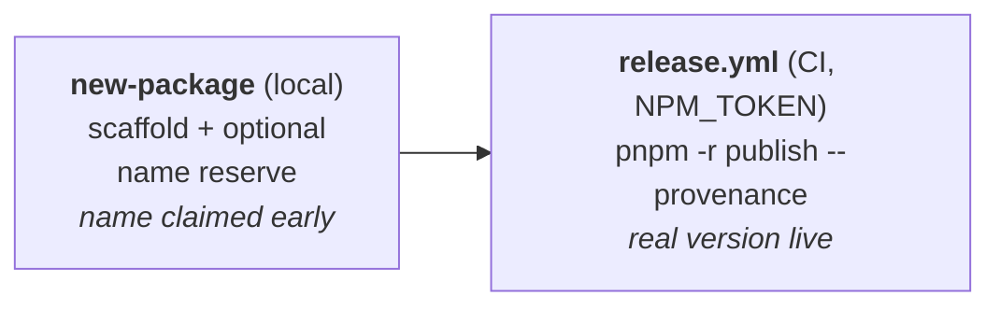

# Releasing & Publishing

Publishing to npm authenticates with a **stored npm token**: the `NPM_TOKEN` GitHub Actions
secret, read by `.github/workflows/release.yml` for one recursive
`pnpm -r publish --provenance`. A **new** package needs no provisioning at all — its first
release simply publishes it. (`--provenance` attestation rides the workflow's `id-token: write`
permission and is independent of auth.)

## The model


```mermaid
flowchart LR
  A["<b>new-package</b> (local)<br/>scaffold + optional<br/>name reserve<br/><i>name claimed early</i>"]
  B["<b>release.yml</b> (CI, NPM_TOKEN)<br/>pnpm -r publish --provenance<br/><i>real version live</i>"]
  A --> B
```

The reserve step is **optional**: with token auth nothing must exist before a release. Reserving
only claims the name early — worth doing when a package will sit unpublished in the tree for a
while before its first release.

## The token

`NPM_TOKEN` is an npm token from the owner's account, stored once as a repo secret:

```sh
# from a machine whose ~/.npmrc holds the token (npm whoami should succeed):
awk -F'_authToken=' '/registry\.npmjs\.org\/:_authToken=/{print $2}' ~/.npmrc | tr -d ' \t' \
  | gh secret set NPM_TOKEN --repo habemus-papadum/pdum_aiui
```

Rotation is the same command after refreshing the local token. Two caveats:

- **Expiry**: npm's *granular* access tokens expire (dashboard-configurable); a *classic
  automation* token does not. If a release fails with 401/403 out of nowhere, check the token's
  status on npmjs.com → Access Tokens and re-run the command above.
- **2FA**: the token must be allowed to publish without an OTP (automation tokens are; granular
  tokens have a "bypass 2FA" setting). A 2FA-required token fails in CI, where nobody can answer
  the prompt.

## Provisioning commands

| Command | What it does |
| --- | --- |
| `pnpm npm:list` | Lists the packages `release.yml` would publish (everything not `--no-publish`). |
| `pnpm npm:reserve [slug…]` | **Optional.** Placeholder-publishes each name (`@habemus-papadum/<slug>@0.0.0-reserve.0`, under the `reserve` dist-tag so it never becomes `latest`). Idempotent — names already on the registry are skipped. Defaults to **all** publishable packages. Runs locally with your own npm login. |
| `pnpm npm:trust [slug…]` | **Retired.** Attached the OIDC trusted publisher, when that was the auth path (see History). Nothing requires it now. |

Add `--dry-run` to `reserve` to see what it would do without touching the registry.

## Adding a new package

`pnpm new-package foo --public` (or `--private`) scaffolds and auto-reserves the name (pass
`--no-reserve` to skip). That is the whole story — the next release publishes it, with no
per-package setup of any kind.

## Cutting a release

CI-only — a manual `workflow_dispatch` on `.github/workflows/release.yml`:

```sh
gh workflow run release.yml -f bump=minor
```

The workflow gates on green CI, writes the lockstep version across every `package.json`, tags,
builds (`pnpm -r run build` — the tarballs' `publishConfig` points at `dist/`), then publishes the
whole workspace in one `pnpm -r publish --provenance --no-git-checks` (pnpm skips `private: true`
members, applies the `publishConfig` dist/ swap, and rewrites `workspace:^` deps to the real
version). The publish job holds `id-token: write` for **provenance only**. See
[AGENTS.md](https://github.com/habemus-papadum/pdum_aiui/blob/main/AGENTS.md) for the "do not
publish by hand" guardrails.

## History: trusted publishing (retired 2026-08-11)

Until 2026-08-11 releases authenticated via npm
[trusted publishing](https://docs.npmjs.com/trusted-publishers/) (OIDC): no stored token, auth
bound to this repo's `release.yml` identity. It was retired for one operational reason: OIDC
requires a **per-package** trusted-publisher registration, npm's `trust` endpoint always demands
2FA, and the CLI can only answer with a TOTP code — which passkey-only npm accounts (the only
kind npm enrolls since ~Sept 2025) cannot produce, leaving a manual website step for every new
package. The token removes that step. The trusted-publisher registrations attached to
already-published packages are harmless leftovers; token publishes coexist with them. Returning
to OIDC someday = re-point the publish step at `scripts/npm-provision.mjs publish`, restore the
per-package trust flow, and delete the secret.
