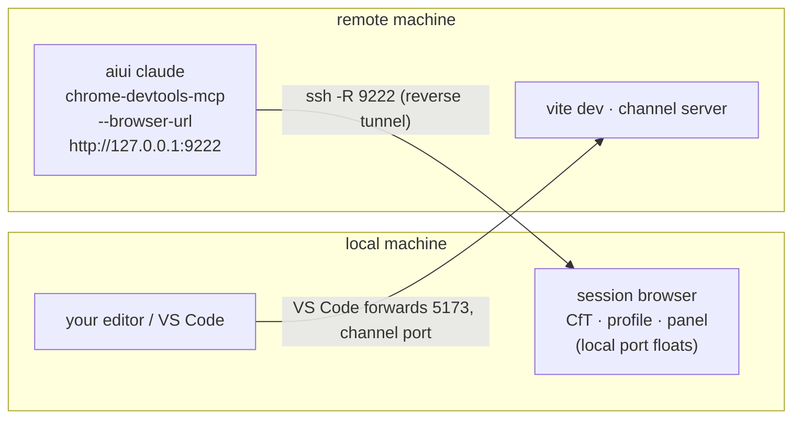

# Remote Development

The session runs on a remote box (over SSH, usually inside VS Code Remote); your display — and
therefore the [session browser](./chrome) — is local. The split that makes this work: **browser
provisioning is a local concern; the session's MCP just needs a URL.** A reverse tunnel carries
your local browser's DevTools debug port to the remote machine, and the remote `aiui claude`
attaches to it instead of managing any browser of its own.



## The one-command way

On your **local machine** (no aiui checkout needed — the packages are published, `npx` works):

```sh
aiui browser --tunnel [user@]remote-host
# or: npx @habemus-papadum/aiui browser --tunnel [user@]remote-host
```

That does the whole local half:

1. **Launches (or finds) the session browser** — Chrome for Testing if you let it install one
   (recommended: the [aiui DevTools panel](./devtools) then auto-loads), your regular Chrome
   otherwise. Tunneled browsers keep their profile in the **user cache**, keyed by the host
   (`~/.cache/aiui/browser-profiles/<host>`), so reconnecting to the same box reuses the same
   browser state — there's usually no local checkout to be project-local to. (`--profile <name>`
   renames the key; `--data-dir <path>` is the escape hatch.)
2. **Opens the reverse tunnel** — `ssh -N -o ExitOnForwardFailure=yes -R 9222:localhost:<local>`,
   in the foreground so ssh's own auth prompts work. Ctrl-C closes the tunnel; the browser stays.
3. **Prints the command for the other side**, e.g.:

```
tunneling dev-box:9222 → localhost:55007 — on dev-box, run:

  aiui claude --aiui-browser-url http://127.0.0.1:9222
```

Paste that on the remote box and you're done. With `--aiui-browser-url` (or the durable
equivalent, `chrome.browserUrl` in [config](./config)), the remote `aiui claude` skips everything
local-browser-shaped — no Chrome for Testing sync or prompts, no profile creation, no extension
loading, no browser launch — and hands chrome-devtools-mcp the URL. `aiui chrome status` on the
remote box will say exactly that. Even `aiui open http://localhost:5173` works from the remote
side: it opens a tab in *your local* browser through the tunnel.

**The port worth pinning is the remote one.** The local debug port can float (the tunnel command
picks up whatever the browser got); the **remote** port — 9222 by default, `--remote-port <n>` to
change — is what the remote session, your config, and any
[VS Code launch configuration](#bonus-breakpoints-via-vs-code) reference. Keep it fixed and
everything downstream stays copy-paste stable. If the remote port is already taken, the tunnel
exits immediately (`ExitOnForwardFailure`) instead of half-working — pick another.

## The manual way (what the tool does for you)

Useful when the tunnel should live in your SSH config rather than a foreground process:

```sh
# 1. locally: a browser with a debug port (any port; note what it prints)
aiui browser --port 9222

# 2. the reverse forward — one-off…
ssh -N -o ExitOnForwardFailure=yes -R 9222:localhost:9222 <remote-host>
```

…or persistently, in `~/.ssh/config` (VS Code Remote-SSH picks this up too — its ports UI only
does remote→local, but the underlying SSH connection honors `RemoteForward`):

```
Host my-remote
  RemoteForward 9222 localhost:9222
```

Then on the remote, either pass `--aiui-browser-url http://127.0.0.1:9222` per launch, or make it
durable in `.aiui-cache/config.json`:

```json
{ "chrome": { "browserUrl": "http://127.0.0.1:9222" } }
```

## Viewing the app itself

Nothing new: VS Code (or plain `ssh -L`) forwards the remote Vite port and the channel server's
websocket port to your local machine as usual, so the app and the
[intent tool](./web-intent-tool) run in your local session browser — which is the same browser
the agent drives. The loop closes: the agent's screenshots are of the page you're looking at.

## Bonus: breakpoints, via VS Code

Not aiui-specific — just underused: VS Code's JavaScript debugger can **attach to an existing
Chrome** through the same kind of debug port the agent uses, giving you real breakpoints in your
app's source. Add to the *remote workspace's* `.vscode/launch.json`:

```json
{
  "version": "0.2.0",
  "configurations": [
    {
      "name": "Attach to aiui session browser",
      "type": "chrome",
      "request": "attach",
      "port": 9222,
      "webRoot": "${workspaceFolder}",
      "urlFilter": "http://localhost:5173/*"
    }
  ]
}
```

Why this works remotely: the debug adapter runs on the remote box (where VS Code's server lives),
and there `127.0.0.1:9222` *is* your local session browser, through the tunnel — which is exactly
why the fixed **remote** port matters: it's what `"port"` hardcodes. `"urlFilter"` picks the app
tab; `"webRoot"` + Vite's sourcemaps map compiled code back to your files. Start the config and
breakpoints set in the editor hit when the page — the one you *and* the agent are driving —
executes that line.

Fully local sessions get the same trick with no tunnel: pin the port once
(`chrome.debugPort: 9222` in [config](./config), or `aiui browser --port 9222`) and the identical
launch config attaches to the local session browser.

## Fallback: headless on the remote box

No tunnel, no local browser? Leave `browserUrl` unset and set:

```json
{ "chrome": { "headless": true, "mode": "launch" } }
```

The agent gets a private headless Chrome on the remote machine; you watch through the screenshots
it takes in the transcript rather than live. Degraded, but zero setup.

## Trust, spelled out

The DevTools debug port is **unauthenticated** — whoever can reach it controls the browser (and
everything the profile is logged into). Locally it binds to loopback; the ssh tunnel extends that
to processes on the remote box, which is precisely the point — the remote agent is supposed to
drive it — but it means the remote machine's other users/processes could too. Use a dedicated
profile, and read [⚠️ Read before running](./warning).
