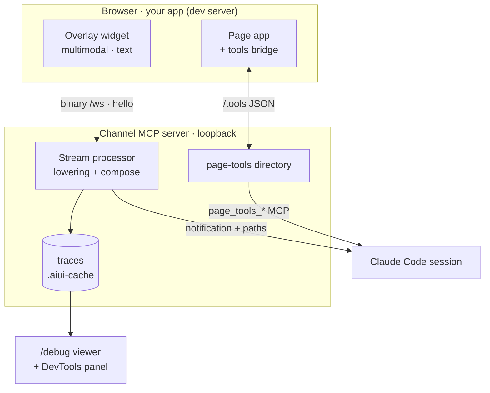
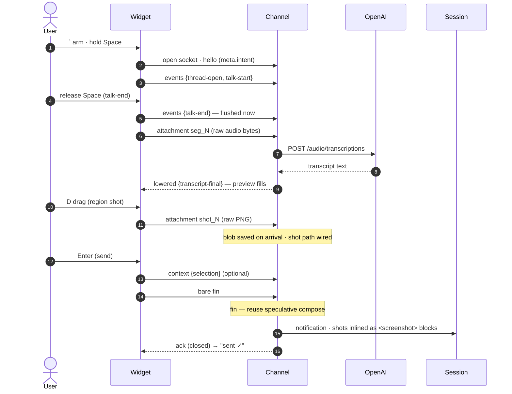
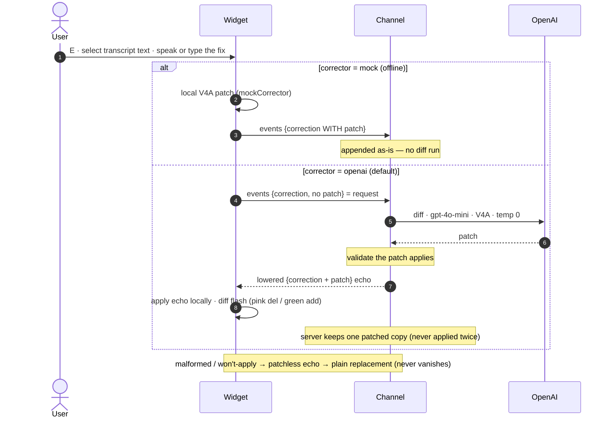

# The Web Intent Tool

The first concrete layer-2 tool: a widget you mount into the web app you're developing that
collects intent — dictation, region screenshots, pen ink, and DOM context, with plain text as the
escape hatch — and streams it to the running channel server, where it is **lowered** into a prompt
for the Claude Code session. This page is the **design document**; [Using the intent
overlay](./intent-overlay) is the user guide for the default multimodal modality;
[Getting Started](./getting-started) shows the whole loop in action; and `pnpm demo` (the
`aiui-demo` package) is a ready-made playground: `./aiui claude` in one terminal, `pnpm demo` in
another, and poke at it.


## Decisions

Three questions had answers to pick; here's what was chosen and why (and what was deliberately
deferred):

**How does it get into the page? A Vite plugin, dev-server-only.** One line of Vite config — the
developer (human or agent) adds the overlay package's plugin, and every page the dev server serves
gets the tool, already wired to the running channel:

```ts
// vite.config.ts
import aiuiDevOverlay from "@habemus-papadum/aiui-dev-overlay/vite";
export default defineConfig({ plugins: [aiuiDevOverlay()] });
```

The plugin is `apply: "serve"`, so the dev gate is structural: the tool *cannot* exist in a
production build — no `import.meta.env.DEV` guard for an app to forget. The Vite config is also
where an app declares **which message format** its tool speaks — the default is the multimodal
`intent-v1` modality; `aiuiDevOverlay({ format: "text-concat" })` selects the plain-text escape
hatch instead, by its wire-format name.
 Client-side pipeline options ride the same call
(`aiuiDevOverlay({ intent: { … } })` — see [Using the intent overlay](./intent-overlay#configuring-the-pipeline)).
Apps with custom modalities mount from app code instead (`aiuiDevOverlay({ mount: false })` keeps
the port/source injection, since modalities are functions and can't cross vite.config); outside
Vite entirely, `mountIntentTool({ port })` works anywhere. A DevTools-panel or browser-extension delivery would
avoid even the config line — both remain on the table. How the plugin gets the tool and its port
into the page is subtler than it looks — see
[the internals note](#how-the-plugin-gets-the-tool-into-the-page-subtle) below.

**Where does state live? Not in the browser.** The tool is **stateless**: no localStorage, no
persistent connection, nothing to survive a reload — which also makes it trivially HMR-proof. Each
submission opens a fresh websocket, speaks its thread, and closes. All durable state — lowering
runs, traces, blobs — lives on the MCP-server side, in the project-local cache.

**Where do artifacts go? A project-local cache.** `.aiui-cache/` under the channel server's
working directory (gitignored) — *not* the per-user cache. Two reasons: the artifacts belong to
the project/session being worked on, and the channel delivers **text** — it has no file
attachments — so a lowered prompt references screenshots and other blobs **by path**, and Claude
Code, running in the same cwd, reads them from disk. Project-local paths make that natural.

## Architecture: three pieces per modality

A **modality** is one kind of intent input (plain text; voice + screenshot; a DOM selection…).
Every modality is implemented as three cooperating pieces, and the abstraction layer for each
piece is independent of any particular modality. Those pieces, in motion — collection in the
browser, lowering in the channel, and the traces that feed debugging — plus the side rails that
carry page tools and the debugger:



Each piece is implemented against an abstraction independent of any particular modality:

| Piece | What it does | Abstraction | Lives in |
| ----- | ------------ | ----------- | -------- |
| **Collection** (browser) | The UI that gathers the input and streams it | `IntentModality` | `aiui-dev-overlay` |
| **Lowering** (server) | Converts the incoming stream into the final prompt | `ChannelFormat` (codec + `StreamProcessor`) | `aiui-claude-channel` |
| **Debugging** (web app) | Renders the recorded lowering trace | trace viewer (+ per-format custom views, planned) | `aiui-claude-channel` |

The rich modalities (voice + pen + screenshots + component location, and the correction
meta-loop) were **designed before they shipped** and now ship as the default overlay (see
[Using the intent overlay](./intent-overlay)). The
[intent workbench](https://github.com/habemus-papadum/pdum_aiui/tree/main/packages/aiui-dev-overlay/workbench)
(`pnpm workbench`) lives on as the **lab where the pipeline is measured and tuned** — a single
instrumented page, running the very same pipeline this overlay does, where every interaction
choice is a setting, every action is an event, the IR passes re-run live as you talk/draw/shoot,
and a `bench/` corpus runner ranks transcription and correction models offline. Design decisions
are made there and graduate into the shipping three pieces.

The three meet at one string: the **stream format name**. The client's `IntentModality.format`
names the format its frames speak; the server's format registry maps that name to a codec and a
processor; the trace records it so the debugger knows what it's looking at.

The split across packages mirrors the split of concerns — browser-side collection is one package,
server-side lowering + debugging another. As real modalities accumulate, implementations are
expected to graduate into their own packages, keeping the abstract layer separate from any one
modality.

### Collection: the pluggable widget

`mountIntentTool` renders the floating button + panel (Shadow-DOM isolated, dependency-free) and
hosts any number of modalities as tabs. A modality is ~a function:

```ts
interface IntentModality {
  format: string;   // the wire format it speaks
  label: string;    // its tab
  mount(container: HTMLElement, ctx: IntentToolContext): undefined | { unmount(): void };
}
```

The host gives it `ctx.openThread()` (a fresh connection + thread in its format),
`ctx.setStatus()`, and `ctx.closePanel()`. The bundled `textModality` — a textarea that sends
`{ text }` as a single `fin` frame — is the proof of concept: no lowering cleverness, it exists to
exercise the full data path and to be the template. The channel port arrives from the Vite plugin
at serve time (see below); pass `{ port }` outside Vite.

#### How the plugin gets the tool into the page (subtle)

`aiui vite` exports the channel port as `VITE_AIUI_PORT` to the dev-server process — but the
widget cannot read it as `import.meta.env.VITE_AIUI_PORT`, and the reason is a classic trap worth
writing down. `import.meta.env.*` is not a runtime lookup: every bundler substitutes it when *it*
compiles the file. The overlay ships prebuilt, and its own library build (Vite lib mode) already
replaced `import.meta.env` with an empty object frozen into `dist/` — by the time the consuming
app's dev server serves that code there is no `import.meta.env` text left to substitute, so the
consumer's env can never reach it. (How this was found: the demo showed "no channel port" while
`VITE_AIUI_PORT` was demonstrably set on the dev server.)

So everything moves at serve time, through `aiuiDevOverlay()` running *inside* the consumer's dev
server — the one place that actually holds the env var:

1. **The mount.** `transformIndexHtml` injects a `<script type="module">` pointing at a virtual
   module the plugin itself serves: `import { mountIntentTool } from …; mountIntentTool({ force:
   true, port: <port> })`, with the port inlined as a literal. The module is generated
   per-request by the plugin, so there is no substitution timing to get wrong. It mounts on
   window `load` — the injected script runs *before* the app's own modules, and an app that
   builds its DOM during startup (`document.body.innerHTML = …`) would sweep an eager mount away
   — and a `MutationObserver` remounts the widget if the app rebuilds its DOM later
   (`mountIntentTool` discards a handle whose host has left the document).
2. **The port seed.** An inline head script sets `window.__AIUI__.port` before any module runs,
   so manually-mounted tools (`mount: false`, custom modalities) and the aiui DevTools panel can
   find the port too.

The widget resolves its port as: explicit `{ port }` option → `window.__AIUI__.port` →
`import.meta.env.VITE_AIUI_PORT`. The env read survives as a last resort because it *does* work
when the overlay is compiled from source (this repo's own tests, for instance). The same baking
affects `import.meta.env.DEV` inside `isDevEnvironment()` — dead in `dist/`, it survives on its
`localhost` hostname fallback, which is why the plugin's virtual module passes `force: true`
instead of leaning on it.

### The wire: one binary protocol for every modality

The tool speaks the channel's binary `/ws` protocol (see `frame.ts` / `channel.ts` in the channel
package): each websocket frame is a 4-byte length, a JSON envelope, then **raw payload bytes** —
never base64. A connection opens with a `hello` naming its stream format; each submission is a
*thread* of `data` frames ending in `fin`. The framing exists precisely so future modalities can
stream screenshots and audio as raw bytes on the same pipe as JSON text. The widget carries its
own ~40-line reimplementation of the framing (`protocol.ts`), keeping it dependency-free; the
tests cross-check its bytes against the channel package's decoder.

#### What rides the hello: tab identity and source location

The `hello` envelope carries an optional `meta` block — the client's answer to *"where is this
intent coming from?"* — assembled fresh for every submission (`collectClientMeta` in the
overlay):

- **`meta.tab`** — the page's live `location.href` and `document.title`, plus, when the **aiui
  DevTools extension** is installed (the session browser auto-loads it), the tab's identity:
  `chromeTabId`, `windowId`, `tabIndex`, and the CDP `targetId`. Only the extension layer can
  know these — its content script asks its background worker (which alone sees
  `sender.tab` and `chrome.debugger.getTargets()`) and stamps the answer on the document as
  `data-aiui-tab`, where the overlay picks it up. None of these ids is the Chrome DevTools MCP's
  `pageId`; they are correlation hints, and the `session-browser` skill teaches the agent the
  `list_pages` → match → `select_page` → verify workflow (background:
  `archive/chrome-devtools-mcp-tab-routing-notes.md`).
- **`meta.source`** — the app's source root, seeded by the Vite plugin
  (`window.__AIUI__.sourceRoot`, default: the resolved Vite root; override with the plugin's
  `sourceRoot` option). This is how a lowered prompt can say *which code renders the page*.

Server-side, the connection hands `meta` to every thread's processor (`ThreadContext.hello`),
and tracing records it as an `info` stage on every trace. The `text-concat` processor uses it to
**augment the prompt**: the user's text arrives in the session prefixed with the tab block (plus
the skill pointer) and the source location — that prefix is what turns "make this wider" into
something the agent can act on. The trace shows the whole lowering: the `info` client context,
the raw `input` frames, the user text as an `ir` stage, and the full augmented prompt as the
`output` stage.

#### What rides the payload: the "about *this*" selection chip

A selection is the payload-level parallel to the hello's tab identity — not *which page* the
intent came from, but *which thing on it*. The overlay runs a **selection watcher** (`selection.ts`):
a debounced `document.selectionchange` listener that snapshots the last non-collapsed selection.
A live read is impossible — the moment focus moves into the widget's textarea the document
selection reads empty — so the selection has to be captured *before* the interaction that asks
about it. The snapshot survives that focus steal (an emptied selection never clears it; only an
explicit dismiss or a completed submission does) and expires after a couple of minutes.

When a snapshot exists the panel shows a dismissible **chip** above the input —
`about: "reaction-diffusion on the GPU" · src/ui/App.tsx:35:13 ✕` — and the text modality rides it
on the submission, which grows from `{ text }` to `{ text, selection? }`. The `selection` block is
the snapshot minus its capture timestamp: the selected `text`, its `rects` (for later screenshot
annotation), `sourceLoc`, `cell`, `tex`, and `url`. The binary protocol is unchanged; this is
entirely payload-level.

Attribution reuses the same DOM contract the screenshot/`locate` pipeline reads, so app authors
write nothing selection-specific: from the selection's start element, `closest('[data-source-loc]')`
and `closest('[data-cell]')` give the authoring line and dataflow node, and `closest('[data-tex]')`
— falling back to KaTeX's own `<annotation encoding="application/x-tex">` — recovers the TeX behind
rendered math (a selection over an equation carries `\partial u/\partial t`, not mangled glyphs).
Every field is optional; a page with no aiui instrumentation still yields text + rects.

The `text-concat` processor keeps the last selection a thread carried and, on `fin`, folds it into
the augmented prompt right after the tab/source block (and adds nothing when there is no selection):

```
It concerns this on-screen selection: "reaction-diffusion on the GPU" (authored at src/ui/App.tsx:35:13; produced by cell catalog).
The selected content is rendered mathematics; its TeX source: \partial u/\partial t
```

The chip and its snapshot live in the widget, not the modality: `IntentToolContext` exposes
`selection()` and `clearSelection()`, so any future modality — a screenshot annotator, a voice turn
— attaches or consumes the same on-screen reference through one hook.

#### When it breaks: one generic error surface

Failures never stay server-side (or die in a dropped ack): a generic `kind:"error"` push —
`ChannelErrorMessage` in the channel's `channel.ts`, mirrored as `ErrorMessage` in the overlay's
`protocol.ts` — carries a short message, a coarse `source` (`transcription`, `correction`,
`connection`, …), and an optional remediation `detail`. Every server-side failure site routes
through one helper (`pushError`); the flagship example is a stale `OPENAI_API_KEY`, which the
channel alone can see, so the channel names it. The widget renders these as **dismissible toasts**
beside the fab — visible with the panel closed (where the footer status line is not), deduped
(repeats become one toast with a ×N badge) and capped. Client-detected transport faults use the
same surface: a channel that is down or refuses the hello toasts at `openThread`, an established
socket closing out from under a turn (the channel stopping, or a reload dropping every connection)
synthesizes the same error message locally, and any `ok:false` frame ack the modality receives is
reported instead of dropped. There is no reconnect to report — the intent socket is deliberately
one per thread, so an interrupted turn is re-sent, not resumed.

### Lowering: stream processors, traced

Server-side, a modality's lowering is its `ChannelFormat`: a codec (JSON or raw bytes) plus a
`StreamProcessor` that consumes the thread's payloads and decides what prompt to send. The
`text-concat` processor concatenates and forwards; a voice modality's processor would transcribe,
denoise, and resolve references before sending — possibly calling helper LLMs.

Every thread is **traced** automatically: `withTracing` decorates the format registry so the
framework records each input frame as it arrives and the lowered prompt as it leaves, with zero
code in the processors. Processors that want to expose their *intermediate* representations opt
in through the context:

```ts
traceOf(ctx)?.record({ kind: "ir", label: "resolved pronouns", data: rewritten });
```

Traces land in `.aiui-cache/traces/<id>/` — a `trace.json` manifest of stages (`input` → `ir`* →
`output`) with binary payloads stored as sibling blob files.

#### A full multimodal turn, end to end

A default turn (the `standard` tier: voice dictation, one screenshot, a selection) as it crosses
the wire. The thread's socket opens on the first contentful act; audio uploads as a whole `seg_N`
blob at talk-end and is transcribed server-side; the shot's blob is saved the moment its bytes
land; and `fin` is a near-empty commit that reuses the compose already run speculatively. Every
client frame is acked FIFO — only the closing ack (which drives *"sent ✓"*) is drawn.



#### The correction meta-loop

Fixing a mis-transcription is a **patch**, not a retype, and where the diff runs depends on the
`corrector` config. The `mock` corrector builds the patch in the browser and streams the
correction already carrying it — the channel just appends it. The default `openai` corrector
streams a *patchless* correction as a **request**: the channel runs the V4A diff, echoes the
completed correction back, and holds the one patched copy (the client applies the echo locally and
never re-sends, so no patched twin appears on the wire). Either way a malformed or non-applying
patch degrades to a plain replacement — a correction never silently vanishes.



### The overlay dogfoods its own agent surface

The intent tool is itself a frontend an agent pair-programs against, so it follows the
[frontend-for-agents](./frontend-for-agents) methodology it exists to enable: it registers its own
tools through the very bridge pages use (`window.__AIUI__.tools`), under the identifier-shaped
namespace **`aiui_overlay`**, and they reach the session as ordinary `page_tools_list` /
`page_tools_call` MCP tools. Callable: `report` (one bounded snapshot — armed/mode/talking/thread,
active modality, effective `IntentPipelineConfig`, the event-log tail, channel + thread-socket
state, selection/capture presence), `get_config` / `set_config` (validated through the *same*
strict validator the advanced panel uses, applied live and persisted the same way — "agent, switch
my transcriber to mock" is a page-tools call), `arm` / `disarm`, `open_panel` / `close_panel`, and
`get_events` (the raw event tail). Installed next to the modality that owns the state, so it exists
exactly as long as the widget does and deregisters (empty-set re-register) on unmount.

Because the loop edits the overlay's own source mid-turn, the *turn* is made durable. The overlay
has no HMR self-accept anywhere in its import graph, so an overlay-source edit under a source-first
dev server **full-reloads the page** — which wipes any `window`-durable state. So the current
thread's event log (transcript + shot refs + thread state — nothing else; config is already
persisted separately) is mirrored to `sessionStorage`, bounded by freshness and same-URL, and
restored on the fresh mount with a status line; a soft `MutationObserver` remount adopts the live
in-memory copy silently instead. See `turn-store.ts` for the finding.

## The debugger

The trace debugger lists lowering runs newest-first and renders every stage — inputs, IRs, the
final prompt — with images inline. This is the compiler's IR dump for prompt lowering: when the
prompt doesn't say what you meant, find the stage that lost it.


Its **home is the [aiui DevTools panel](./devtools)** — debugging the lowering pipeline sits
alongside the panel's transport and server monitors. The core viewer stays a plain server-side
page at **`/debug`** (the widget's 🔍 button opens it directly, and the panel embeds it), so it
also works **standalone** and **live** (it polls; you can watch a trace grow mid-session). The
generic stage viewer covers every modality; the design allows a modality to ship a *custom* debug
view keyed by its format (waveform scrubbing for audio, region overlays for screenshots) — the
manifest already carries the format name, but the plug-in mechanism itself is not built yet.

**Traces are one per thread, and they say who made them.** Every websocket thread mints one
trace directory under `.aiui-cache/traces/` — including cancelled turns (`status: "abandoned"`)
and turns driven by an agent doing UI testing, which is why a busy session's list grows fast.
To keep those apart, the overlay self-reports an **actor** on every thread's hello
(`meta.actor`). It defaults to `human` and is only ever changed by explicit opt-in: per tab via
`sessionStorage.setItem("aiui-actor", "agent")` (one evaluate for an agent or CI run to label
the tab it drives; remove the key to revert), or pinned with the `actor` option on the Vite
plugin / `mountIntentTool`. It is deliberately **not** inferred from `navigator.webdriver` —
that flag is browser-wide, and in the shared session browser it labeled the human's own turns
as `agent`. The channel stamps the label on the trace manifest. Trace lists — `/debug`, the DevTools Intent pane, the workbench — badge any
non-human actor. There is no pruning yet; traces only accumulate.

**Watching lowering without an agent: the workbench.** The in-repo workbench (`pnpm workbench`)
runs the whole pipeline against a **debug channel server** (`aiui-claude-channel serve`) that has
no MCP client at all — turns lower, trace, and echo the final prompt back over the websocket (a
`lowered-prompt` push every client is free to ignore), but can never reach a session. Its trace
pane reuses the same shared debug-ui components as the DevTools panel, so viewer improvements
land in both. See `packages/aiui-dev-overlay/workbench/README.md`.

## Adding a modality — the checklist

1. **Client**: implement `IntentModality` — collect the input, stream it via `ctx.openThread()`.
2. **Server**: implement a `ChannelFormat` under your format name — decode, lower (recording
   `ir` stages via `traceOf`), `sendPrompt`, `close`. Register it in the server's format registry.
3. **Blobs**: write large/binary artifacts through the trace handle (`recordBlob`) and reference
   them by path in the lowered prompt.
4. **Debug** (optional, once pluggable views exist): ship a custom viewer for your format.

## The acknowledgement prompt

Loading a development channel makes Claude Code show a one-key confirmation at startup. Whether
`aiui claude` best-effort presses Enter for you is your first-run choice, saved as
`claude.enterNudge` in [config](./config) (the mechanism is a TIOCSTI keystroke injection — see
`enter-nudge.ts`); if you declined, or your platform forbids the injection, you just press it
yourself.

## Open questions

- Delivery: does the tool stay an explicit import, or also ship as a DevTools panel / extension?
- Custom debug views: what exactly does a modality register — a component, a URL, an iframe?
- Cache hygiene: traces accumulate; when and how are they pruned?
- Multi-app pages: one widget per page today (double-injection guarded) — is that right?
- See the running [Questions](/questions) note.
