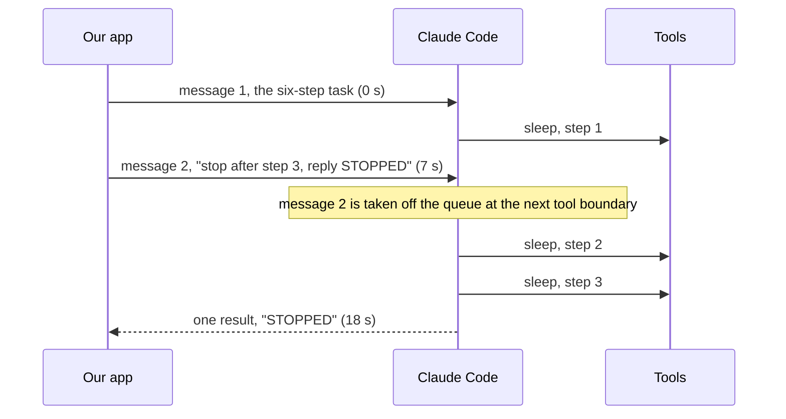
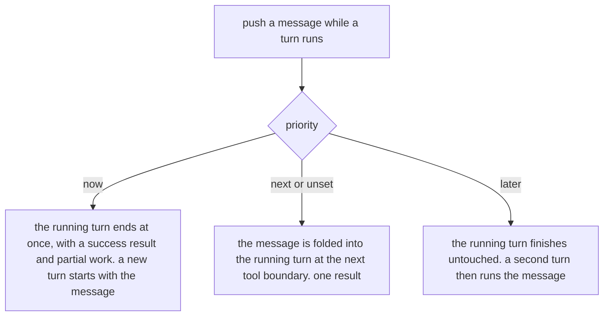

# What happens when a message is sent to Claude Code in the middle of a turn

Measured on 2026-10-10 with the Claude Agent SDK, versions 0.3.272 and 0.3.296, on a Haiku model.
Read [the primer](./live-primer.md) first if any word here is unfamiliar.

## 1. The question

In client mode, one of our thinking models is Claude Code, run on a server through the Claude
Agent SDK. The voice model hands it a request; it reads code, runs commands, and speaks back
through a tool. A single request can take a while.

Suppose Claude Code is in the middle of that work and a second request arrives. We wanted to
know what the SDK does with it:

1. Is it dropped?
2. Is it held until the current work finishes, and then run as the next job?
3. Is it folded into the current work, so the model sees it before finishing?

And: can we **choose**? Can we say "stop what you are doing and start over with this", or
"fit this in when it is convenient", or "wait until you are done"?

A spike on 2026-09-15 had concluded that a message pushed mid-turn was never answered, and our
Claude delegator was built to run one request at a time because of it. That conclusion needed
re-testing.

## 2. Words we use

**Turn.** One unit of Claude Code's work: it reads a user message, thinks, calls tools as many
times as it needs, and ends with a final reply. The SDK reports the end of a turn with a
`result` message. One turn, one result.

**Streaming input.** The way we run Claude Code: instead of one prompt and one answer, we keep
a channel open and **push** user messages into it whenever we like. The SDK calls this streaming
input mode. All of the behavior below applies only to this mode.

**Tool boundary.** The moment between one tool call finishing and the next one starting. A turn
with six tool calls has six such moments. This matters because it is where a new message can be
slipped in.

**Interrupt.** A method on the SDK, `interrupt()`, that stops the running turn. The turn ends
with an error result, and the channel stays open for the next message.

**Priority.** A field on a pushed user message, `priority`, with three allowed values: `now`,
`next` and `later`. This field is what answers the "can we choose" question. It is typed in the
SDK but has no documentation comment, so its meaning had to be measured.

## 3. How we measured

The script is `exploration/live-probe/claude-midturn-spike.mjs`. It runs Claude Code in
streaming input mode with one in-process tool called `step`, so the turn has visible progress.

- First message: "for n = 1..6, run the Bash command `sleep 3` and then call the `step` tool
  with n. Then reply with the single word DONE." That is about twenty to forty seconds of work
  with a tool boundary every few seconds.
- Seven seconds later, a second message. Its wording and its priority are the variable.
- Everything the SDK emits is logged with a timestamp.

The variants:

| Variant | Second message | How it was sent |
| --- | --- | --- |
| A | "When you are finished with the steps, also tell me the value of 17 + 25." | default priority |
| B | "Change of plan: stop after step 3 and reply STOPPED instead of DONE." | default priority |
| B at 1 s, B at 2.6 s | the same redirect, pushed before any step had run | default priority |
| C | the redirect | `interrupt()` first, then the push |
| D now | the redirect | `priority: "now"` |
| D next | the redirect | `priority: "next"` |
| D later | the redirect | `priority: "later"` |

Every variant ran on both SDK versions. The results were the same on both.

## 4. What happened

### The default: folded in at the next tool boundary

Variant A: the turn ran all six steps and ended with a single result containing both "DONE"
and "17 + 25 = 42". One turn, one result, both requests answered.

Variant B: the turn ran steps one to three and ended with "STOPPED". The redirect was obeyed
mid-turn. The SDK's lifecycle events show when: message two is reported as "started" at the very
next tool boundary after it was pushed, 0.2 to 1.8 seconds later.

Pushed early, at one second or at 2.6 seconds, before any step had run: the same. Three steps,
then "STOPPED".

So the answer to the first question is **folded in**. The model sees the new message before its
current turn ends, at the next tool boundary, and there is still only one result.

### The three priorities

- **`next`** behaved exactly like the default. It is the default.
- **`later`**: all six steps ran and the turn ended with "DONE". Then a second turn started with
  the redirect, and the model answered that the steps had already run. Two results.
- **`now`**: the running turn ended immediately, 10 milliseconds after the push, with a
  **success** result and only the work done so far. A new turn started with the redirect, ran
  steps one to three, and ended with "STOPPED". Two results.
- **`interrupt()` then push** (variant C): like `now`, except the stopped turn's result says
  **error during execution** instead of success. The new turn then runs normally.

Two more details about `now`, both measured on the newer SDK with a fifteen-second tool call
in flight instead of a three-second one:

- Plain `now` does **not** cut into a running tool call. The fifteen-second command ran to the
  end, and only then did the turn end and the new one start.
- A `now` message stamped as coming from a person, through the message's `origin` field, did
  something different on the newer CLI: the running command was **moved to the background**, and
  the message **joined** the running turn instead of ending it. One result, both requests
  answered. With short tool calls the same stamp made no difference; the turn ended at the next
  boundary as usual. The SDK changelog for 0.3.286 describes exactly this rule.

## 5. What we learned

1. **The 2026-09-15 finding does not hold.** A message pushed mid-turn is not dropped. On both
   SDK versions it is folded into the running turn at the next tool boundary, and answered
   within that turn's single result.
2. **There is a choice, and it is the `priority` field.** `next`, the default, folds in.
   `later` waits for the turn to end. `now` ends the turn and starts over with the message.
3. **Two ways to stop a turn, with different endings.** `priority: "now"` ends it as a success
   with partial work. `interrupt()` ends it as an error. Both leave the channel open.
4. **Folding happens between tool calls, not during one.** The message is picked up at a tool
   boundary. A turn that is inside one long tool call cannot see it until that call returns.
   That holds for `now` too, unless the message is stamped as a person's on a recent CLI, in
   which case the tool is moved to the background and the message joins the turn at once.
5. **One result per turn, even with two requests inside it.** When a message is folded in, its
   answer arrives in the same result as the first request's. The result carries the list of
   user message ids it consumed, so a consumer can tell which of its sends were answered.
6. **A message can be context only.** The field `shouldQuery: false` appends a message to the
   transcript without starting a turn. It is merged into the next message that does.
7. **The SDK documentation does not describe this, but the terminal's does.** The `priority`
   field has no doc comment, and the public SDK page says only that streaming mode supports
   "queued messages" and "the ability to interrupt". The behavior is described, in passing, in
   the doc comment of the result message's `user_message_uuids` field: "any queued user message
   folded into the running turn between tool rounds, once taken off the queue". The interactive
   terminal's documentation states the same rule for prompts typed while Claude works, see the
   next section.
8. **The September finding was a timing artifact.** The old spike was re-run unchanged. Its
   second message was folded in, but the spike's own `interrupt()` call fired before the model
   had got to it, and the model answered it in the following turn. Delivered, not dropped.

### Where this is written down

The terminal's own page on interactive mode, at
`https://code.claude.com/docs/en/interactive-mode`, under "When Claude Code sends what you queued":

- "Type a message and press Enter while Claude is working. Claude Code queues the message
  instead of interrupting the turn."
- "Messages: if you queue a message while Claude is running tool calls, Claude Code passes it
  to Claude as soon as those tool calls finish, within the same turn."
- "To send what you queued without waiting, press Ctrl+Enter." Since version 2.1.281 that key
  moves running tools to the background and Claude reads the message in the same turn; before
  that it interrupted the turn.

So the terminal's default is the SDK's `next`, and its Ctrl+Enter is the SDK's `now` with the
person's stamp.

The two changelogs, with the versions that matter:

| Where | Version | What it says |
| --- | --- | --- |
| CLI | 0.2.75 | "Hit Enter to queue up additional messages while Claude is working" |
| CLI | 2.1.275 | a send-now key that "interrupts the current turn and sends all queued messages at once" |
| CLI | 2.1.281 | send now changed "to move running tools to the background instead of cancelling the turn" |
| SDK | 0.3.206 | `command_lifecycle` frames reporting each message's state: queued, started, completed, cancelled, discarded |
| SDK | 0.3.243 | `queued_turn_count` on results: how many queued sends are still pending, "so hosts know whether another turn and result will follow" |
| SDK | 0.3.265 | `user_message_uuids` on the first reply and the result, "naming the messages you sent that it picked up mid-turn" |
| SDK | 0.3.286 | "a person's priority `now` message" now moves running commands to the background "and join[s] the running turn instead of stopping it" |

The CLI changelog is at `https://github.com/anthropics/claude-code/blob/main/CHANGELOG.md` and
the SDK's at `https://github.com/anthropics/claude-agent-sdk-typescript/blob/main/CHANGELOG.md`.
No entry in either introduces the `priority` field itself.

Timings, for reference:

| Quantity | Measured |
| --- | --- |
| Push to "started" at the next tool boundary (default) | 0.2 to 1.8 s |
| Push with `now` to the running turn's result | 10 ms |
| `interrupt()` to the running turn's error result | 10 ms |
| A redirect obeyed, from push to "STOPPED" | 10 to 15 s, after the three steps it allowed |

## 6. What this means for our code

Our Claude delegator, `packages/aiui-live/src/claude/index.ts`, runs one delegation at a time:
each new request waits for the previous turn's result. That was built on the old finding. It is
now a choice, not a necessity.

- **A second delegation can be folded in.** Pushing it with the default priority gives the
  model the new request at its next tool boundary, inside the running turn. That is the
  "incorporate when natural" behavior the voice loop wants for a follow-up or a correction.
- **A redirect can supersede.** `priority: "now"` is a clean "drop that, do this" with a success
  result for the partial work. `interrupt()` is the harsher version. The live-delegation proposal's
  supersede-versus-queue option maps onto `now` versus `later`.
- **Ticket bookkeeping changes.** Today one turn equals one ticket. With folding, one result
  may answer two tickets. Stamp an id on every push; the result's list of consumed message ids
  is the join key, so resolve every ticket whose id appears in it. The result's count of still
  queued sends says whether another result is coming. And a turn cut by `now` ends as a
  success with empty text, which today would be read as a normal completion.
- **The speaking tools need a ticket id.** The `say`, `note` and `steer` tools already accept
  an optional delegation id. With two tickets open inside one turn, the model must pass it, or
  the delegator must attribute speech to the newest folded ticket.
- **Progress notes can be context only.** A "the user is still waiting" nudge can go in with
  `shouldQuery: false` so it does not start a turn of its own.

## 7. What we still do not know

- Whether a folded message can be cancelled before it is consumed. The SDK types describe a
  "cancel queued message" control request and an interrupt receipt that lists still-queued
  message ids, but neither is exposed as a method, and we did not exercise them.
- The CLI binary mentions a "turn preempted" frame for a follow-up that arrives before the
  running turn has shown any output. Pushing at one second and at 2.6 seconds never produced
  it. When it fires, and what it changes, is untested.
- How the person's stamp on a message is meant to be used by a server-side host like ours,
  where every message comes from our code on a user's behalf. The behavior differs with it,
  but nothing documents who should set it.

## 8. Where the data is

`exploration/live-probe/claude-midturn-spike.mjs`, run as `npm run claude:midturn -- <variant>`
from that directory, with `SDK_DIR` to point at a different SDK install. Logs are
`exploration/live-probe/out/claude-midturn-<variant>-<sdk version>.jsonl`, one line per SDK
message with seconds since the start. The SDK type declarations referenced above are
`sdk.d.ts` in each installed package: the user message type with `priority` and `shouldQuery`,
the result message's `user_message_uuids`, and the `interrupt()` method and its receipt.
