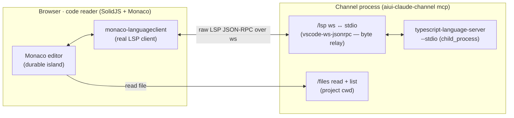

# Code Reader — an LSP-backed reading, navigation, and walkthrough surface

**Status:** proposal. A design to react to, not a spec to implement. Lives under `docs/proposals/`
(like `archive/`, readable on GitHub, not part of the docs-site nav).

## The gap

The aiui cockpit today lets a human and an agent talk *about the running UI* — point at pixels,
speak "make **this** wider," and watch the transcript. What's missing is the **code**. You can see
the app and the conversation, but not what the agent is actually reading and changing.

This proposal adds the code half and closes a loop: **code ↔ UI ↔ running client**, all legible as
the system moves. The centerpiece interaction is the same deictic gesture the overlay already
supports — *point and speak* — but the thing you point at is **source**: select code, speak what you
want it to do, and it feeds the existing prompt-lowering pipeline.

It is deliberately **three tiers**, buildable and useful in order:

1. **The LSP-backed code reader** — a read-only, Monaco-based reader that talks to a *real* language
   server. Navigate by definition / references / symbol, jump and jump back, fold, syntax-highlight.
   A power tool for a senior developer, not an IDE. *This is the hard, load-bearing tier.*
2. **Integration into prompt-building** — select code (across files), speak, watch the prompt
   preview assemble, send. Reuses the whole intent pipeline.
3. **AI-authored guided tours** — an MCP tool the agent calls to build a *walkthrough*: an ordered
   list of `(file, range, prose, optional narration, optional diff)` steps the human clicks through
   while the agent explains a feature or a change. A generic "code overview" feature; the AI is one
   author.

Two ideas carry the whole design: **the LSP is proxied, never dumbed down** (Tier 1, §"No veneer"),
and **Monaco is a durable imperative island, not a field of reactive cells** (Tier 1, §"Monaco and
the Viz principles"). Everything else follows from those two.

---

## Tier 1 — the LSP-backed code reader (the golden path)

The goal, stated as the bar to clear: a **read-only, web-based code reader that does not reinvent an
IDE but is greedy enough to satisfy a senior developer who wants power tools.** Reading and moving,
fast; not editing.

### What it does (v1 scope)

- **Render**: syntax highlighting + code folding, from Monaco. Multiple files, a tab/history strip.
- **Navigate (read-only LSP)**: go-to-definition, find-references (symbol usages), hover/type-info,
  a document-symbol **outline + breadcrumb**, project-wide **symbol search**, and **jump-back /
  jump-forward** across a navigation history stack. This is "let a person move through the codebase
  quickly" — the core value.
- **Not in scope for _this_ design**: editing, refactors, run/debug, terminals. If it feels like an
  IDE feature, it's out unless it directly serves *reading*.

### A sibling, not a feature: the read-only source-control / Git reader

Source control is the one thing worth calling out explicitly so it doesn't confuse the scope above.
A **read-only Git reader** has high, honest value and is squarely read-only: read a `git log`, read a
commit message, blame a line, and — usefully — **select text out of a diff or a commit message to
talk about it**, exactly like selecting code here. So it is *not* being dismissed; it is being
**deferred as its own design exercise**.

The reason it's a sibling rather than a Tier: it is *slightly orthogonal*. LSP has nothing to say
about history, refs, blame, or diffs — that's a different model with a different backend (Git, not a
language server). It **composes** with this reader (shares the shell, the selection→compose path of
§Tier 2, and the diff rendering of §Tier 3) but owns its own data. Treat it as a future companion
proposal (`docs/proposals/source-control-reader.md`) rather than scope creep here.

### No veneer: proxy the LSP, don't reinterpret it

The constraint is explicit: **the browser talks LSP directly to a real language server; the channel
must not dumb it down.** A browser can't open a stdio pipe to a subprocess, so *something* sits
between — the question is only *what*:

- **A dumb byte relay (what we build).** The channel spawns the real language server
  (`typescript-language-server --stdio`, which wraps `tsserver` and speaks genuine LSP) in the
  project cwd. A new `/lsp` WebSocket relays the **exact LSP JSON-RPC** both ways — `Content-Length`
  framing ↔ ws messages, via the standard `vscode-ws-jsonrpc` shim. The browser runs a **real LSP
  client** (`monaco-languageclient`) that speaks genuine `initialize`, `textDocument/definition`,
  `.../references`, `.../hover`, `.../documentSymbol`, `.../foldingRange`, `.../semanticTokens`,
  `workspace/symbol`, and receives real `publishDiagnostics`. **Nothing in the middle understands or
  rewrites LSP semantics.**
- **A semantic veneer (what we do *not* build).** A hand-rolled `/definition?file=…` endpoint that
  internally calls tsserver and returns a simplified shape. This is exactly the thing to avoid.

So the constraint is honored precisely: end-to-end LSP against a server running under the project's
real `tsconfig` — real project semantics, not a stub. The only added element is transport plumbing,
which is unavoidable and is not a veneer.



**Home (survey-confirmed).** The `/lsp` proxy and the file endpoints belong in the **channel
process** — the one resident, cwd-aware, long-lived process in the system. It already serves
`/health`, `/ws`, `/tools`, `/debug` and already demonstrates the dual-`WebSocketServer` `noServer`
routing that a `/lsp` endpoint copies. A new sibling module (`lsp.ts`, parallel to `page-tools.ts`)
spawns the server with `child_process.spawn` and manages its lifetime. One server per language,
keyed by file extension; **TS/JS first** (this repo), others later via a registry. Loopback-only, no
auth, same posture as the rest.

**Read-only document model.** The reader fetches file content from a channel `/files` endpoint and
opens it in the LSP with `didOpen`. There are no user edits, so no `didChange` from typing. When the
agent changes a file on disk (below), we re-`didOpen` the new content and notify the server via
`workspace/didChangeWatchedFiles`, so diagnostics and the index stay correct.

### Monaco and the Viz principles: a durable imperative island

You flagged the real tension: Tier 1 *should* be built with the
[Viz package](../guide/frontend-for-agents) principles, **but** Monaco is a heavyweight that manages
its own state its own way — so we should **not** make every piece of its state a reactive cell. That
instinct is exactly right, and the Viz vocabulary already has the name for it: the
**durable/disposable line**.

Monaco is a **durable imperative island** — the same category as the demo's WebGL context or its
running worker. Concretely:

| Viz principle | How the reader applies it |
| --- | --- |
| **`durable(key, create)`** — create-or-adopt across HMR | The Monaco instance, its text models, view state (cursor, folds, scroll), and the LSP client live in `durable("code-reader/monaco", …)`. A code edit to the *reader's own* modules rebuilds the SolidJS shell and adopts the same Monaco — you don't lose your place while iterating on the reader. |
| **Durable vs disposable** | **Durable:** Monaco + models + view state + LSP connection + nav history + the open walkthrough. **Disposable:** the SolidJS chrome around it (tabs, outline panel, status, command palette) — rebuilt freely from the durable roots. |
| **Cells at the coarse edges only** | The reactive/cell layer wraps a *thin* interface: `currentFile`, `currentSelection`, `lspStatus`, `diagnostics`, `navHistory`, `activeWalkthroughStep`. Cells drive **commands into** Monaco (open file, reveal range, apply decorations) and observe **coarse events out** (selection changed, cursor moved to a new symbol). **Monaco's per-keystroke / per-fold / per-scroll state never becomes a cell.** |
| **Tool surface (`agentToolkit`)** | The reader dogfoods its own agent tools under a namespace (e.g. `__aiuiCode`): `open_file`, `reveal`, `goto_definition`, `find_references`, `start_walkthrough`, plus a `report()` snapshot. Via the overlay bridge these become `page_tools_*` MCP tools, so the agent can drive the reader (and verify Tier 3). |
| **Legibility (`data-source-loc`)** | The reader is the *native* producer of `file:line:col`: a Monaco selection **is** a source location. It closes the loop the overlay opened (screenshot-rect → `file:line`) — see [code ↔ UI](#code-ui-the-loop-that-motivates-all-of-this). |

The rule of thumb: **treat Monaco as an appliance with a remote control.** SolidJS/cells own the
remote control (a small, declarative command+observation surface); Monaco owns the TV's internals.
This is what "not every single thing is a reactive cell" means, made precise.

### Framework & where it lives

- **A SolidJS 2.0 app**, built like the reference notebooks in `packages/aiui-demo` and on
  `@habemus-papadum/aiui-viz` — its own package (proposed: `@habemus-papadum/aiui-code`), its own
  Vite entry. It discovers the channel port exactly as the overlay does (`window.__AIUI__.port` /
  registry). *How it's presented* — a slide-in drawer over the app vs. a standalone tab — is its own
  question, answered in [Presenting the reader](#presenting-the-reader-slide-in-overlay-vs-a-synchronized-tab).
- **Split of concerns:** the heavy UI app is one package; the channel gains only *thin, cwd-bound
  services* (`/lsp`, `/files`, and Tier 3's walkthrough store). This mirrors the repo's existing
  "collection in one package, server services in another" split.

### Navigation: keyboard, modal, and voice

Reading fast is the whole point, so movement is first-class and multi-modal:

- **Command palette (string nav).** Fuzzy **file open** + fuzzy **symbol jump** (`workspace/symbol`).
  Cheap, no models, high value.
- **Modal / keystroke navigation (power-tool ambition).** A keyboard-first mode (jump to
  next/previous symbol, into/out of scope via the document-symbol tree, fold/unfold subtree, jump
  back/forward) so a senior dev never reaches for the mouse. Optional but squarely on the "greedy
  enough" side; it echoes the overlay's *armed keymap* ethos and reuses its typing-target guard so
  it never fights Monaco's own text widget.
- **Voice navigation.** "Go to the render function", "open `browser.ts`." This is NL → *navigation
  command* (distinct from NL → prompt). Reuse the channel's transcription-only realtime session
  (`realtime.ts`) — the survey confirms it's the right precedent; only the downstream step is new: a
  small **navigation resolver** that matches the transcript against document/`workspace/symbol`
  names (fuzzy first, an LLM disambiguation pass only when ambiguous). Traced via `withTracing`
  (voice → parsed command → resolved symbol → jump), so a mis-navigation is debuggable like any
  lowering.

### Keeping the reader live while the agent works

The reader is read-only, but the *files* change underneath it. LSP does **not** cleanly announce a
disk change for an open document (the client is assumed to own its content), so we don't rely on it.
Instead, generalize the channel's existing debounced watcher (`hot.ts`'s `watchChannelSource`,
`fs.watch(dir, {recursive:true})`) to the project, push a `file-changed` event, and the reader shows
a subtle "changed on disk" affordance → reload the model + `workspace/didChangeWatchedFiles`.
Diagnostics then refresh for free. (The *richer* "what did the agent change, and why" is Tier 3's
diff/walkthrough territory, and can additionally tail the session transcript JSONL — but that's not
needed for a correct, live reader.)

---

## Tier 2 — integration into prompt-building

This is where the reader stops being a standalone tool and becomes part of the intent infrastructure
— the moment you "switch from the UI to the code" while assembling a prompt.

The insight that makes this cheap: **a code selection is natively the deictic reference the pipeline
already consumes.** The overlay carries `SelectionSnapshot { text, sourceLoc, … }` where `sourceLoc`
is `file:line:col`, derived *backwards* from a rendered rectangle. In the reader you have it
*forwards*: the selection **is** `file:line:col-range` plus the exact excerpt.

So the two modes you described map onto existing machinery:

- **Navigate-by-voice mode** — Tier 1's voice navigation.
- **Select-and-compose mode** — select code region(s) → each becomes a deictic **chip** → speak or
  type what you want → the **prompt preview** assembles → **send** lowers and injects. Reused
  verbatim: the intent websocket + framing, the `IntentEvent` / `Engine` / `composeIntent` machinery
  (framework-free, built for new modalities), the transcriber tiers, the correction meta-loop,
  tracing, and the one-way MCP `notifications/claude/channel` injection.

New, and small:

- A **code-ref** attachment/event: `{ file, range, excerpt, symbol? }`, inlined into the lowered
  prompt as a fenced block tagged with `file:line` — the code analogue of how screenshots inline
  today.
- **Multi-file selection accumulation** into one turn (the overlay carries a single on-screen
  selection; the reader wants several, across files).
- A **`code-v1` `ChannelFormat`** (its own `StreamProcessor`), or — more likely — a thin extension
  of `intent-v1`, which already inlines located sources. Tracing comes free via `withTracing`.

The prompt preview is rendered in the reader's own SolidJS UI (a natural cell over the accumulating
selection set + transcript).

---

## Tier 3 — AI-authored guided tours (code walkthroughs)

A feature that is *not* AI-specific but is a perfect fit for it: a **code overview / walkthrough** —
an ordered narrative pinned to source.

### The data model (author-agnostic)

```ts
interface WalkthroughStep {
  file: string;                 // project-relative
  range: { start: Pos; end: Pos };  // highlighted in the reader
  title?: string;
  prose: string;                // pops up nicely when you arrive
  narration?: string;           // optional text to read aloud (TTS)
  diff?: { before: string; after: string } | UnifiedDiff;  // optional "what changed"
}
interface Walkthrough { id: string; title: string; steps: WalkthroughStep[]; createdBy?: string; }
```

The reader renders it as a **stepper**: click through steps (or ← / → keys), each reveals its range
in Monaco with a highlight, shows its prose in a nicely-placed popover, optionally **reads the
narration aloud**, and optionally shows a **before/after diff** for that location. A code walkthrough
you can *listen to* while it drives the editor for you.

### The AI as one author — an MCP tool

Expose walkthrough authoring as a **channel MCP tool** (registered alongside `channel_info` in
`tools.ts`): the agent calls `create_walkthrough({ title, steps })` — or streams steps — and the
walkthrough is stored in `.aiui-cache/walkthroughs/<id>.json` (project-local, same cache family as
traces). The reader lists/opens walkthroughs and can report "user is on step N" back, so a future
conversational agent can react. Ask *"explain how the new feature works in code"* → the agent
authors a tour → you walk it, narrated.

### Reuse

- **Narration audio** → the existing `speak.ts` TTS seam (the channel already does spoken acks).
- **Diffs** → the V4A patch renderer already in the shared `debug-ui` (`parsePatchLines`,
  `renderPatch`) — the same pink/green rendering the correction loop uses.
- **Storage & tracing** → the `.aiui-cache` conventions and `withTracing`.

Because the data model is author-agnostic, the same stepper serves a *human*-written onboarding tour,
a *release-notes* tour generated from a commit range, or an *"explain what you just did"* tour after
an agent turn — the last being the natural marriage of Tier 3 with the change-awareness in Tier 1.

---

## Code ↔ UI: the loop that motivates all of this

The overlay already maps a screenshot rectangle → components → `file:line` (`locateComponents`,
`data-source-loc`). The reader closes the loop:

- **Jump to a source location *from the running web app* — a first-class capability.** While you're
  in the UI, point at a component (a click, a DOM selection, or the end of a screenshot drag) and
  jump straight to that `file:line:col` in the reader. This is the primary trigger for the reader
  sliding in (below): you're looking at the app, you see something, and the code that authored it is
  one gesture away. Mechanically it's the reverse of a code selection — the same `data-source-loc`
  stamp read from the DOM instead of produced by the editor — plus a `reveal(file, range)` command
  into the reader.
- From a code selection → **highlight the rendered component** in the app (the other direction of the
  same `data-source-loc` lookup).

That is the "look at the code **and** the UI **and** the client, and point across them" cockpit — the
thing the current tool can't do. Not required for Tier 1, but the payoff that makes the reader more
than a mini-IDE.

## Presenting the reader: slide-in overlay vs. a synchronized tab

How does the reader sit next to the app you're developing? Two shapes, and they serve different
moments — the recommendation is to support **both with one reader app**.

**A. Slide-in overlay (recommended for the "switch to code mid-prompt" moment).** The dev overlay
injects the reader as a **full web app in an iframe drawer** that slides in over the app page —
literally one application overlaid on another. This is the natural home for the app→code jump above:
point at a component and the drawer slides in already at that `file:line`. Prompt-state sync is
**free** here: the reader is a child of the overlay's host, so a code selection `postMessage`s up to
the overlay and joins the *same* compose session as DOM/screenshot selections — one intent
websocket, one prompt preview, nothing to reconcile. Costs: an iframe boundary, Monaco loading
inside the app's tab, and z-index/focus/keymap arbitration with the app (the overlay already solves
the last one with its armed-keymap + typing-target guard).

**B. Standalone / synchronized tab (recommended for deep reading and walkthroughs).** The reader is
its own full-screen tab (`aiui open`), unconstrained by the app's layout — better for long reading
sessions, navigation, and narrated walkthroughs. The catch is exactly the one you named: if
prompt-building spans two tabs, the **compose draft must synchronize**. The two surfaces live on
different origins (app dev-server vs. reader), so `BroadcastChannel` won't reach across them — the
**channel is the sync hub**. Give the channel a small per-session **compose draft** (the accumulating
selections + the in-progress transcript) that both the overlay and the reader subscribe to and append
to over their existing websockets. The draft is server-side state the two surfaces mirror — the same
"durable state lives off the browser, the client is stateless" posture the overlay already takes.

**Recommendation.** One reader app, two host contexts: the iframe drawer for integrated
prompt-building (sync via `postMessage` to the parent overlay), the standalone tab for reading +
walkthroughs (sync via the channel-hosted compose draft). The channel-hosted draft is the more
general mechanism, so if we build it first, the drawer can use it too and `postMessage` becomes an
optimization rather than a requirement. New tab vs. drawer then stops being an either/or — it's the
same app and the same draft, presented in whichever host fits the moment.

---

## Reuse map (exists → new)

**Reuse (already built):** intent websocket + binary framing · `SelectionSnapshot` / chip concept ·
`IntentEvent` / `Engine` / `composeIntent` · transcriber tiers + correction loop · TTS (`speak.ts`) ·
tracing + `withTracing` + the shared `debug-ui` (incl. patch/diff rendering) · the page-tools bridge
+ `agentToolkit` · the `durable()` registry + cell model from `aiui-viz` · the `data-source-loc` /
`LocatedComponent` vocabulary · one-way MCP injection.

**New:** the Monaco reader surface (SolidJS app, new package) · a real LSP client in the browser ·
the `/lsp` ws↔stdio proxy + language-server subprocess management · channel `/files` list+read
endpoints · project file watcher · the NL→navigation resolver · the `code-ref` attachment + `code-v1`
lowering · the walkthrough data model + store + `create_walkthrough` MCP tool + the reader's stepper.

## Phasing

- **P0 — spike:** channel serves file list + contents; a Monaco read-only view renders a file with
  syntax + folding (no LSP yet). Prove the surface, the durable-island wiring, and where it embeds.
- **P1 — Tier 1 core:** `/lsp` proxy + `typescript-language-server` + `monaco-languageclient`;
  definition / references / hover / outline / folding / diagnostics; command-palette file+symbol
  search; jump history. *This alone delivers "I can finally read what the agent is doing."*
- **P1.5 — power-tool nav:** modal keystroke navigation + voice navigation.
- **P2 — Tier 2:** code selection → chip → reuse voice + correction → `code-v1` lowering → inject;
  multi-file accumulation; the prompt preview. (Standalone tab first; the slide-in drawer + the
  channel-hosted compose-draft sync is the integrated form — see *Presenting the reader*.)
- **P3 — Tier 3:** the walkthrough model + `create_walkthrough` MCP tool + the reader's narrated,
  diff-aware stepper.
- **P4 — the loop:** the app→code jump + the slide-in drawer; bidirectional code ↔ UI linking; the
  file watcher's "live" affordance; the "explain what you just did" tour.

## Open questions / decisions

1. **Monaco vs CodeMirror.** Proposal assumes **Monaco** (your lean, and `monaco-languageclient` is
   the most turnkey path to *undiluted* LSP — which is the point). CodeMirror 6 is lighter and its
   modal-UX story is nicer, but its LSP client needs more glue. If the bundle weight of Monaco
   bothers us more than the LSP glue of CM6, that's the only reason to revisit.
2. **New package vs a pane in an existing surface.** Proposal: a new `aiui-code` SolidJS app,
   standalone + embeddable. Alternative: a workbench/DevTools-panel pane (cramped for a full reader).
3. **Language scope for v1.** TS/JS only (obvious here) vs a multi-server registry from the start.
4. **Presentation & prompt-state sync.** Proposed answer in
   [Presenting the reader](#presenting-the-reader-slide-in-overlay-vs-a-synchronized-tab): one app,
   both a slide-in drawer and a standalone tab. The remaining sub-decision is *ordering* — build the
   general channel-hosted **compose draft** first (works for both hosts), or the cheaper
   `postMessage` drawer first (works only overlaid).
5. **The source-control / Git reader** — a deferred companion proposal (see the sibling note under
   Tier 1). Open: when we write it, and how much of this reader's shell it reuses vs. owns.

## Risks / watch-items

- **Monaco weight vs the repo's lightweight ethos** — mitigated by lazy-loading (the reader is a
  developer cockpit, not on the app's critical path) and by keeping it a durable island rather than
  threading it through the reactive graph.
- **`monaco-languageclient` / `vscode-ws-jsonrpc` version coupling** — pin them; they track VS Code's
  protocol versions and can churn.
- **Language-server lifecycle** — one long-lived process per session, killed with the channel; guard
  against orphans and re-spawn on crash (mirror `hot.ts`'s resilience posture).
- **"Directly talk to LSP" expectation** — the `/lsp` relay is byte-piping, documented as such, so
  it reads as honoring the constraint, not sneaking a veneer in.
- **Walkthrough diffs going stale** — a step's diff is a snapshot; if the file moved on, reconcile
  against current content or mark the step drifted (don't silently show a diff that no longer applies).
