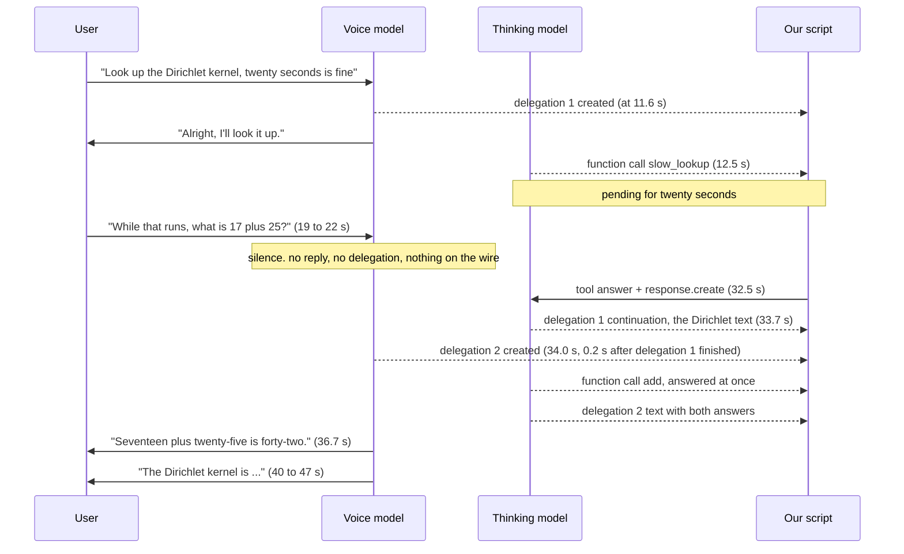
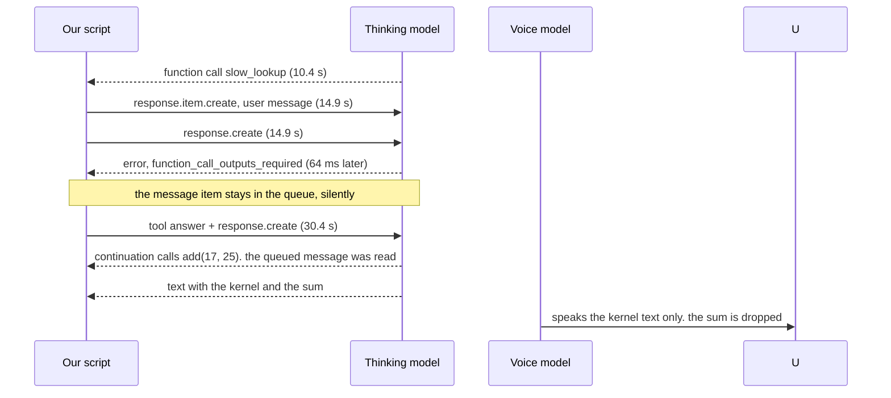

# What happens when the user speaks while a hosted task is running

Measured on 2026-10-10 against the real OpenAI Live API, hosted mode, thinking model `gpt-6-sol`.
Read [the primer](./live-primer.md) first if any word here is unfamiliar.

## 1. The question

In hosted mode the voice model hands each request to a thinking model that OpenAI runs. Suppose
that thinking model has asked our app to run a slow tool, and the tool takes twenty seconds. At
about second six, the user speaks again. We wanted to know:

1. Does the voice model hand the new words over as a second delegation?
2. If so, does the second piece of work run beside the first, or wait for it?
3. Is the first piece of work cancelled or changed by the new words?
4. What does the voice model say to the user in the meantime, and when?
5. If the new words change the request ("actually, look up X instead"), does anything different happen?

We also tested the typed path: instead of speaking, our app queues a text message for the
thinking model while the slow tool is still running.

## 2. How we measured

No microphone and no browser. A script plays synthesized speech into a real session, exactly as a
person would, and records every event with a timestamp. The method is described in
[Testing patterns for realtime vendor APIs](./live-api-testing.md). The script is the `overlap`,
`redirect`, `typed` and `hold` scenarios in `exploration/live-probe/probe.mts`.

The setup, in every run:

- The thinking model has two tools. `slow_lookup` is answered by our script only after twenty
  seconds. `add` is answered at once.
- First sentence: "Please look up the Dirichlet kernel; it is fine if that takes about twenty seconds."
- About six to eight seconds after the voice model hands that off, a second sentence.
- The script keeps serving tool calls until everything is answered and the voice has been quiet for
  a few seconds.

Which thinking models the account can use in hosted mode was checked first. All four GPT-6 ids the
key lists were accepted by the session: `gpt-6-astra`, `gpt-6-sol`, `gpt-6-luna`, `gpt-6.1-sol`.
Every run below used `gpt-6-sol` with low reasoning effort.

## 3. What happened

### Run 1, a second question while the first task runs

Second sentence: "While that runs, what is seventeen plus twenty-five?"

In plain words. The voice model heard the second question and then **said nothing for twelve
seconds**. It did not hand the question over. It did not say "hang on". The moment the first
task's tool answer came back and the thinking model finished, the voice model created the second
delegation, got the sum, and spoke both answers. The quick question was answered sixteen seconds
after it was asked.

Two details worth noticing:

- The second delegation's `offset_ms` points back at the end of the second sentence. The stamp is
  retroactive. The hand-off was decided late, but recorded as if it happened on time.
- The thinking model's reply for delegation 2 restated the Dirichlet answer as well. The two
  delegations share one conversation, so the second one knew about the first.

### Run 2, the user changes the request

Second sentence: "Actually, change that: look up the Fejér kernel instead." (Run twice; the
second time with "Poisson kernel", which the transcriber hears correctly.)

The same pattern. Silence after the redirect. The first lookup was still answered by our script at
twenty seconds, and the thinking model still produced the Dirichlet text. Then, a fraction of a
second later, delegation 2 was created and asked for a second `slow_lookup`, this time for the new
kernel. Twenty seconds after that, the new result arrived and was spoken.

What the voice model did with the first result: **it did not speak it.** After the redirect it
said "I'm still looking that up" and waited for the new one. Nothing was cancelled. The first
piece of work ran to the end, and its text was simply never read aloud.

### Run 3, a typed message instead of speech

At six seconds, with the slow tool still pending, our script sent the two-event pair from
OpenAI's guide: `response.item.create` with a user message "Also tell me seventeen plus
twenty-five", then `response.create`.

In plain words. You cannot ask the thinking model to run while it is waiting for a tool answer.
The request is refused at once, with the error `function_call_outputs_required`. But the message
you queued is **not lost**. It sat in the queue and was used the next time the thinking model ran,
which was right after the tool answer. No second delegation was created, because the voice model
never knew about the typed message. And when the thinking model's text came back with both the
kernel and the sum, the voice model spoke the kernel part and left the sum out.

### Run 4, is the voice model frozen, or only holding the user's words?

Same slow task. At six seconds, instead of new speech, our script sent a **say** append with a
null delegation id: "The lookup is still running; about fifteen more seconds." Then, at twenty
seconds, the user asked the quick question.

The voice model spoke our line **0.6 seconds** after we sent it, while the tool call was still
pending. So it is not frozen. It talks to us. What it holds is specifically the processing of
**new user speech** and the delegation that speech would create. The quick question was again
held until the slow task finished, twelve seconds later. And the voice model then said "I'm still
waiting on that lookup" 0.6 seconds **after** the lookup had in fact completed. It speaks from its
own state, which lags the backend.

## 4. What we learned

1. **New speech is held, not ignored and not folded in.** While a hosted task has a pending tool
   call, the voice model does not create a delegation for new speech. It creates it 0.2 to 0.4
   seconds after the earlier task's thinking model goes idle. In our runs that was 7 to 12 seconds
   after the user finished speaking.
2. **Strictly one task at a time.** The thinking model's conversation is one chain. Each
   delegation's first response points at the previous delegation's last response. Events for two
   delegations never interleave.
3. **Nothing is cancelled and nothing is steered.** In five sessions there was no incomplete or
   failed response and no event type beyond the normal lifecycle. A redirect does not stop the
   first task. The first result is computed and then not spoken.
4. **The voice model is silent about held speech.** No "one moment", no acknowledgement. The user
   hears nothing until the held request is finally served. Our own say appends are spoken within
   a second, so the silence is a choice the voice model makes, not a stall.
5. **Typed messages queue silently and survive a refused run.** `response.item.create` has no
   acknowledgement. `response.create` is refused while a call is pending. The queued item is
   consumed on the next run. The voice model does not know a typed message exists, and may drop
   the part of the answer that came from it.
6. **Delegation can fire before the user finishes the sentence.** In one run the hand-off came
   3.2 seconds before the audio ended, right after the key words.
7. **The thinking model's text is read aloud as written.** It returned LaTeX, and the voice
   model read the backslashes. The hosted instructions must forbid markup.
8. **Every `response.completed` event carried an empty `output` list.** The real content arrives
   only in the item-done and text-delta events before it. OpenAI's guide warns about this, and
   the data confirms it, fifteen out of fifteen times.
9. **The first response of every session points at a response we never saw.** OpenAI seeds the
   hosted conversation with a hidden starting response.

Timings, for reference:

| Quantity | Measured |
| --- | --- |
| Delegation created to first function call | 0.7 to 1.5 s |
| Tool answer to the continuation's completion | 1.0 to 3.0 s |
| Second delegation after the first task's completion | 0.2 to 0.4 s |
| Held question answered after it was asked | 12 to 16 s |
| A say append to speech | 0.6 s |
| Refusal of `response.create` with a call pending | 64 ms |
| Reasoning tokens per response, low effort | 0 to 69 |

## 5. What this means for our code

Our session engine, in `packages/aiui-live/src/session.ts`, handles hosted mode by opening one
task per delegation and answering function calls itself. The shape matches the wire. Four things
do not:

1. **Tasks are marked done too early.** The engine decides a task is finished when a
   `response.completed` event has no function call in its `output` list. That list is always
   empty, so the task is marked done about a second after the delegation, while the tool is still
   running. For the same reason the task never records the thinking model's answer text.
2. **"This task is blocking the conversation" is not represented.** The wire never says so. It
   must be derived locally from "we owe a tool answer".
3. **Typed input sends `response.create` unconditionally.** With a call pending it gets the
   refusal. The engine should hold the run request until nothing is pending, or treat that error
   as expected.
4. **Only the first response id of a delegation is recorded.** Continuations create new ids under
   the same delegation, two or three per task in these runs.

## 6. What we still do not know

- Whether the voice model would behave differently if the thinking model were fast and the hold
  were short. Every run here had a twenty-second tool.
- What a failed or incomplete hosted response looks like on this wire. None occurred.
- Whether a queued item survives across delegations if no `response.create` ever follows it.
- Anything about images in hosted mode. The guide says they go through the same queue; nothing
  was tried.
- Whether the final redirected answer was spoken in the Fejér run. The script closed the session
  too early that time. The repeat with "Poisson kernel" did speak it.

## 7. Where the data is

All under `exploration/live-probe/out/`: `overlap`, `redirect`, `redirect-poisson-kernel`,
`typed` and `hold`, each as a `.jsonl` event log (every non-audio event, both directions, with
seconds since the socket opened) and a `.wav` of what the voice model said. The model acceptance
checks are `models6-*.jsonl`. The scenarios themselves are in `exploration/live-probe/probe.mts`,
with `PROBE_BACKEND`, `PROBE_SLOW_MS` and `PROBE_REDIRECT_TOPIC` as environment overrides.
