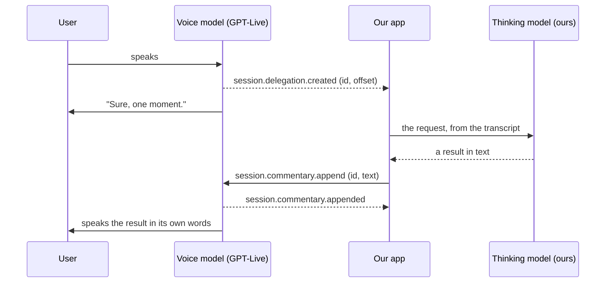
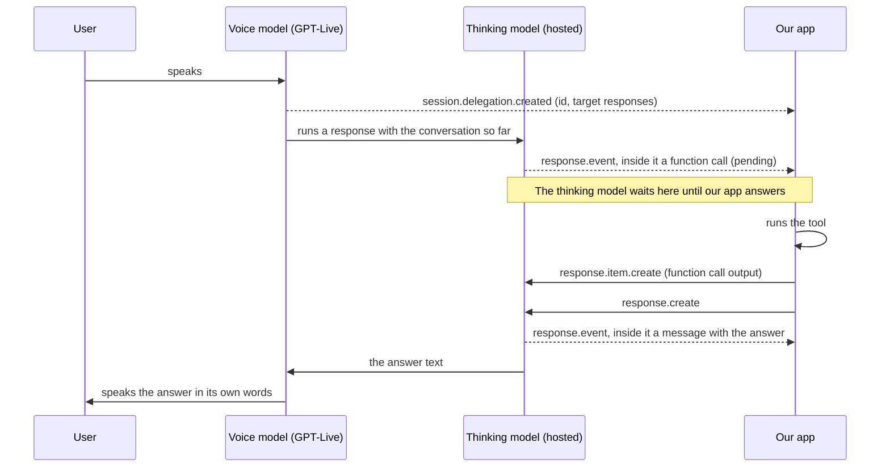
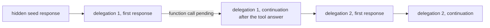

# The two-model voice loop, in plain words

This is the first of three short documents. It explains the ideas and the words. The other two
report what we measured:

- [What happens when the user speaks while a hosted task is running](./live-hosted-overlap-findings.md)
- [What happens when a message is sent to Claude Code in the middle of a turn](./claude-sdk-midturn-findings.md)

You do not need to know OpenAI's APIs to read these. Every term is defined the first time it
appears. If a word is not defined here, it is not needed.

## 1. Why we care

Our voice front end lets a person talk to an app. The person says something, and a model answers
out loud. Some requests are quick. Some take a long time, because a model has to think, read code,
or call a slow service.

The subtle part is what happens **while the slow work is running**. People keep talking. They add
a detail. They change their mind. They ask something else. We needed to know, exactly, what the
system does with those words. Are they ignored? Held until the work finishes? Folded into the
work? Each answer leads to a different design, so guessing was not acceptable.

## 2. The cast

There are four parties in every conversation.

| Party | What it is | What it does |
| --- | --- | --- |
| **The user** | A person with a microphone | Talks, listens, interrupts |
| **The voice model** | OpenAI's `gpt-live-1`, which OpenAI calls **GPT-Live** | Hears the audio, talks back at once, never does long work |
| **The thinking model** | A separate model that does the real work | Reads, reasons, calls tools, produces an answer in text |
| **Our app** | Our code, in the browser or on a server | Sits between the other three, runs the app's tools, keeps the records |

The key idea: **the voice model never thinks hard.** When a request needs real work, the voice
model hands it off. That hand-off is called a **delegation**. The voice model keeps talking to the
user while the work runs, and reads the result aloud when it arrives.

## 3. Words we use

**Session.** One open connection between our app and the voice model, like one phone call. It
starts with a `session.start` message and ends with `session.closed`. Everything below happens
inside a session.

**Event.** A small JSON message sent over the connection, in either direction. Every event has a
`type` field, such as `session.delegation.created`. When this document says "the voice model sends
X", it means an event of type X arrives at our app.

**Transcript.** The words, as text. The voice model streams two transcripts: what the user said
(`session.input_transcript.delta`) and what the voice model said (`session.output_transcript.delta`).
Each fragment carries a start and end time in milliseconds. A fragment is not a full sentence,
and transcripts can contain mistakes.

**Delegation.** The voice model's hand-off of a request to the thinking model. The event is
`session.delegation.created`. It carries an id, a **target** (who does the work, see the two modes
below), and `offset_ms`, the point in the user's audio where the voice model decided to hand off.
The event carries **no text**. Our app has to work out what was asked from the transcript.

**The two modes.** When a session starts, we choose once who the thinking model is. The choice is
frozen for the whole session.

- **Client mode.** Our app is the thinking model, or runs one. Our code receives each delegation
  and answers it however it likes: a small model we call ourselves, Claude Code on a server, or a
  canned reply in a test.
- **Hosted mode.** OpenAI runs the thinking model for us, using its Responses API (next term). We
  only run the app's own tools when asked. OpenAI calls this "Responses delegation". We say
  "hosted" because the thinking happens on OpenAI's side.

**The Responses API.** OpenAI's ordinary request-and-answer API for text models. You send a list
of **items** and get back a **response** that contains new items. The items you need to know:

- a **message**: text from the user or from the model;
- a **function call**: the model asking our app to run a named tool with JSON arguments;
- a **function call output**: our app's answer to that call;
- an **image**: a picture for the model to look at.

Every response has an id. To continue a conversation, you send only the new items plus the
previous response's id. The server remembers the rest. So a conversation with the thinking model
is one **chain** of responses, each pointing at the one before.

**Pending function call.** When the thinking model asks our app to run a tool, the conversation
stops until our app answers. While it waits, the call is "pending". Nothing else can happen in
that conversation until the answer arrives. This single fact explains most of what we measured.

**Item create and response create.** In hosted mode, our app talks to the thinking model through
two events:

- `response.item.create` puts one item into the thinking model's conversation. A user message, a
  tool answer, an image. It is a queue: the item waits there. There is no acknowledgement.
- `response.create` asks the thinking model to run, using everything queued so far. It is refused
  if a function call is still pending.

Answering a tool call is therefore two events in a row: create the output item, then create a
response.

**The response event envelope.** In hosted mode we do not see the Responses API directly. Every
Responses event arrives inside an outer event of type `response.event`, with the delegation id on
the outside and the real event on the inside. Our app reads the outer id to know which task the
inner event belongs to.

**The three appends.** These are how our app talks **to the voice model**. Each one carries text
and a delegation id, or `null` to mean "for the whole session". Each one is acknowledged by an
`appended` event.

| Event | Our name | What the voice model does with it |
| --- | --- | --- |
| `session.commentary.append` | **say** | Speaks it, in its own words |
| `session.thinking.append` | **note** | Keeps it as a quiet fact, says nothing unless asked |
| `session.instructions.append` | **steer** | Treats it as a directive about how to behave next; may interrupt its own speech |

**Steering the voice versus steering the thinking.** The three appends steer the voice model.
They do not reach the thinking model. Changing what the thinking model is doing in the middle of
its work is a different feature called **mid-turn steering**. It exists only on the direct
Responses API, over its own WebSocket connection, with OpenAI's GPT-6 models, through an event
called `response.steer`. The Live API does not expose it. In hosted mode the only way to reach the
thinking model is the queue above.

## 4. The loop, drawn

### Client mode: our app does the thinking

### Hosted mode: OpenAI does the thinking, we run the tools

### One chain, one task at a time

In hosted mode the thinking model's conversation is a single chain. Each delegation adds a link.
Each `response.create` adds a link. Nothing runs beside the chain.

## 5. The question we set out to answer

Picture the hosted loop above. The thinking model has asked for a slow tool, and our app is
running it. It will take twenty seconds. At second six, the user says something else.

Three things could happen to those words:

1. **Ignored.** The voice model hears them, but nothing reaches the thinking model.
2. **Held.** The words are kept, and handed over only when the current work is done.
3. **Folded in.** The thinking model is told right away and adjusts its current work.

The same question applies when the thinking model is Claude Code on a server, which has its own
rules about messages that arrive during a turn. The two findings documents answer the question for
each case, with the timings we recorded.

## 6. Where the real code is

- The event names and shapes, as our code types them: `packages/aiui-live/src/protocol.ts`.
- The session engine that opens a task per delegation and answers function calls:
  `packages/aiui-live/src/session.ts`.
- The Claude Code thinking model for client mode: `packages/aiui-live/src/claude/index.ts`.
- OpenAI's own guides, readable as Markdown by adding `.md` to the URL:
  `https://developers.openai.com/api/docs/guides/live-delegation` and `/guides/steering`.
- How we run these measurements without a microphone: [Testing patterns for realtime vendor APIs](./live-api-testing.md).
