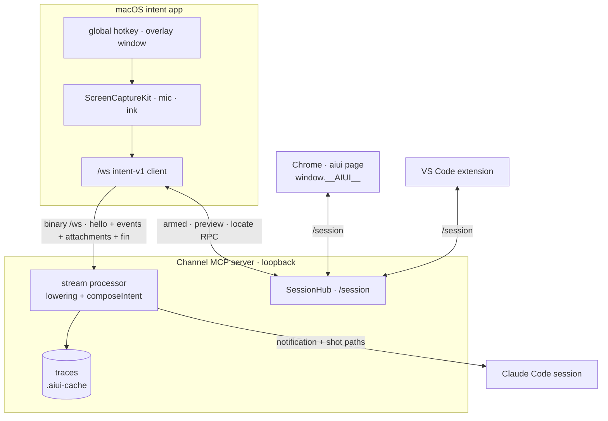

# A macOS Intent App (design notes)

Status: **exploratory** — research and a design sketch, not committed design (July 2026).
Companion to the concept pages [The Web Intent Tool](../guide/web-intent-tool.md),
[Multi-View Sessions](../guide/multi-view-sessions.md), and [The Channel](../guide/channel.md),
which document what *is*.

## The ask

Today intent is collected by a widget **inside the web app you are developing**
([`mountIntentTool`](../guide/intent-overlay.md)). Could the same turn — dictation, ink,
screenshots, selections — be collected by a **native macOS app** instead, so that the thing you
screenshot and talk about is *anything on your screen*, not just the page the overlay lives in?

Sub-questions, in the order they were asked:

1. Would it be Electron, "Electron without a window", or something native?
2. On launch it should pop up a picker: *which channel — which Claude session — am I feeding?*
3. Could a screenshot of a **Chrome window** still recover source-code locations, the way an
   in-page shot does?
4. Once attached, would it "just look like another session" to the rest of aiui (e.g. VS Code)?

## The short answer

**Yes, and it is smaller than it looks** — because almost none of the interesting machinery lives
in the browser. Lowering, transcription, composition, tracing and prompt delivery all live in the
[channel](../guide/channel.md), a local server the app can simply dial. What the overlay actually
contributes is *collection*: a keymap, an ink layer, a capture path, and ~40 lines of framing.

Five findings shape the design:

- **The channel is already a general intent server.** `POST /prompt`, the binary `/ws` protocol,
  and the `/session` bus are transport, not browser API. Nothing on the wire assumes a page.
- **The repo has already made this bet once.** `aiui-code` / `aiui-code-server` /
  `aiui-code-protocol` — an in-browser Monaco code reader and its channel sidecar — were deleted in
  `cd10f44` *"in favor of the editor you actually use"*, replaced by an external VS Code process
  contributing over `POST /session/publish`. The message types and the lowering did not change:
  *"a contributor is a contributor."* A native collector is the second inhabitant of that vacated
  niche, and the contract it needs is unchanged and live.
- **The session picker already exists.** The registry (`~/.cache/aiui/mcp/<pid>.json`) plus
  `claude agents --json --all` is exactly the "which Claude session?" popup, and
  `serverLabel()` in `packages/aiui-claude-channel/src/select.ts` already renders that row.
- **`locateComponents(rect)` is a pure function over a viewport rectangle.** The screenshot →
  source-location attribution is not welded to the capture. If a native app can hand a page a rect
  in *its* coordinates, it gets the same `<element source="src/ui/plot.tsx:20">` metadata an
  in-page shot gets. Question 3 is a *yes*.
- **The session browser is confined to capturing its own tab.** `launchSessionBrowser` passes
  `--auto-accept-this-tab-capture` and deliberately *not* `--use-fake-ui-for-media-stream`,
  because that flag hijacks the `getDisplayMedia` picker into selecting the **entire screen** —
  which needs a macOS Screen Recording grant the Chrome-for-Testing binary does not have, so every
  capture dies with `NotReadableError` (a paid-for finding, recorded in the launch-args comment in
  `packages/aiui-util/src/browser.ts`). A user *could* grant CfT that permission by hand, but
  even then a page-scoped overlay can only annotate what it can hit-test: the DOM. **Screen-scoped
  capture is the thing the current architecture is not shaped to do.** That is the hole this app
  fills.

Recommendation, up front: **native Swift**, with the one genuinely shared pure function
(`composeIntent`) either pushed down into the channel or run in **JavaScriptCore** — which ships
with macOS. Not Electron. The reasoning is in [Runtime](#runtime-swift-electron-or-electron-without-a-window).

## The reframe: page-scoped vs screen-scoped intent clients

The overlay is a **page-scoped** intent client. Its coordinate system, its capture surface, its
DOM contract, and its identity (`meta.tab` = `location.href` + `document.title`) all coincide,
for free, because it lives inside the thing it observes.

A macOS app is a **screen-scoped** intent client. It gains reach and loses that coincidence:

| | Overlay (page-scoped) | macOS app (screen-scoped) |
| --- | --- | --- |
| Capture surface | `getDisplayMedia({preferCurrentTab})`, cropped | `SCScreenshotManager` over any display/window |
| What it can shoot | its own tab (see above) | Xcode, a terminal, Figma, a PDF, *and* the browser |
| Rect coordinates | viewport CSS px — free | global display points — must be mapped |
| Attribution | `locateComponents(rect)`, direct call | must ask whoever owns those pixels |
| Identity | `meta.tab` | app bundle id, window title, display |
| Owns the keyboard | while armed, inside the page | while armed, via a key overlay window |
| Screen Recording grant | not held by the session browser | required, and TCC-gated |

Everything downstream of the websocket — lowering, the trace, the `<screenshot>` block, the
notification into the session — is **unchanged**. This is the load-bearing observation: the app is
a new *collection* implementation against an existing contract, not a new pipeline.



## The wire contract a native client must honor

From `packages/aiui-claude-channel/src/{frame,channel,intent-v1}.ts`. Everything below is JSON or
raw bytes — no browser primitive appears anywhere.

**Framing.** Each client→server websocket frame is `u32be hdrLen | UTF-8 JSON header | raw payload`
(`frame.ts:150`). Server→client replies are JSON **text** frames of two species: per-frame acks
(no `kind` field) and out-of-band pushes (a `kind` field). Client→server frames **must be binary** —
a text frame is fatal, not ignored: the server replies `{ok:false, fatal:true}` and closes the
socket (`web.ts:416`).

**Hello.** `{"v":1,"kind":"hello","format":"intent-v1","meta":{…}}`, where `HelloMeta` is
`{tab?, source?, actor?, intent?}` (`frame.ts:62`). Every field is optional, and a client that
sends none still lowers — it just produces a prompt with no context preamble.

::: warning `meta.intent` is optional but not neutral
Omit it and `resolveIntent` defaults `tier` to `"standard"` (`intent-v1.ts:359`), which expands to
`transcriber: "openai"` — the **legacy REST whole-blob** transcription path, not the browser's live
default (`rapid`, streaming). A native client that sends no `meta.intent` silently gets no
`transcript-delta` pushes at all. **Always send the effective config.**
:::

**Events.** The turn is an append-only log of `IntentEvent`s
(`packages/aiui-dev-overlay/src/intent-pipeline/types.ts`): `thread-open`, `talk-start`,
`talk-end`, `stroke`, `ink-clear`, `shot`, `shot-drop`, `app-selection`, `code-selection`,
`transcript-delta`, `mode`, `note`, …

**Payloads.** A data frame's header names one of five `ChunkDescriptor` kinds (`frame.ts:104`):
`events` (JSON `IntentEvent[]`), `context` (a late `{selection?}` block, at most once, just before
fin), `attachment` (a whole blob — `shot_N` PNG, or `seg_N` as one complete audio segment),
`audio` (that same segment arriving as many PCM frames *while you talk*, in `seq` order), and
`video` (one sampled share frame). Raw bytes throughout, never base64.

**Fin.** A `data` frame with `fin:true`, **no chunk, empty payload**. The channel reuses its
speculative compose and pushes the prompt into the session. A turn that ends in
`thread-close{reason:"cancel"}`, composes to an empty prompt, or drops its socket before `fin`
sends **nothing** — that is an invariant (`intent-v1.ts:1402`).

**Server pushes.** Exactly four: `lowered` (server-produced events to merge — chiefly transcripts
the client did not compute), `lowered-prompt` (the final composed prompt, on fin), `speech` (TTS
acks), and a generic `error` with a coarse `source` and a remediation `detail`.

Two things a native host does **not** have to implement, which is the whole point: transcription
(the channel holds the OpenAI realtime session; the key never leaves it) and composition (the
channel folds the event log into the prompt).

### What a native client must get right

The wire is forgiving about *identity* and unforgiving about *timing*. Gathered from the source, in
rough order of how badly each bites:

- **`at` on every `IntentEvent` is wall-clock milliseconds**, by wire contract. Compose does
  absolute arithmetic across events (`POST_WINDOW_ANCHOR_GRACE_MS`, `MAX_DELTA_LAG_MS` in
  `engine.ts`) to slot each screenshot into the sentence you were speaking. A monotonic clock
  misplaces shots.
- **Emit `thread-open`.** `composeIntent` scopes its fold to events after the *last* one
  (`engine.ts:598`); without it, it folds the entire stream.
- **Send the `shot` event before its `attachment shot_N` bytes**, and flush `talk-end` promptly —
  it commits the upstream STT buffer, so don't hold it behind a batch debounce.
- **Streaming PCM is s16le mono @ 24 kHz** (`audio/pcm;rate=24000`, 120 ms frames —
  `multimodal/audio.ts:102`).
- **A whole-segment `attachment seg_N` stalls the entire connection.** `onAttachmentChunk` awaits
  the transcription round-trip and `handleFrame` serializes on a promise queue (`channel.ts:325`),
  so any `shot`, `talk-start`, or `fin` sent during that window queues behind it. It is the
  *simpler* v1 path (record the segment, upload one blob, no PCM plumbing) and it does work — but
  it is a stall, not a background task, and it forecloses streaming deltas. Prefer `audio` chunks
  with `tier: "rapid"` if the preview matters.

And one genuine gift, which changes the shape of v1: **a native client need not upload screenshot
bytes at all.** `applyShotPaths` (`intent-v1.ts:697`) only overwrites a shot's `path` when the
*server* holds a blob for that marker. If the app writes the PNG somewhere the agent can read and
sets `path` on the `shot` event itself, compose honors it — no attachment frame, no upload, no
round trip. A screen-scoped app already has a file on disk; it can simply say where.

### The one thing that leaks: the preview

The overlay's live preview is not pushed — it is computed client-side by `composeIntent(events)`,
imported from `@habemus-papadum/aiui-dev-overlay/intent-pipeline`. That module is the shared
compiler: **the channel imports the very same function** (`intent-v1.ts:57`). So a native client
that wants a live preview must either reimplement it or run it.

But look at what the channel already does. On every mutating batch it runs a *speculative* compose
and caches the result:

```ts
// intent-v1.ts — the speculative-compose cache
const recompose = (): void => {
  lastComposed = composeIntent(events, "replace", composeOptions);
  composedSeq = mutationSeq;
  trace?.record({ kind: "ir", label: "composed (speculative)", data: { … } });
};
```

`lastComposed` holds exactly the preview text, is refreshed on every event, is written to the
trace — and is then thrown away until `fin` reuses it. **Pushing it as a `lowered-preview` message
would make every non-browser client preview-capable for free**, at the cost of one message kind.
(Name it carefully: `preview` is already a *session-bus shared-state slot*. That is the `/session`
websocket; this would be a `/ws` push. Two different surfaces, and the doc would need to say so.)

Honest caveat: the code comments a deliberate invariant — *"speculation never sends, pushes, or
spends"*. A preview push amends the "pushes" clause. It still never sends into the session and
never spends a model call, so the spirit survives, but this is a real decision to make on purpose,
not a free lunch. It is the single highest-leverage change in this document: it converts "port the
compiler to Swift" (a permanent drift hazard, cf. the *prompts live in docs* rule) into "render a
string the server already computed."

## Which session? — the launch popup

The picker the app needs is already assembled elsewhere in the repo.

`RegistryEntry` (`registry.ts`) is `{ tag, pid, ppid, port, cwd, startedAt, name?, debug? }`, one
file per live server under `~/.cache/aiui/mcp/`. The Claude session identity comes from a second
source: `listClaudeAgents()` shells out to `claude agents --json --all` and matches
`server.ppid === agent.pid`, yielding `{ sessionId, name, status, kind, cwd }` — the human name
like `pdum-aiui-97`. `serverLabel()` already renders the row:

```
pdum-aiui-97  ·  /Users/nehal/src/pdum_aiui  ·  port 51734
aiui workbench  ·  /Users/nehal/src/pdum_aiui  ·  port 51902  ·  debug
```

So the app's launch popup is: read the registry directory (no port needed, no server contacted),
shell out to `claude agents --json --all`, join on `ppid`, sort by directory affinity
(`sortServers`), and render. Both are trivially reachable from Swift (`FileManager` + `Process`).

Rules worth inheriting rather than reinventing:

- **A lone real server auto-selects; a lone `debug: true` server never does** (`select.ts:37`).
  Connecting to a server that answers to nobody must be a deliberate choice.
- **Persist the `tag`, not the pid or port.** Both change across restarts; `tag` is the stable id.
  Re-resolve on relaunch, fall back to the picker when the tag is gone. (`quick --tag <t>` skips the
  selector entirely on the same principle.)
- **Show `status` (`idle`/`busy`)** — the app can afford a live status dot the CLI selector cannot.
- **Prune, or don't, on purpose.** `listMcpServers` removes registry files whose process is dead;
  the VS Code extension's own `listChannels` (`aiui-vscode/src/channels.ts:158`) deliberately does
  not, to avoid dragging the channel package into its bundle. Pick one knowingly.

The naming ladder — `entry.name ?? claudeAgent[entry.ppid].name ?? "pid <ppid>"` — appears
identically in three places already (`select.ts:16`, `aiui-vscode/src/extension.ts:72`,
`aiui/src/commands/paint.ts:111`). Copy it, don't invent a fourth.

Worth knowing before writing any Swift: **`@habemus-papadum/aiui-vscode` publishes its
`channels.ts`, `agents.ts`, and `contribution.ts` as `vscode`-free modules**, its own `index.ts`
saying they are *"useful for any other editor tool that wants to contribute selections to a
session."* If any part of the app runs Node, import them. In pure Swift it is ~120 lines to port,
and the port is the picker.

If the app grows durable settings, they belong in the existing config system: `~/.cache/aiui/
config.json` and `<project>/.aiui-cache/config.json`, merged per key with project winning, CLI flags
over both, and an **unknown key is a hard error, not a warning** — *"a typo that silently reverts to
the dangerous default is worse than a failed launch."* One `ConfigSectionSchema` object in
`config-schema.ts` adds a section and simultaneously drives validation, `aiui config get/set`, and
the config TUI.

**Proposed change:** have the channel write `sessionId` and `name` into its own registry entry at
startup. It knows its `ppid`; it can run the same enrichment once. Every consumer (this app, the
VS Code extension, `aiui debug`) then gets the session name from a file read instead of spawning
`claude` and parsing JSON. Small, and it removes a `PATH` dependency from every client.

## Host or contributor — the genuinely hard question

[Multi-View Sessions](../guide/multi-view-sessions.md) draws the line: **one view hosts the turn**
(owns the `Engine`, is the single writer of the `preview` slot); every other view *contributes*.
The bus is a dumb relay of last-writer-wins slots (`armed`, `preview`) and transient publishes
(a `code-selection` contribution). Roles are free-form strings — `app`, `code`, `git`, `ipad`.

A macOS app wants to **host**. It has the mic, the ink, and the screenshots. But a browser tab with
the overlay mounted also hosts, by default, and two hosts fight over `preview`.

Three options:

1. **Contributor only** (v1-safe). The app publishes shots and selections into whatever browser tab
   is hosting. Cheap, no protocol change — and useless when there is no browser tab, which is
   precisely the case that motivates the app (screenshotting Xcode).
2. **Host, refusing to arm when an `app` host is armed.** The app checks the peer list, and if a
   turn-hosting view exists it says so instead of arming. Honest, one-line rule, mildly annoying.
3. **Explicit host election.** Add a `host` slot to the bus: a last-writer-wins claim carrying a
   `clientId`. Whoever claims it owns the turn; everyone else renders "hosted by *macOS intent
   app*" and downgrades to contributing. `intentTool: false` becomes a *default*, not a config.

Recommendation: ship **(2)** and design toward **(3)**. Option 3 is the right shape — it is the
same one-owner-plus-contributors model the bus already encodes, merely made explicit and
transferable rather than implicit in "which page mounted the widget."

### "Would VS Code just see it as another session?"

Not a session — a **view** of one. There is exactly one session per channel, and the port *is* the
session's identity; anything dialing that port is by construction a peer of it.

The VS Code extension discovers channels through the registry, publishes its selection over
`POST /session/publish` as `{clientId, topic: "contribution", payload}` under `role: "vscode"`, and
offers a picker over each channel's **`app`** peers — literally:

```ts
// packages/aiui-vscode/src/extension.ts:94
return peers.filter((p) => p.role === "app");
```

So for a selection made in VS Code to land in a turn the macOS app is hosting, that predicate must
become *host-capable peer* rather than *role is exactly `app`*. It is a one-line change, and option
(3) above supplies the predicate: *the peer holding the `host` slot*.

Register as `role: "desktop"`, `label: "macOS intent app"`, and the peer list, arming sync, and
preview mirror all work with no other change.

**Join the bus as a websocket peer, not an HTTP publisher.** A channel reload — a source edit under
the watcher, or `POST /debug/api/reload` — closes *every* websocket with code 1012, and tabs
reconnect with fresh `clientId`s. An HTTP publisher must revalidate its target before every send
(the VS Code extension carries a three-step re-bind for exactly this: same id → same URL → "it's the
only tab"). A socket peer gets it free: it reconnects and the join snapshot re-syncs it. That, plus
the need for a reply path on the locate RPC, settles the transport question.

One correction to a tempting precedent: **the iPad paint client never touches the session bus.**
Arming travels iPad → paint relay → the desktop browser host → `engine.setArmed` → `bus.set("armed")`.
The desktop page remains the single writer. So the iPad is not, today, an example of a second device
holding a seat on the bus — the macOS app would be the first non-browser peer to hold that socket
at all.

## Source attribution for a screen-space screenshot

The interesting question. An in-page shot calls `locateComponents(rect)` and gets back
`LocatedComponent[]` — component name, `file:line:col`, viewport bbox, the direct-cell frontier.
A screen shot has global display points and no DOM.

The good news is structural: **`components: []` is already legal.** Viewport shots (`S`) skip the
locator entirely and lower to a self-closing `<screenshot>` tag. So attribution is a *ladder*, and
its bottom rung is already the supported degradation path — not a hack.

### Tier 0 — native surface identity (always available)

`SCShareableContent` gives, for every on-screen window: `frame` (global points), `title`,
`owningApplication.bundleIdentifier` and `applicationName`, plus the display. That is the direct
analog of `meta.tab`, and it is strictly *more* than the overlay knows about anything but itself.

This suggests generalizing `meta.tab` → `meta.surface`, a tagged union:

```ts
type Surface =
  | { kind: "tab"; url: string; title: string; chromeTabId?: number; targetId?: string }
  | { kind: "window"; app: string; bundleId: string; title?: string; display: string }
  | { kind: "display"; display: string }
  | { kind: "file"; path: string };   // a dropped image
```

A shot of Xcode then lowers into something the agent can genuinely use — *"the user screenshotted
`ContentView.swift` in Xcode"* — with no DOM anywhere.

Two caveats on the `tab` arm. `chromeTabId` and `targetId` are stamped by the DevTools extension
only on dev-host pages (`/^http:\/\/(localhost|127\.0\.0\.1)([:/]|$)/`), so a shot of an `https://`
tab in the session browser carries url and title alone. And a native capturer does not need the
stamp anyway: `targetId` comes straight from `/json/list`.

### Tier 1 — CDP, with the locator inlined (needs *no* change to anything)

The pleasant surprise. `locateComponents(rect)` is a **public package export** (`src/index.ts:62`)
and a pure function of `document` + a viewport rect + `window.__AIUI__.sourceRoot`. Its transitive
closure — `locateComponents`, `cellFrontier`, `absoluteSource`, one `ENCLOSE_TOLERANCE` constant —
is about 60 lines with no imports. An external process can **inline that source text into a single
`Runtime.evaluate({returnByValue:true})`** and get back a `LocatedComponent[]` byte-identical to
the overlay's. No extension, no new page primitive, no cooperation beyond the Vite plugin having
already stamped the DOM.

`aiui claude` launches Chrome with `--remote-debugging-port=0` and a project-local profile at
`<cwd>/.aiui-cache/chrome/default`; Chrome writes the chosen port into `DevToolsActivePort`, which
`discoverSessionBrowser()` reads and probes at `/json/version`. The endpoint is **loopback and
unauthenticated** — documented as deliberate in [Read before running](../guide/warning.md). Any
local process can attach. The repo even contains a dependency-free CDP client to copy verbatim:
`packages/aiui-demo/scripts/rasterize-cdp.mjs`, whose header already notes it works against a
running session browser.

```
1. port    ← first line of <cwd>/.aiui-cache/chrome/default/DevToolsActivePort
2. GET /json/list                        → page targets, each with its own websocket URL
3. per target, Runtime.evaluate          → { screenX, screenY, outerWidth, outerHeight,
                                             innerWidth, innerHeight,
                                             visibilityState, hasFocus(), sourceRoot }
4. pick the target whose derived viewport rect contains the capture rect
   AND whose visibilityState === "visible"        ← background tabs report "hidden".
                                                     This IS tab selection. No title matching.
5. convert screen px → viewport CSS px  ← via the calibration probe, NOT arithmetic
6. Runtime.evaluate(`(${locateComponentsSource})(rect)`, returnByValue: true)
```

Using the **per-target websocket URLs from `/json/list`** means never calling
`Target.attachToTarget`, which matters because `chrome-devtools-mcp` is *already* attached to this
same browser in the default launch path. A native capturer would be a third unauthenticated client
on one debug port; CDP tolerates that, and per-target sockets sidestep the two things that collide
(`Emulation.*` overrides, and attach without `flatten:true`).

`Browser.getWindowForTarget({targetId})` is browser-level and needs no attach; it returns the OS
window bounds in Chromium screen DIP. That is the ground truth you calibrate against.

Two things not to do. **Never call `Emulation.setDeviceMetricsOverride`** — `rasterize-cdp.mjs`
does, but it owns a throwaway tab; against the shared session browser it resizes the human's
viewport. And know the prior: a server-side CDP screenshot path was **explicitly rejected** for the
*in-page* tool (`packages/aiui-dev-overlay/handoff/pipeline-and-interaction-model.md:477` —
*"chattier, slower, session-browser-only, and cannot do continuous video. Don't re-propose without
new facts."*). Those reasons are about replacing `getDisplayMedia` inside the page; none of them
apply to an external native capturer, which has its own pixels and only wants the attribution. Say
so explicitly when proposing this.

### Tier 2 — ask the page over the session bus (the portable path)

Tier 1 is Chrome-only. The portable alternative ships the screen rect *to* the page and lets the
page answer over the `/session` bus, joined as a real websocket peer (not `POST /session/publish`,
which is fire-and-forget with no reply path):

```
desktop → all peers:   publish("aiui.locate/request",  { rect: {x,y,w,h}, displayId, at })
page    → desktop:     publish("aiui.locate/response", { clientId, hit, viewportRect,
                                                          components, sourceRoot, url, title })
```

Each `app` peer answers whether the rect falls inside its viewport and, if so, returns
`locateComponents(viewportRect)`. Pages with no aiui instrumentation never answer.

::: warning Be precise about what delegating buys — it is *not* coordinate accuracy
It is tempting to argue that the page "knows its own viewport→screen mapping" and should therefore
own the conversion. **It does not.** A page has exactly `screenX/screenY`, `outerWidth/Height`,
`innerWidth/Height`, and `devicePixelRatio` — every one of which a CDP client reads with a single
`Runtime.evaluate`. There is no DOM API that returns the viewport's screen origin. The page holds
*zero* privileged information, and the docked-DevTools failure below breaks the arithmetic
identically whether it runs in JavaScript or in Swift. Delegating relocates the broken arithmetic;
it does not fix it.

Tier 2's real and sufficient justification is narrower: **it works in Safari and Firefox**, where
there is no CDP, and it needs no debug port. That is worth building when a non-Chrome browser
matters, and not before.
:::

The page-side primitive is nearly free when the day comes: `locateComponents` is already exported,
and `installOverlayTools` already registers an `aiui_overlay` tool namespace (`report`, `arm`,
`get_events`, …) on the page-tools bridge. A `locate` entry is a wrapper, not new machinery.

Note that the **DevTools extension is irrelevant here.** It exists so the *page* can learn its own
tab identity and ship it in the hello envelope; it never attaches a debugger. An external CDP client
knows `targetId` natively from `/json/list`. Don't build on the extension.

### Coordinate pitfalls (the part that will actually cost a day)

The element lookup is nearly free; **the screen→viewport calibration is the whole cost.** The traps,
in the order they bite:

- **Units.** ScreenCaptureKit delivers **physical pixels**. `kCGWindowBounds` and window frames are
  **points**. Divide by `NSScreen.backingScaleFactor` before any coordinate reaches CDP.
- **Origin flip.** `NSScreen.frame` is bottom-left. `kCGWindowBounds` is top-left from the primary
  display's top, and Chromium screen DIP is top-left too — so stay in `kCGWindowBounds` space.
  Never mix in `NSScreen.visibleFrame`: it excludes the menu bar and Dock, and you will be off by
  exactly the menu-bar height.
- **Browser chrome height is not a constant, and the debug port changes it.** `outerHeight -
  innerHeight` covers the tab strip, omnibox, and bookmark bar — and Chrome launched with
  `--remote-debugging-port` shows the *"controlled by automated test software"* infobar, roughly
  40 px, which appears and disappears. Since aiui always launches with that flag, this is not a
  hypothetical. **Read the value live on every capture. Never cache it.**
- **Docked DevTools breaks it the other way.** A bottom dock shrinks `innerHeight` without moving
  the viewport top; a right dock shrinks `innerWidth`. The folk formula
  `screenY + (outerHeight − innerHeight)` is then simply wrong, and — this is the point — it is
  wrong *identically* whether you evaluate it in the page or in Swift.
- **Page zoom breaks the subtraction too.** `innerHeight` is CSS px (shrinks with zoom);
  `outerHeight` is DIP (doesn't). At zoom *z*, `chromeTop_dip = outerHeight − innerHeight × z`, and
  no clean page-side read of browser zoom exists.
- **`window.screenX` is not what the spec says.** MDN describes it as the *viewport* offset; Chrome
  returns the **outer window** origin. Don't adjudicate this from documentation.
- **Don't trust `devicePixelRatio`.** It folds display scale and browser zoom into one number, and
  you want neither factor separately. The repo's own capture path never reads it: `shot.ts:224`
  computes `scaleX = video.videoWidth / window.innerWidth` — a *measured* ratio.

Taken together, the last four say something stronger than "be careful": **the analytic path is
unsalvageable.** Chrome height varies with the infobar, the bookmark bar, and the downloads shelf;
docked DevTools decouples `innerHeight` from the viewport origin; zoom rescales one term and not the
other; and `devicePixelRatio` is a product you cannot factor. There is no arithmetic that survives
all four, in any language. So don't do arithmetic — **measure the viewport directly.**
- **Viewport vs document coords.** `locateComponents`, `getBoundingClientRect`, and
  `DOM.getNodeForLocation` are all **viewport**-relative; `Page.captureScreenshot`'s `clip` is
  **document**-relative. The in-page path never notices because `clientX/clientY` is already
  viewport space — and helpfully, the shot rect carries no scroll offset either, so an external
  client never needs `scrollX/scrollY`.
- **Z-order needs the native side.** CDP cannot tell you which of two overlapping Chrome windows is
  in front. `CGWindowListCopyWindowInfo(.optionOnScreenOnly, kCGNullWindowID)` returns windows
  front-to-back; correlate by bounds. Filter on `kCGWindowIsOnscreen` for Spaces and minimized
  windows.
- **Exclusion, not `sharingType`.** On macOS 15+, ScreenCaptureKit **ignores**
  `NSWindow.sharingType = .none` — the compositor merges everything. Keep the app's own crosshair,
  ink, and HUD out of its own screenshots by passing them to
  `SCContentFilter(display:excludingWindows:)`, then composite the strokes into the PNG afterwards
  from the stroke model. That is effectively what the overlay does, and it is strictly more
  controllable.

### Where it genuinely cannot work

Worth stating plainly, because each one is a support question waiting to happen:

- **Stamps are dev-server-only.** `sourceLocatorVite` is `apply: "serve"`, skips `node_modules` and
  anything outside the Vite root, and stamps **only lowercase host JSX elements, never components**.
  A production build, a non-Vite app, or plain HTML yields nothing.

  They do *not*, however, require the overlay. The plugin is deliberately standalone — it runs its
  own babel pass before `vite-plugin-solid` precisely so that *"this works for ANY consumer, not
  just Solid apps."* So a page can carry `data-source-loc` with no widget, no bus, and no
  `window.__AIUI__`. Such a page has no `sourceRoot`, and `absoluteSource` passes the stamp through
  root-relative for the channel to resolve — which is exactly what the lowering expects. **The CDP
  path therefore works on instrumented pages the bus path cannot reach at all**, which is a second,
  independent reason it is Tier 1.
- **Cross-origin iframes.** A main-frame `Runtime.evaluate` cannot see into OOPIFs, and the
  enclosure sweep silently misses them. `DOM.getNodeForLocation` *does* pierce them — but it is
  point-wise, so you would sample a grid, reintroducing exactly the "the app shell is in every
  shot" problem the enclosure rewrite eliminated. Escape hatch only.
- **A rect spanning two windows or two apps.** Attribution is per-page. A rect covering the tab
  strip yields a negative `cssY`.
- **Not Chrome, not this machine, not instrumented** → Tier 0.

Two format details, since they are easy to get subtly wrong: `data-source-loc` is
`file:line:col` with a **1-based column**, and `data-cell-loc` is `file:line` with **no column**.

### The calibration probe — how the mapping is actually obtained

Not an escape hatch. This is the mechanism; the arithmetic above is only there to explain why it has
to exist.

**Paint a fiducial, capture it, read the answer off the pixels.**

1. `Runtime.evaluate` a `position: fixed` element pinned to the viewport — either a full-viewport
   wash in an improbable color, or (gentler) four small squares at the viewport's corners.
2. Native-capture the Chrome window (`SCContentFilter(desktopIndependentWindow:)`).
3. Find the fiducial's bounding box in the captured pixels.
4. `Runtime.evaluate` its removal.

That box **is** the viewport rect in window pixels — origin *and* scale — with no assumption about
chrome height, infobars, DevTools docking, browser zoom, or `devicePixelRatio`. It measures the
*composite* scale directly rather than trying to factor it, which is exactly the instinct behind
`shot.ts:224`'s `video.videoWidth / window.innerWidth`. One paint plus one capture, on the order of
tens of milliseconds.

Cache the result per window and invalidate when `outerWidth`/`outerHeight`/`innerWidth`/
`innerHeight`/`devicePixelRatio` change — all four are cheap to poll in the same `Runtime.evaluate`
you already make. Cross-check it against `Browser.getWindowForTarget().bounds` and `kCGWindowBounds`
for the correlated window; a disagreement means a Chromium/CoreGraphics mismatch worth surfacing
rather than silently absorbing.

The honest cost: a fiducial is **visible**, one frame of it. Run the probe at attach time and on
geometry change, not per capture, and prefer corner markers to a full wash. If even that is
unacceptable, the no-flash variant is template matching — capture the window natively *and* the
viewport via CDP `Page.captureScreenshot`, then locate the latter inside the former — which is
exact for the same reason and merely slower.

**Verdict on question 3: yes, and cheaper than expected.** Tier 1 (CDP plus the inlined locator) is
the primary path and requires no change to any existing package. Tier 2 (the bus RPC) buys Safari
and Firefox — and *only* that; it confers no coordinate advantage. Tier 0 is the floor, and is
already the supported degradation. The calibration probe is what makes the screen→viewport map
exact, and it is the one piece of genuinely new engineering here. The attribution itself — the part
that sounds hard — is a sixty-line pure function pasted into a `Runtime.evaluate`.

## Runtime: Swift, Electron, or "Electron without a window"

### What "the same logic" actually is

The instinct — *reuse the overlay's code, so maybe a headless Electron* — deserves a careful audit,
because the reuse is smaller than it feels:

| Overlay concern | Reusable natively? |
| --- | --- |
| Lowering, transcription, correction | **N/A** — lives in the channel, over the wire |
| Trace recording, the debugger | **N/A** — channel-side; the viewer is a web page already |
| Binary framing (`protocol.ts`) | ~40 lines. Rewriting is cheaper than embedding a runtime |
| Event log / `Engine` | An append-only array with a state machine. Small |
| Keymap, arming, tweak mode | **Must be rewritten** — it becomes window/hotkey management |
| Ink layer | **Must be rewritten** — Core Graphics, not canvas |
| Capture | **Must be rewritten** — ScreenCaptureKit, and this is the entire point |
| `composeIntent` | **The one real shared artifact.** Pure, and drift-prone if forked |

So the code you would embed a JS runtime *for* is precisely the code you must throw away, and the
one function worth sharing is a pure `(events) => { transcript, prompt }`.

### The options

- **Electron.** Maximum apparent reuse: the overlay *is* a web page, and a transparent
  click-through `BrowserWindow` gives a screen-wide ink surface. But `desktopCapturer` routes
  through a JS/WebM pipeline rather than ScreenCaptureKit + VideoToolbox, you still need a native
  module for good capture and window exclusion, you ship ~70–120 MB, and you inherit the same TCC
  gate anyway. You pay Electron's costs and still write the native code.
- **Tauri 2.** Smaller binary, web UI, but the ScreenCaptureKit glue is Rust you write yourself,
  and transparent-window behavior on macOS has known rough edges. The Rust glue is the same work as
  the Swift glue, minus the ecosystem.
- **Swift + an embedded Node sidecar** ("Electron without a window"). Buys you `Engine` and
  `composeIntent` verbatim. Costs: shipping a Node binary, two runtimes, IPC, and a notarization
  story for the embedded executable. For one pure function, this is a bad trade.
- **Swift + JavaScriptCore.** `JavaScriptCore` is a **system framework** — it ships with macOS, no
  bundling, no notarization surprises. Bundle `composeIntent` as a single ES5 file at build time,
  evaluate it in a `JSContext`, call it with the event log as JSON. Zero drift from the shared
  compiler, zero extra runtime. This is the "run it in JavaScript" instinct, done at the right
  granularity.
- **Swift, and push the preview down into the channel** (see [above](#the-one-thing-that-leaks-the-preview)).
  Then there is no shared function to embed at all.

### Recommendation

**Pure Swift** — SwiftUI + AppKit, `NSStatusItem` menu-bar presence, a borderless overlay window,
ScreenCaptureKit, AVAudioEngine, `URLSessionWebSocketTask`.

For the preview: **add a `lowered-preview` push to the channel** and render the string. If that
change is rejected, fall back to **JavaScriptCore hosting the real `composeIntent` bundle** — never
a hand-ported Swift copy, which would silently drift from the compiler that produces the prompt the
agent actually reads.

## Native interaction design (arming without Accessibility)

The overlay's central gesture — *arming takes over the keyboard; tweak mode hands it back* — maps
onto AppKit cleanly, and, pleasingly, **without any Accessibility grant**:

- **Arm** with a global hotkey registered through Carbon's `RegisterEventHotKey`. This needs no
  Accessibility permission because it is narrowly scoped: the app is told about one chord and never
  observes other input. (A `CGEventTap` would see everything and *does* need Accessibility. Note
  that a bare `` ` `` cannot be a global hotkey — it would eat backticks system-wide; `⌥Space` or
  `⌃`+`` ` `` are the natural bindings.)
- **Armed** = the app activates and a borderless, transparent `NSWindow` spanning every screen
  becomes the key window. It now receives `Space`, `D`, `S`, `C`, `Enter`, `Esc` legitimately, as
  the focused application. No event tap, no permission, no key swallowing from other apps. This is
  a faithful reproduction of "while armed, the keymap takes over."
- **Tweak mode (`T`)** = `ignoresMouseEvents = true` and resign key. Clicks and keys fall through to
  the app underneath while the turn stays open — the same explicit handover, except now it works on
  *any* app, not just the page. Arguably the native version is the better one.
- **Ink** draws into the overlay window; strokes are composited into shot PNGs afterwards.
- **`D` + drag** → region shot via `SCScreenshotManager.captureImage(contentFilter:configuration:)`.
  **`S`** → the focused display. And a native-only affordance worth adding: **`W`** → the window
  under the cursor, perfectly cropped, no drag — something a page-scoped tool cannot offer.
- **Drag-and-drop** — an image dropped on the menu-bar item or the armed overlay (a Figma export, a
  Finder screenshot, a page of a PDF) becomes a `shot` event with `components: []`, a `surface` of
  `{ kind: "file", path }`, and its `path` set directly. The lowering path is *already* "a PNG on
  disk, inlined at its stream position as a `<screenshot path=…>` block" — there is no token to
  correlate and, per the finding above, not even an upload to perform. It costs the drop target and
  nothing else, and it is the one capability with no overlay analogue at all, since a page cannot
  read a file it was not given.
- **Voice** — `AVAudioEngine` tap → 24 kHz PCM16 → the existing `seg_N` path, the same
  channel-side realtime transcription, the same streaming deltas back.
- **Video / ambient frames** — `SCStream` on a cadence, uploaded as `vid_<share>`. The wire already
  carries this; see [Ambient Frames](./ambient-frames-and-live-reframing.md).

## Permissions, signing, and the rebuild problem

This is the part that will hurt, and it should be decided before any code is written.

- **Screen Recording is TCC-gated with no entitlement escape.** The app needs
  `NSScreenCaptureUsageDescription` in `Info.plist` or macOS terminates it, and the user must grant
  it in System Settings once.
- **macOS Sequoia and later re-prompt roughly weekly** for screen recording. Nothing to be done;
  worth documenting so it doesn't read as a bug.
- **TCC identifies an app by its code signature.** An ad-hoc signed binary (`codesign --sign -`)
  has a fresh CDHash on **every build**, so every rebuild is a new app to TCC and every permission
  resets. For a repo whose thesis is *edit the tool mid-session and reload*, this is a genuine
  friction. Mitigations: sign with a stable Apple Development / Developer ID identity so the Team ID
  persists across rebuilds; iterate on the **channel** side (which hot-reloads via `channel_reload`)
  rather than the app; accept re-granting during app-shell development.
- **`SCContentSharingPicker` needs no screen-recording grant** — but it interposes a system picker
  on every capture, which destroys the hold-`D`-and-drag flow. Wrong tool for shots; possibly right
  for a long-lived video share.
- **Microphone** is a separate grant (`NSMicrophoneUsageDescription`).
- **Trust posture, unchanged.** The channel is unauthenticated on loopback, and the Chrome debug
  port likewise. A native client inherits exactly that posture and adds no new surface — but under
  `channel.bind: "host"` the session bus is LAN-reachable, so a peer on the network could arm and
  drive the desktop app's turn. That is the documented trusted-LAN trade
  ([Read before running](../guide/warning.md)), and this app does not change it. Worth a sentence in
  the warning page if this ships.

## What it buys

The reason to build it is not "the overlay, but native." It is that a screen-scoped intent client
quietly generalizes aiui **beyond web frontends**:

- Screenshot Xcode, a terminal, a profiler, a PDF, a native app you are building — anything.
- Drag an image *in* — a design mock, a paper figure, a photo of a whiteboard.
- Frame the browser **and** the editor **and** the terminal in one shot, and talk about the
  relationship between them.
- Ink over anything, including things that have no DOM.
- Capture the session browser itself — window chrome, DevTools, the tab strip — none of which a
  page-scoped overlay can see.
- Dictate while looking at the app, with no widget occluding it.
- Keep the whole downstream pipeline: same lowering, same traces, same `<screenshot>` blocks, same
  debugger.

## Staging

Each stage is independently useful and proves one thing.

| | What ships | What it proves |
| --- | --- | --- |
| **v0** | Menu-bar app, channel picker, a text box → `POST /prompt` | Discovery, session identity, the popup |
| **v1** | `/ws` intent-v1 host: hotkey, overlay window, mic → one whole `seg_N` attachment, `D`-drag → a `shot` event with `components: []` and a client-written `path` (no upload), drag-and-drop images, `Enter` → fin. **Sends `meta.intent`.** | The wire, with zero attribution and no streaming |
| **v2** | `/session` peer (`role: "desktop"`), armed sync, streaming `audio` chunks, preview (via `lowered-preview` or JavaScriptCore), VS Code contributions land | It is a first-class view of the session |
| **v3** | The calibration probe, then CDP + the inlined `locateComponents` (Tier 1) | Screenshots of Chrome carry source locations |
| **v4** | `W` window shots, `SCStream` video share, ambient frames | The screen-scoped affordances the overlay can't have |

v0 is an afternoon. v1 is the real work and is entirely independent of every hard question in this
document — which is the argument for building it first and letting the answers arrive with use.

## Open questions

- **Does the channel push the composed preview?** The single fork in the road for a Swift-only
  client. The value is already computed and traced (`lastComposed`); pushing it amends a stated
  invariant. Decide deliberately.
- **Host election.** Is `host` a bus slot, or does the desktop app simply refuse to arm alongside a
  browser host? Does `intentTool: false` become the default for pages once a desktop host exists?
- **`meta.tab` → `meta.surface`.** A tagged union changes the `text-concat` and `intent-v1`
  preambles and every historical trace's `info` stage. Is the trace debugger's replay path willing?
- **Does the registry gain `sessionId` / `name`?** It removes a `claude`-on-`PATH` dependency from
  every client, this app included.
- **What is `sourceRoot` for a shot spanning two apps?** Today it is the Vite root of *the* page.
  A screen shot may frame two projects, or none.
- **TCC identity vs a repo that rebuilds constantly.** Is a stable signing identity acceptable in a
  project explicitly documented as "safer to read than to run"?
- **Multi-display, mixed DPI, and Spaces.** A rect that spans two displays with different
  `backingScaleFactor` has no single pixel scale. Reject, or capture per-display and stitch?
- **Is a visible fiducial acceptable?** The calibration probe flashes for one frame. Corner markers
  at attach time are probably invisible in practice; if not, the no-flash template-match variant
  costs latency instead. This wants trying before it wants arguing about.
- **Should this be a sidecar client rather than a standalone app?** The channel hosts
  [sidecars](../guide/channel.md#sidecars), but it cannot spawn a GUI app that needs TCC grants.
  Almost certainly standalone — and note that no existing second device holds a bus socket, so this
  app would be the first, rather than following the iPad's path.
- **Is `attachment seg_N` acceptable for v1 given that it stalls the connection?** The alternative
  is PCM streaming on day one. The answer depends on whether a v1 turn ever needs to do anything
  between `talk-end` and the transcript landing.

## References

Repo:
`packages/aiui-claude-channel/src/{registry,list,select,agents,frame,channel,intent-v1,web,session-hub}.ts`,
`packages/aiui-dev-overlay/src/{protocol,session-bus,session-contrib,instrumentation,source-locator}.ts`,
`packages/aiui-dev-overlay/src/intent-pipeline/{types,engine}.ts`,
`packages/aiui-dev-overlay/src/multimodal/shot.ts:350-451` (`locateComponents` — the ~60 lines to
inline), `packages/aiui-util/src/browser.ts:55-206` (port discovery + launch flags),
`packages/aiui-demo/scripts/rasterize-cdp.mjs` (a dependency-free CDP client, copyable verbatim),
`packages/aiui-dev-overlay/src/intent-pipeline/engine.ts:1135-1182` (`renderShot` — the
`<screenshot>` block to reproduce),
`packages/aiui-dev-overlay/handoff/pipeline-and-interaction-model.md:477` (the prior rejection of a
server-side CDP shot path), `packages/aiui-dev-overlay/src/source-locator.ts:172` (why the stamper is
standalone), `packages/aiui-dev-overlay/src/overlay-tools.ts:128` (where a `locate` page tool would
hang), `packages/aiui/src/util/config-schema.ts` (where new settings go),
`packages/aiui-vscode/` (the external-peer template, with `vscode`-free helpers you can import).

External:
[ScreenCaptureKit](https://developer.apple.com/documentation/screencapturekit/) ·
[Capturing screen content in macOS](https://developer.apple.com/documentation/ScreenCaptureKit/capturing-screen-content-in-macos) ·
[SCContentSharingPicker](https://developer.apple.com/documentation/screencapturekit/sccontentsharingpicker) ·
[NSStatusItem](https://developer.apple.com/documentation/appkit/nsstatusitem) ·
[CDP Emulation domain](https://chromedevtools.github.io/devtools-protocol/tot/Emulation/) ·
[MDN `Window.screenX`](https://developer.mozilla.org/en-US/docs/Web/API/Window/screenX) ·
[MDN `devicePixelRatio`](https://developer.mozilla.org/en-US/docs/Web/API/Window/devicePixelRatio) ·
[Electron `desktopCapturer`](https://www.electronjs.org/docs/latest/api/desktop-capturer) ·
[Tauri window customization](https://v2.tauri.app/learn/window-customization/) ·
[macOS 15 + `sharingType` / ScreenCaptureKit](https://github.com/tauri-apps/tauri/issues/14200) ·
[Carbon `RegisterEventHotKey` vs `CGEventTap`](https://github.com/blackboardsh/electrobun/issues/334)
