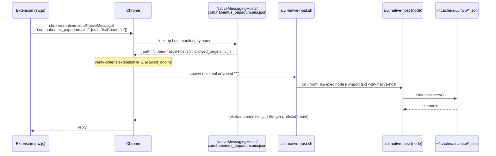

# Native-messaging host flow — current state

> **Status: descriptive, not a proposal.** This records how the browser extension and its
> native-messaging host are built, shipped, installed, and spawned **as of today**, so there is a
> clear baseline before any redesign. It lives in `docs/proposals/` only because that folder is
> off the VitePress nav/sidebar — it is a reference note, not a plan. Anchored to symbols (not just
> line numbers) so it survives edits; when in doubt, the code wins.

## TL;DR

- **"The extension" and "the native host" are two separate artifacts shipped by different routes.**
  The extension is the browser-side MV3 bundle (`dist-ext/`). The native host is a subcommand of the
  `aiui` CLI (`aiui native-host`). The native host is **never inside the extension** and is **never
  in the release zip**.
- Chrome spawns the native host via a **native-messaging host manifest** (`com.habemus_papadum.aiui.json`)
  whose `path` points at a generated **wrapper script**, which `exec`s `node … native-host`.
- That host manifest is **generated locally on each machine at install time** — its absolute `path`
  is minted for that box, never frozen into a release artifact.
- There are **two installers with opposite scoping**:
  - `aiui extension install-native-host` — broad: per-OS-user, three browser families, fixed
    user-level locations. Not tied to any profile/user-data-dir. For browsers aiui does **not** manage.
  - `installProfileNativeHost` (automatic on launch) — narrow: one specific `<user-data-dir>`. For the
    Chrome-for-Testing session browser aiui **does** manage.
- The native host is an **optional enhancement**, not a hard requirement: it powers cold-start channel
  discovery; the extension still works without it via three other discovery routes.

---

## 1. Two artifacts, two files both called "manifest"

| Thing | What it is | Ships in the zip? | Machine-specific? |
| --- | --- | --- | --- |
| **Extension** (`dist-ext/`) | Browser-side MV3 bundle: `manifest.json`, `sw.js`, `content-main.js`, `index.html`, assets | **Yes** (the zip *is* this, renamed) | No — fully portable |
| **MV3 manifest** (`dist-ext/manifest.json`) | The extension's own manifest. Mentions native messaging only as the `"nativeMessaging"` **permission** — a capability grant, no path | Yes (inside the bundle) | No |
| **Native host** (`aiui native-host`) | A subcommand of the `aiui` CLI; a Node stdio process Chrome spawns | **No** | n/a (it's the installed CLI) |
| **NM host manifest** (`com.habemus_papadum.aiui.json`) | The native-messaging manifest with the absolute `path` to the wrapper + `allowed_origins` | **No** — generated locally at install time | **Yes** — absolute path per machine |

The confusion this doc exists to dispel: the two files named "manifest" are unrelated. The MV3 manifest
grants the *permission* to call native messaging; the NM host manifest tells Chrome *where the host
binary lives*. Only the second carries a machine-specific absolute path, and it is never shipped.

Source of truth: `packages/aiui-intent-client/dist-ext/manifest.json` (`"nativeMessaging"` under
`permissions`), vs. the NM host manifest assembled in `ensureWrapperAndManifest`
(`packages/aiui/src/commands/extension.ts`).

## 2. The native host itself

`aiui native-host` — `packages/aiui/src/commands/native-host.ts`.

- A thin **stdio shim** speaking Chrome's native-messaging wire format exactly: each frame is a 32-bit
  native-endian length prefix + UTF-8 JSON, both directions (`encodeNativeFrame` / `decodeNativeFrames`).
- Answers three requests: `{cmd:"ping"}`, `{cmd:"version"}`, `{cmd:"listChannels"}` (`handleNativeRequest`).
- `listChannels` reads the **on-disk channel registry** (`~/.cache/aiui/mcp/<pid>.json`) through the
  same `listMcpServers()` the CLI's own selectors use, and returns `{tag, port, pid, cwd, startedAt,
  name?, debug?}` per channel.
- The loop (`runNativeHost`) answers every frame until stdin closes, so it serves both Chrome's
  one-shot `sendNativeMessage` (spawn-per-request) and long-lived `connectNative`. **stdout is sacred**
  (frames only); diagnostics go to stderr.

Why it exists at all: an extension page's origin is `chrome-extension://…`, so — unlike the
channel-served plain page, which reads its own port off its URL — the extension **cannot read the
on-disk registry**. The native host is the bridge that lets it enumerate channels cold.

## 3. How Chrome actually spawns it

Chrome knows nothing about `aiui`. The chain is manifest → wrapper → node:



- Chrome finds the host by **name** (`com.habemus_papadum.aiui`) in a per-browser
  `NativeMessagingHosts/` directory.
- It checks the caller's extension id against `allowed_origins` before spawning.
- It spawns the wrapper with a **minimal environment and cwd `/`** — which is why everything in the
  wrapper is absolute and why the wrapper `cd`s before running (`--import tsx` resolves from cwd).

## 4. The wrapper + how the CLI is resolved (dev vs installed)

The wrapper script (`wrapperScript` in `extension.ts`) is:

```sh
#!/bin/sh
# aiui native-messaging host wrapper — generated by `aiui extension install-native-host`.
cd "<aiui package root>" || exit 1
exec "<node>" [--import tsx] "<cli entry>" native-host
```

It is written to `~/.cache/aiui/native-host/aiui-native-host.sh` (`wrapperPath` → `cacheDir("native-host")`),
`chmod 0755`, and **rewritten on every install** so it stays current after moves/reinstalls.

What `<cli entry>` is depends on the `aiui` package's own shape, decided by
`resolvePackageCli("@habemus-papadum/aiui")` (`packages/aiui/src/util/resolve-cli.ts`):

| `aiui` package shape | `runningFromSource`? | Wrapper execs |
| --- | --- | --- |
| **Dev checkout** (still carries `src/`) | true | `node --import tsx <root>/src/cli.ts native-host` |
| **Installed from npm** (only `dist/`) | false | `node <root>/dist/cli.js native-host` |

Either way the CLI is spawned via the **current Node with an absolute path** — it relies on neither
PATH nor an executable bit.

## 5. Who writes the NM host manifest — two installers, opposite scoping

Both share `ensureWrapperAndManifest(extensionId)`, which writes the wrapper and returns the manifest
body. The manifest's `allowed_origins` always pins **both** the given extension id and the stable
shipped id, so a custom build never locks the shipped client out.

### 5a. `aiui extension install-native-host` — broad, unmanaged browsers

`installNativeHost` (`extension.ts`). Writes the manifest into fixed **user-level** directories from
`nativeHostManifestDirs(process.platform, homedir())`:

- **macOS:** `~/Library/Application Support/{Google/Chrome, Chromium, Microsoft Edge}/NativeMessagingHosts/`
- **Linux:** `~/.config/{google-chrome, chromium, microsoft-edge}/NativeMessagingHosts/`
- Any other platform: **throws** (macOS/Linux only for now).

Scoping: keyed to **only** `process.platform` + the OS user's `homedir()`. Covers **three browser
families at once**. **Not** tied to any profile, `--user-data-dir`, or running instance — a normally
installed, normally launched branded Chrome reads its host manifests from that one fixed per-user
location regardless of active profile. This is the installer for **browsers aiui does not manage**.

**Deliberately no Chrome-for-Testing entry:** CfT was measured (macOS, CfT 150) to ignore these fixed
Application-Support paths and read `<user-data-dir>/NativeMessagingHosts/` instead. That gap is filled
by 5b.

### 5b. `installProfileNativeHost` — narrow, the managed session browser

`installProfileNativeHost(userDataDir)` (`extension.ts`). Writes exactly one file:

```
<userDataDir>/NativeMessagingHosts/com.habemus_papadum.aiui.json
```

Scoping: tied to **one specific user-data-dir** — the managed session browser's profile — precisely
because CfT reads its host manifest from there. Called automatically by the launchers via
`ensureProfileNativeHost(userDataDir, intentReady, warn)` (`claude.ts`, `browser.ts`), which:

- runs **only** when the intent client's extension is actually loadable (`intent.state === "ready"`);
- is **never fatal** — a failed write degrades to the panel's type-a-port fallback with a warning;
- runs on **both** the launch and attach-to-running paths, so a long-lived profile converges on a
  current manifest;
- needs **no user decision and no browser restart** (NM manifests are read per `sendNativeMessage`
  call) — it's the same class of write as creating the profile itself.

### Comparison

| | `install-native-host` (5a) | `installProfileNativeHost` (5b) |
| --- | --- | --- |
| Trigger | Manual `aiui extension install-native-host` | Automatic, every managed launch/attach |
| Location | Fixed user-level dirs (3 families) | `<user-data-dir>/NativeMessagingHosts/` |
| Scoped to a data dir? | **No** — per OS user | **Yes** — this profile only |
| Target browser | Branded Chrome / Chromium / Edge (unmanaged) | Chrome for Testing (aiui-managed) |
| User decision? | Yes, explicit command | No |

## 6. How the managed user-data-dir is decided

For 5b, `settings.userDataDir` comes from `resolveChromeSettings` → `chromeUserDataDir`
(`packages/aiui/src/util/chrome.ts`). The **same** value is handed to both the browser
(`--user-data-dir`) and the host installer, which is the coupling that makes the manifest land in the
very profile the browser launched against.

`chromeUserDataDir({dataDir, profile, variant}, base)`:

1. **Explicit `dataDir`** (from `--aiui-chrome-data-dir` or `chrome.dataDir`) wins → resolved against `base`.
2. Otherwise, a project-local partitioned path:
   ```
   <base>/.aiui-cache/chrome/<variant>/<profile>
   ```
   - `<variant>` = browser flavor from `chromeVariant`: `chrome-<channel>`, `custom-<hash>` (per binary),
     or the managed flavor (`chromium` / `chrome-for-testing`). Distinct builds never share a profile.
   - `<profile>` = `--aiui-chrome-profile` / `chrome.profile`, else `DEFAULT_CHROME_PROFILE`. Validated
     against `PROFILE_NAME` (letters, digits, `.` `_` `-`).

Flags beat config; the profile/data-dir pair is reconciled as a unit (see `resolveChromeSettings`).

## 7. Extension distribution modes × the native host

| Extension arrives via | How the extension loads | How the native host is set up |
| --- | --- | --- |
| **Release zip** (`aiui-chrome-<version>.zip`) | Human unzips, chrome://extensions → Load unpacked. The zip is just `dist-ext/` renamed (`release.yml`) | **Separate & manual**: user must also install `aiui` from npm and run `aiui extension install-native-host` (5a). Until then, cold-start discovery falls back to the other routes (§8) |
| **Installed from npm** (`aiui claude`) | Launcher auto-loads the installed package's `dist-ext/` over `--load-extension` / CDP `loadUnpacked` | **Automatic** (5b) into the session-browser profile. Wrapper execs `dist/cli.js` |
| **Dev / live code** (source checkout) | Same auto-load, but `dist-ext/` must be built once (`build:ext`; no build-on-launch) | **Automatic** (5b). Wrapper execs `src/cli.ts` via tsx |

Key point about the zip: it is only the **browser half** of a working setup. The machine-specific half
(the NM host manifest, with its absolute path) is deliberately generated locally rather than frozen in,
so it's always correct for whatever machine it's installed on. The stable extension id
(`cdpbfpcelmifhagikjlfpgfipggcmdeg`, derived from the checked-in manifest key, not the load path) is what
lets one locally-installed manifest authorize the zip-loaded copy.

## 8. Where native messaging sits in extension-side discovery

`packages/aiui-intent-client/src/ext/channel.ts`. The extension finds a channel by four routes,
strongest evidence first (`discoverChannel`); native messaging is **one** of them and the extension
degrades gracefully without it:

1. **CDP tag** (`aiui2.cdpChannel`) — planted into the extension's storage by the channel itself through
   this browser's debug endpoint (`src/cdp/tagger.ts`). Same-browser proof; wins whenever alive.
2. **Recently-used port** (`chrome.storage.local`) — verified before use.
3. **Native host** (`channelsViaNativeHost` → `sendNativeMessage`) — reads the on-disk registry, so a
   **cold** start finds channels with no live ports known. `undefined` if no host installed.
4. **Live channel mirror** (`/debug/api/channels`) — one reachable channel enumerates the rest.

So the native host's unique contribution is **cold-start discovery** (no port known, no live channel to
ask). Routes 1, 2, 4 carry the common cases. This is why the release-zip-without-host configuration is
usable, just weaker on a cold start.

## 9. Invariants & gotchas

- **NM manifest `path` must be absolute on macOS/Linux** (Chrome spec). On Windows it may be relative to
  the manifest's own dir — never to `$HOME`, and Chrome never expands `~`. This repo is macOS/Linux-only
  and always emits an absolute path.
- **`cacheDir` resolves through `homedir()`**, so the path in the manifest is concrete
  (`/Users/you/.cache/aiui/…`), never `~`-relative. Edge case: `$AIUI_CACHE` is used *verbatim* as the
  cache root — a *relative* `AIUI_CACHE` would produce a relative wrapper path that Chrome would then
  reject. The default and `$XDG_CACHE_HOME` (ignored unless absolute) branches can't do that.
- **The wrapper is rewritten on every install** (idempotent, write-if-changed), so it self-heals after
  the checkout/install moves.
- **`allowed_origins` always contains both** the (possibly overridden) id and the stable shipped id.
- **No build-on-launch** for the extension bundle: `dist-ext/` is a deliberate `build:ext`; an unbuilt
  checkout prints a note and skips auto-load (`findIntentClientExtension` / `warnIntentClientState`).

## 10. File map

| Concern | File / symbol |
| --- | --- |
| The host process (stdio loop, frame codec, request handling) | `packages/aiui/src/commands/native-host.ts` |
| Both installers, wrapper generation, manifest body, dirs | `packages/aiui/src/commands/extension.ts` |
| CLI resolution (source-via-tsx vs dist-via-node) | `packages/aiui/src/util/resolve-cli.ts` |
| Cache root / `cacheDir` | `packages/aiui-util/src/index.ts` |
| Managed browser settings & user-data-dir | `packages/aiui/src/util/chrome.ts` (`resolveChromeSettings`, `chromeUserDataDir`, `chromeVariant`) |
| Launch wiring (`ensureProfileNativeHost`, extension auto-load) | `packages/aiui/src/commands/claude.ts`, `browser.ts` |
| Extension-side discovery (where native messaging fits) | `packages/aiui-intent-client/src/ext/channel.ts` |
| Extension MV3 manifest (the `"nativeMessaging"` permission) | `packages/aiui-intent-client/src/ext/manifest.ts` → `dist-ext/manifest.json` |
| Release zip build | `.github/workflows/release.yml` (Build the Chrome extension step) |

---

*Baseline captured 2026-07-18. Intended as the "how it works now" reference preceding a planned change
to this flow.*
