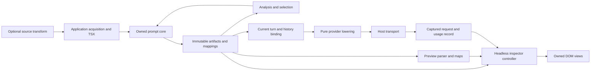

# TypeScript prompt toolkit architecture and implementation plan

**Status:** initial architecture with an implemented foundation, 2026-10-09. The
[consumer review](structured-prompts-review.md) is accepted. The authoritative implemented API and
storage/replay contract are now in the [package guide](../../packages/aiui-prompts/README.md) and
[record contract](../../packages/aiui-prompts/docs/record-contract.md). The interfaces below retain
the broader design and roadmap; they are not a claim that every proposed API or UI feature has shipped.
The two private spikes remain independent reference experiments.

Build an owned TypeScript toolkit around a small, immutable semantic record and its re-derivation
contract. Author normal TSX, capture plain JSON with schema/compiler versions and context decisions,
and derive ordered text/media when inspecting or delivering it. Bind records into session operations,
channel pushes, or Responses delegation; a provider request is one delivery shape. Inspection,
comparison, and optimization derive the same artifacts and mappings. The inspector is an early
integration consumer of the compiler, so correct
navigation and coordinated folding become foundation requirements rather than later reconstruction.

The implemented first slice is **TSX → stored semantic JSON → validated replay → linked tree, raw
output, and preview**, tested through mounted UI in jsdom. It includes recorded session conditionals,
reused content, exact scientific text, split equations, images, the three consumer families, optional
source instrumentation, consumer-owned versioned adapters, conservative comparison, and bounded
authored-variant search. Storage and readback begin here. A separate wire record captures actual
payloads only at the host's send boundary.
The sites' corpus is read-only requirements evidence and an adoption baseline, not required output
for this foundation. Synthetic fixtures exercise its shapes without importing legacy renderers.

## Review guide and decisions

Sections below cover the evidence, package boundaries, authoring semantics, compiler passes,
provenance, preview mappings, request formation, inspector behavior, analysis, testing, and delivery.
The final review checklist identifies the decisions with the greatest architectural consequences.

For a focused review, follow these paths:

- [Composition](#composition-and-authoring-semantics),
  [identities and artifacts](#semantic-graph-identities-and-artifact-schema),
  and [compilation](#compilation-pipeline-and-failures) establish the data model.
- [Mappings](#provenance-and-mapping-contracts), [source capture](#source-capture-and-mixed-jsx-projects),
  and [preview parsing](#preview-parsing-and-dom-mappings) establish what navigation can promise.
- [Turns and requests](#current-turns-history-provider-lowering-and-assets),
  [inspector behavior](#inspector-behavior-and-application-integration), and
  [analysis](#comparison-accounting-and-optimization) specify user-visible behavior.
- [Testing](#testing-strategy-with-jsdom-as-the-first-ui-line),
  [implementation milestones](#technical-implementation-plan), and
  [review questions](#review-questions-and-acceptance-boundary) describe delivery and review gates.

| Decision | Proposed contract | Reason |
| --- | --- | --- |
| D1 Foundation | No runtime dependency on existing aiui packages or the Python library. | Those systems become consumers; existing policies must not define the foundation. |
| D2 Evaluation | JSX runs once; session-state branches are data-driven Case decisions over recorded facts. | Recompilation cannot repeat acquisition or lose why a branch was selected. |
| D3 Content versus operation | Content records bind to session updates/appends, channel pushes, or delegated requests; history stays separate. | Core contracts must serve all three consumers without assuming a request. |
| D4 Identity | Definitions, placements, occurrences, and cross-revision correspondence are distinct. | Reuse, independent folds, contextual headings, and moves require different identities. |
| D5 Mapping | Partition emitted output into primary contributions; maintain separate many-to-many provenance edges. | Exact accounting and multi-owner explanations must coexist without double counting. |
| D6 Preview | Parse complete presentation scopes, then project folds; never edit TeX to insert attribution. | Equations, tables, links, and fences can cross authoring boundaries. |
| D7 UI | Owned headless controller plus framework-independent DOM views. | Portable embedding and fast DOM tests; optional aiui host bindings remain downstream. |
| D8 Testing | Node tests for pure contracts, jsdom for normal UI behavior, small browser suite for platform behavior. | Most interaction failures should be reproducible without starting a browser. |
| D9 Optimization | Explicit selection first; measured candidate search later. | An inspectable correct compiler precedes algorithms that alter content. |
| D10 Instrumentation | Optional source transform; runtime correctness and output do not depend on it. | Plain TSX remains usable, with honest missing source information. |
| D11 Storage | Plain semantic JSON plus schema/compiler versions and fingerprint; exact replay or explicit version failure. | Ledgers retain meaning, not display caches or duplicate rendered text. |
| D12 Delivery capture | Host captures exact wire payload separately from prepared delivery. | A rendering plan is not proof that a payload was sent. |
| D13 Adapter ownership | Consumers own versioned adapters; the toolkit owns their contract and supplies utility profiles. | Sessions, sockets, batches, and future transports must not be forced into a request envelope. |

The implementation owns the prompt model, JSX runtime, resolution, maps, controller, diff, and
optimization contracts. We previously considered POML, prompt-tsx, and Priompt; none is an
implementation base. General parsing and math primitives are a separate dependency choice: this plan
continues the spike's use of a math renderer and proposes a positional Markdown parser behind owned
interfaces. No third-party prompt framework or existing aiui implementation is reused.

## Evidence from the spikes

The [scenario ledger](../../packages/aiui-prompts/spikes/SCENARIOS.md) links the recreated Python examples.
The [authoring spike](../../packages/aiui-prompts/spikes/authoring/README.md) executes seven examples;
its [playground catalog](../../packages/aiui-prompts/spikes/authoring/playground/catalog.ts) calls the
real example functions. The [inspector spike](../../packages/aiui-prompts/spikes/inspector/README.md)
uses independent fixtures and real Markdown/KaTeX rendering. It does not validate the authoring
compiler's provenance.

| Observation | Architectural consequence |
| --- | --- |
| The same evidence value renders under two heading depths without mutation. | Store an immutable definition graph and expand contextual occurrences during compilation. |
| Adjacent text coalesces while exact output ownership survives. | Emission and map construction must be one operation; string searching cannot recover ownership. |
| Text–image–text remains ordered. | Parts, not a flattened string, are the canonical content representation. |
| Full/short/omit changes current content while replay and remote references stay fixed. | Selection owns only declared current contributions; unknown history cost is not zero. |
| Scientific values preserve `4.500`, `1.900 Å⁻¹`, and raw TeX. | Formatting is explicit; scientific meaning cannot be reconstructed from JavaScript numbers. |
| A valid equation crosses contributors at command and brace boundaries. | Ownership boundaries cannot determine preview parse boundaries. |
| Folding one contributor leaves a shared equation intact with a partial-fold indicator. | Exact raw folding and safe rich-preview folding need separate projections of the same fold state. |
| Parent folds preserve child fold intent; reused placements fold independently. | Fold state addresses occurrences/ranges, not definitions or DOM elements. |
| The raw view needed inline spans after multiline buttons disrupted text layout. | DOM structure and accessibility need real component tests plus a narrow layout check. |
| Image focus, Escape, and rerendering exposed popup lifecycle issues. | Overlays need explicit state, stable anchors, and disposal, not listeners attached to temporary decorations. |
| The inspector reparses and rebuilds DOM on commands and matches revisions by fixture IDs. | Keep the demonstrated behavior, replace the fixture shortcuts with indexed maps and explicit correspondence. |
| Playground stages make actual transformations easier to understand than JSON alone. | Keep readable stage views and exact data export together in the development application. |

Baseline on 2026-10-09: **27 tests pass** across authoring, playground execution, and inspector fixture
logic. The inspector suite runs in Node and tests reducers, range coverage, and generated HTML; it
has no mounted DOM behavioral suite. Source sites, correspondence, and inspector request data are
still fixtures. The authoring runtime ignores JSX keys, IDs are local paths, source metadata is
coarse, and the compiler lacks general graph validation. These are limits to replace, not production
contracts to preserve.

The older viewers remain valuable requirements evidence. The Python package's
[CodeView](../../../t-prompts/widgets/src/components/CodeView.ts) mutates DOM through a sequence of
transforms and repairs chunk-to-element associations. Its
[Markdown position plugin](../../../t-prompts/widgets/src/components/MarkdownView.plugin.ts) searches
normalized content for ownership, while [MarkdownView](../../../t-prompts/widgets/src/components/MarkdownView.ts)
inserts attribution into TeX. The new design replaces those mechanisms with maps produced before
rendering and explicit view bindings. The existing
[shared viewer container](../../../t-prompts/widgets/src/components/WidgetContainer.ts) and
[scroll synchronizer](../../../t-prompts/widgets/src/components/ScrollSyncManager.ts) demonstrate why
folding, wrapping, sources, and scrolling must share logical identities.
These sibling-checkout links are reference material, never build dependencies.

## Package boundaries and dependency direction

The implementation now has three public physical packages: `aiui-prompts` for portable core,
`aiui-prompts-inspector` for native Solid views, and `aiui-prompts-vite` for build-time source capture
and routing. Core has no third-party runtime dependencies; operations and analysis are explicit
subpaths. Inspector owns Markdown/KaTeX dependencies and Solid peers. The table below describes
logical boundaries, including prospective entry points that are not all exposed yet. The
[adoption guide](../../packages/aiui-prompts/docs/adoption.md#package-split-and-native-solid-refactoring)
lists actual imports, historical loading, condensed embedding, and the jsdom testing approach.
Both spikes remain independently runnable; their schemas are not production schemas.

| Package or entry point | Responsibility | Allowed runtime dependencies |
| --- | --- | --- |
| `aiui-prompts` root | Authoring values, snapshots, compilation, turns, neutral request plans. | Owned portable TypeScript; no DOM, Node I/O, provider SDK, or existing aiui runtime. |
| `aiui-prompts/jsx-runtime`, `jsx-dev-runtime` | Owned automatic JSX runtime and scoped JSX types. | Core authoring model only. |
| `aiui-prompts/artifact`, `mapping` | Serialized contracts, validation, source/output queries, interval indexes. | Portable core. |
| `aiui-prompts/analysis`, `optimize` | Accounting contracts, structural/output comparison, candidate selection. | Core; tokenizers and evaluators arrive as explicit services. |
| `aiui-prompts/operations` | Versioned operation records, consumer-owned adapter framework, and utility capability profiles/lowerers. | Core and adapter-local types; no SDK initialization or network. |
| `aiui-prompts-inspector/model` | Controller, historical record loading, selection/fold state, host interfaces. | Core; no Solid, DOM, or parser runtime. |
| `aiui-prompts-inspector/preview` | Positional Markdown parsing, owned preview AST and maps, math preparation. | Core plus isolated parser/math primitives. |
| `aiui-prompts-inspector` | Native Solid full and condensed previews, raw, tree, provenance, and comparison views. | Inspector model/preview, Solid, and browser APIs. |
| `aiui-prompts-vite` | Source capture and file routing, Vite integration. | Core metadata types plus build-time AST tooling; no source-processor reuse. |

Use the full `@habemus-papadum/` scope in manifests and imports. Keep lightweight barrels explicit:
importing the core must not import the inspector, parser, KaTeX, a tokenizer, or build tools.
Provider-specific imports stay on named subpaths. Avoid a plugin registry until a concrete extension
needs one; ordinary TypeScript components already provide most authoring extensibility.



The application owns acquisition, agent loops, live cells, credentials, uploads, provider sessions,
and sending. An optional future aiui adapter may bind the inspector to cells and source navigation;
that adapter depends on this toolkit. It is not imported back into any foundation package.

The production inspector follows the repository's four-layer playbook: pure queries and projections;
controller/effects at async boundaries; thin DOM views; application integration. The controller uses
its own small subscription/effect boundary rather than aiui cells because portability and the user's
foundation constraint apply to this package. The [frontend playbook](../../packages/aiui-viz/docs/frontend-playbook.md)
remains the development order, not a runtime dependency requirement.

## Composition and authoring semantics

### The ordinary workflow

```tsx
/** @jsxImportSource @habemus-papadum/aiui-prompts */
import {
  Prompt, Section, Paragraph, Text, Math, Image, Use, Choice, tex,
  snapshot, compilePrompt, renderTurn, prepareRequest,
} from "@habemus-papadum/aiui-prompts";

// Host code acquires and validates data before composing a snapshot.
const experiment = await loadExperiment("run-42");
const plot = await preparePlotAsset(experiment);
const evidence = (
  <Section title="Evidence">
    <Paragraph>
      The measured energy is <Text value={experiment.energyText} origin={experiment.origin} /> eV.
    </Paragraph>
    <Math value={tex`\hat{H}\psi = E\psi`} />
    <Image asset={plot} />
  </Section>
);

const document = (
  <Prompt>
    <Use key="primary" value={evidence} />
    <Section key="check" title="Independent check">
      <Use key="repeated" value={evidence} />
    </Section>
    <Choice name="background" short={<Paragraph>Use the Morse model.</Paragraph>}>
      <Section title="Background">{background}</Section>
    </Choice>
  </Prompt>
);

const semantic = snapshot(document);
const compiled = compilePrompt(semantic, { selection: { background: "short" } });
const turn = renderTurn({ input: compiled });
const request = prepareRequest(turn, { history: { kind: "none" } });
```

`loadExperiment`, `preparePlotAsset`, and `background` are application-provided values/functions in
this illustration. `compilePrompt(document, options)` also accepts a composed value and snapshots it
as a convenience. Advanced callers retain the explicit semantic snapshot for repeated selection.
No compile, analysis, preview, or request-preparation operation executes author components again.

Functions, arrays, conditionals, imports, and loops are ordinary TypeScript. A component is
`(props) => PromptValue`. The JSX runtime eagerly calls it once for that JSX invocation, validates
its result, and records an assembly boundary if metadata is available. Calling a function twice
constructs two values; placing one returned value twice reuses its definitions. We cannot prevent
side effects in arbitrary author functions, but we never schedule those functions during rendering
or budget search. Async components, lazy getters as stored content, promises, and live signals are
not accepted prompt values. An application can await preparation and then call a synchronous builder.

`snapshot` validates and serializes the already evaluated graph. It does not replay functions or
capture arbitrary props, closures, stacks, or the application heap. Factories copy supported metadata
and asset descriptors without freezing caller-owned objects. Retained data must be plain supported
values; reject cycles, accessors, nonfinite JSON values, and unsupported objects at the boundary.
Snapshotting does not turn arbitrary JavaScript into a sandbox.

### Vocabulary and whitespace

| Construct | Contract |
| --- | --- |
| `Prompt` | Root block sequence; joins nonempty blocks with two LF characters by default. No roles/history/tools on this node. |
| `Section` | Plain-text title and block body. Heading depth derives from retained section ancestry. Empty sections disappear unless `keepEmpty` is explicit. |
| `Paragraph` | Inline sequence. Concatenates children exactly; no implicit spaces between expressions. |
| `Group` and `Fragment` | Transparent concatenating sequence with an optional semantic label. No added text. |
| `Join` | Explicit separator between nonempty evaluated entries. Used for raw tables and fragments needing exact separators. |
| `Text` | Exact string leaf. No trim, dedent, Markdown escaping, number reformatting, or newline normalization. |
| `Literal` | Explicit plain-text leaf escaped for the selected text format. Useful when dynamic values should not introduce Markdown syntax. |
| `Math` | Exact TeX body plus inline/display mode; default display. Accepts either `value` or a text-only child sequence, never both. |
| `Code` | Exact code body; selects a fence long enough for its content and records generated delimiters. |
| `Image` | Atomic asset placement; no synthetic image-placeholder text in the emitted parts. |
| `Xml` | Structured XML element with text/element content and mapped context-specific escaping. |
| `Use` | Explicit placement of a reusable value; carries placement key, label, and optional provenance. |
| `Choice` | Authored variants, default full plus optional short/omit, with named selection and constraints. |
| `Label`, `Ref`, `Table`, `List` | Subsequent structured features built on the same occurrence and emission contracts. |

The first slice implements the spike vocabulary plus `Use` and correct keys. `Literal`, `Code`,
labels/references, and structured tables/lists follow in the scientific-resolution milestone;
raw exact text and `Join` continue to support existing examples throughout.

Arrays flatten in the enclosing sequence. Thus arrays under `Prompt` are block entries, while arrays
under `Paragraph` are inline entries. Wrap several inline pieces in `Paragraph`, `Group`, or `Join`
to keep them one entry in a block sequence. The formatter does not guess paragraph boundaries.
Separators attach to the enclosing sequence operation; empty and omitted entries contribute none.
An image is nonempty and preserves its position among neighboring entries.

Bare strings emit as authored text, so Markdown syntax can deliberately span contributions.
Use `Literal` for escaping, or structured nodes when layout must be resolved globally. Section titles
are plain text and escaped during Markdown emission. `Text` is exact even when it contains Markdown;
its name does not imply sanitization. Prompt text, including user data, has no power to create message
roles. The toolkit does not claim to solve prompt injection by escaping text.

Children accept values, strings, finite numbers, ordered arrays, `null`, and `false`. Finite numbers
use documented JavaScript string conversion; scientific precision should enter as strings or through
an explicit formatter. Reject `true`, explicit `undefined`, promises, and arbitrary objects. An absent
`children` property is an empty sequence. Explicit omissions are `null`/`false`, not missing data.

JSX prose follows the selected JSX transform's whitespace/entity rules. Exact content belongs in
string-valued leaves; `tex` is a raw-string helper. `separator={"\n"}` produces a newline;
`separator="\n"` does not. There is no implicit dedent. Optional `dedent` is a named transformation
with a segment map. Acquired strings preserve CRLF and lexical zeros; preserving original bytes
additionally requires a host-provided byte resource and encoding.

### Scientific content and global resolution

A math node may contain multiple exact text leaves, allowing the split-equation fixture to be real
compiled content. Compile its body as one text-only sequence and add delimiters once. Images,
sections, nested math nodes, and structural XML are invalid inside math. TeX is never algebraically
simplified or decorated for navigation. Structural emission validates framing; unsupported TeX is
a preview diagnostic unless the caller explicitly enables stricter validation.

Labels and references resolve within one compiled prompt by default. Each `Use` introduces a
placement namespace for local fragment labels; external references use an explicit placement key
and local label. Reusing a fragment therefore does not accidentally define the same document-global
label twice. Explicit global labels must be unique. Selection precedes numbering and reference
resolution; a retained reference to an omitted required target is an error, not stale text.
Cross-message references are outside the first version's scope.

Markdown heading depth starts at one (or an explicit compile base level), counts retained `Section`
ancestors, and ignores function/component nesting. More than six levels is an error by default;
a caller can opt into an explicit fallback style whose transformation is recorded. Raw Markdown
headings are opaque content: they do not change structural depth. Importing a compiled prompt as a
child is rejected; reuse its semantic value to resolve placement again, or explicitly import its
output as opaque text/parts with lineage.

XML uses a validated namespace-free subset initially. Escaping text, attributes, and generated
names are distinct emission operations. No DOM is required. Raw XML remains an opaque `Text` leaf;
inside structural XML it is escaped as text unless explicitly declared as a validated raw fragment.
Single-root XML export is a separate serializer with single-root validation. Mixed prompts can
contain several XML snippets. Media inside XML requires a declared textual reference policy and is
otherwise rejected. Full namespace resolution is a later feature, not an incidental promise of `Xml`.

Structured tables retain column definitions, row keys, exact display strings, optional scalar values,
units, and row/cell origins. JSON-compatible scientific scalars use tagged representations where
necessary, for example decimal strings and bigint strings. Formatting policies specify rounding and
units; they do not infer significant figures. Row omission records which rows were excluded. Table
Markdown escapes and alignment syntax belong to generated/mapped output, not data cells.

Declared macro sets, assumptions, symbols, citations, and required dependencies become explicit
resources. A selected equation can require a macro preamble or explanatory assumption; dropping it
is invalid. Macro declarations intended for model understanding must be emitted or explicitly marked
preview-only. Preview configuration must never silently grant the model unavailable definitions.
We do not parse arbitrary TeX to infer all dependencies or certify mathematical equivalence.

## Semantic graph, identities, and artifact schema

Use immutable discriminated unions internally, not the spike's single type with many unrelated
optional fields. A composed value is a handle to a definition plus placement metadata. A parent owns
edges to child handles; it never writes its parent into a reused definition. A custom component can
return an existing value without cloning that value; its call boundary adds lineage/placement data.

| Identity | Meaning and lifetime |
| --- | --- |
| `SnapshotId` | One semantic snapshot, including definitions and captured origins. |
| `DefinitionId` | One evaluated value in that snapshot. Equal text need not mean the same definition. |
| `EdgeId` | One declared placement/variant edge within a definition. |
| `OccurrenceId` | A definition reached along a placement path in one compilation. |
| `ContentId` / `PartId` | A compiled content artifact and one of its ordered text/media parts. |
| `TurnId` / `BindingId` | One current invocation and a specific use of compiled content as instructions or a message. |
| `SourceSiteId` / `OriginId` | A recorded code span or external data origin, never an occurrence identity. |
| `OperationId` | One recorded transform/pass/decision with its inputs, outputs, and method. |
| `PreviewNodeId` | One syntax/presentation node within a particular preview result. |
| `ViewHandle` | Ephemeral mounted DOM binding in one inspector and layout epoch. |

IDs are namespaced opaque identifiers. Deterministic graph traversal yields repeatable local IDs for
the same snapshot/options; there is no process-global counter. These IDs do not promise stability
across code edits. Separately record content fingerprints, artifact fingerprints, and caller-supplied
logical keys. Exclude timing/run telemetry from content fingerprints. Canonical serialization and
hashing are versioned, and ordered arrays never sort as part of canonicalization.

JSX `key` belongs to the placement wrapper, not the reused definition. Keys are scoped to the
parent's child/variant sequence; duplicate keys are errors. Unkeyed positions are valid but weak
correspondence hints. A key path matches placements across ordinary sibling insertions. Moving a
node between differently keyed parents requires an explicit stable `id`/host match or a validated
diff match; a matching local key alone does not prove identity. A separate optional artifact-wide
logical `id` supports such moves and must be unique. Labels used for display are not keys.

Compilation expands selected branches only, retaining the entire definition/variant graph. An
omitted `Choice` has a placed decision record and zero output; its unselected descendants remain
available under an alternatives view without pretending they are emitted occurrences. Enforce cycle,
maximum-depth, occurrence-count, text-size, and expansion limits with deterministic diagnostics:
a small acyclic reusable graph can still expand exponentially.

Proposed top-level records, with abbreviated field types:

```ts
interface SemanticSnapshot {
  schema: "prompt-semantic/1";
  id: SnapshotId;
  root: DefinitionId;
  definitions: readonly Definition[];
  origins: readonly Origin[];
  sites: readonly SourceSite[];
  resources: readonly ResourceDescriptor[];
}
interface CompiledPrompt {
  schema: "prompt-content/1";
  id: ContentId;
  semantic: SnapshotId;
  occurrences: readonly Occurrence[];
  decisions: readonly SelectionDecision[];
  parts: readonly ContentPart[];
  contributions: readonly Contribution[];
  lineage: readonly MappingEdge[];
  semanticRegions: readonly SemanticRegion[];
  operations: readonly Operation[];
  diagnostics: readonly Diagnostic[];
  compiler: { version: string; optionsFingerprint: string };
}
interface InspectionBundle {
  schema: "prompt-inspection/1";
  snapshots: readonly SemanticSnapshot[];
  contents: readonly CompiledPrompt[];
  turns: readonly CurrentTurn[];
  requests: readonly PreparedRequest[];
  assets: readonly AssetDescriptor[];
  sources?: readonly SourceResource[];
}
```

The bundle owns referenced records once; content reuse in multiple messages does not duplicate the
semantic graph. APIs may expose resolved convenience views, but serialization uses references.
Export preserves all referenced semantic and compiled records required by the selected retention
profile. Runtime indexes are rebuilt on import; a missing required definition/content is an invalid
bundle, while an absent optional source body or asset byte resource is an inspectable missing resource.
No functions, Maps/Sets, DOM nodes, cycles, native Blobs, or live provider handles are serialized.
Use plain arrays/objects and tagged values. Validate schema and all references on import, with bounds
for counts/depth; reject unknown major schemas and report missing optional extensions. Export/import
must work without executing original TSX. Preview ASTs and layout are rebuildable caches.

## Compilation pipeline and failures

| Pass | Input → output | Invariant |
| --- | --- | --- |
| Capture | Evaluated value → semantic snapshot | Copies supported data; author functions have already run. |
| Validate | Snapshot → validated graph/index | Acyclic definitions, valid variants/keys/resources, bounded expansion. |
| Place and select | Snapshot + selection → occurrence forest and decisions | Distinct reuse occurrences; no application callbacks; omitted alternatives retained as definitions. |
| Resolve | Selected occurrences → contextual document | Headings, empty blocks, labels, numbering, dependencies, and required resources reflect selection. |
| Emit | Resolved document → ordered parts, contributions, semantic regions, maps | All output units/media have attribution; coalescing preserves boundaries. |
| Bind | Compiled content → current turn | Roles/order/instruction intent are explicit; history absent. |
| Prepare | Turn + immutable history/request settings → request plan | Current content and prior context stay distinct. |
| Lower | Request plan + target profile + prepared assets → provider payload and wire maps | No hidden acquisition; unsupported capability produces a diagnostic/failure. |
| Measure | Lowered request + estimator → accounting record | Units, target, coverage, and uncertainty are explicit. |

Implement pure passes with separately testable inputs/outputs and operation records. A debug option
can retain intermediate resolved records; normal artifacts retain the information required for
explanation without storing every redundant intermediate tree. Record options and implementation
versions. Given equal inputs and versions, results are deterministic; record wall time outside the
canonical artifact.

Emission uses a buffer/rope of owned segments, then coalesces neighboring compatible text segments.
Do not repeatedly append to a growing string or repeatedly scan all mappings for each query.
Primary contribution intervals partition every nonempty text part, including generated separators,
headings, XML escapes, and math delimiters. Assets have one primary emission record. Semantic regions
retain equation bodies, code blocks, structural tables, XML fragments, and their framing ranges so
inspection can respect grammar without rediscovering typed intent.

Generated syntax has a producer operation and contextual owner. For example, a section owns its
heading prefix; a sequence owns separators; a math node owns its delimiters. Folding children does
not silently transfer those units to arbitrary neighbors. Coverage queries can distinguish content
body from structural framing (§ preview and folding below).

Expose `tryCompilePrompt` as a result union for live tools and `compilePrompt` as a throwing
convenience. Errors have stable codes, stage, severity, affected addresses, and relevant related
locations. Do not return a valid compiled payload after a structural compile error. The inspector
can display the semantic graph plus diagnostics, or retain a clearly labeled last successful result.
Preview errors are different: an exact compiled prompt remains inspectable even if its Markdown or
math cannot be rendered. Provider failures prevent labeling a request prepared for that target.

Diagnostics include unsupported children, cycles, duplicate keys/labels, invalid XML, unresolved
references, unavailable selected assets, unsupported media/roles, stale explicit selections, and
infeasible budgets. No warning should silently change the emitted scientific content.

## Provenance and mapping contracts

### Addresses and relations

Use distinct address types rather than one ambiguous offset:

```ts
type ContentAddress =
  | { content: ContentId; part: PartId; kind: "text"; start: number; end: number }
  | { content: ContentId; part: PartId; kind: "asset" };
type BoundAddress = { turn: TurnId; binding: BindingId; content: ContentAddress };
type SourceAddress = { resource: SourceResourceId; start: number; end: number };
type WireAddress = {
  request: RequestId;
  path: readonly (string | number)[];
  textRange?: { start: number; end: number };
};
```

All string intervals are half-open UTF-16 offsets. A wire text range refers to the decoded JSON string
value at that path, not the escaped bytes of `JSON.stringify(payload)`. Wire-byte addressing, if a
transport needs it, is an additional encoding map. Source line/column values derive from a revisioned
source buffer; they are not the authoritative stored address. Content addresses do not require a
message: a compiled fragment may be inspected before a turn exists, and one fragment can bind twice.

A primary `Contribution` identifies an output interval/asset, its owning occurrence, producing
operation, and applicable input/value ranges. A separate relation table expresses additional origins,
ancestors, generated syntax, reuse, summaries, references, transformations, and provider framing.
Primary contributions partition output; explanatory edges can overlap freely.

Do not combine relationship kind and mapping precision in one enum:

```ts
interface MappingEdge {
  from: readonly Address[];
  to: readonly Address[];
  relation: "copy" | "escape" | "normalize" | "generate" | "derive" | "place" | "bind";
  precision: "exact" | "bounded" | "owner" | "unknown";
  correspondence?: "affine" | "atomic";
  operation?: OperationId;
  reason?: string;
}
```

`exact/affine` supports offset translation within equal-length segments. `exact/atomic` gives exact
input/output bounds for an indivisible transform such as `&` → `&amp;`; it does not promise a unique
input character for every position inside the encoding. `bounded` gives a valid enclosing range;
`owner` identifies a contributing value/site without character alignment. `unknown` never acquires
precision by interpolation. Generated output can have exact output bounds and zero input addresses,
with a required producer/owner. Summaries retain their input set and method with coarse lineage.

| Map | Producer | Required behavior |
| --- | --- | --- |
| Code span → evaluated value/field | Optional source transform or explicit host metadata | Separate construction site, literal field segments, and dynamic interpolation site. |
| External origin → value | Author/host | Preserve experiment, dataset row, query, capture, file revision, or tool-result identity. Never infer these from variable names. |
| Definition/edge → occurrence | Placement pass | Represent reuse and assembly/use sites without mutating the definition. |
| Input value → emitted content | Emitter and explicit transforms | Exact copies/escapes where known, generated owners, no output gaps. |
| Selection/transform → output revision | Compiler/optimizer | Explain omissions, variants, summaries, derived assets, and discarded candidates. |
| Content → turn binding | Turn builder | Distinguish two uses of identical compiled content in different roles/messages. |
| Bound content/request fields → provider fields | Adapter | Text ranges, media delivery, role conversion, instruction fields, tools, and overhead. |
| Content → preview syntax/visible text | Preview parser adapter | Original spans, decoded entities, syntax-only ranges, reference dependencies, atomic math. |
| Preview/raw addresses → DOM bindings | View renderer | Exact Text-node offsets where valid; element/equation anchors otherwise. |
| Logical anchors → geometry | Layout adapter | Ephemeral rectangles indexed by view and epoch; never serialized as provenance. |
| Before → after | Diff/correspondence engine | Reason, confidence, ambiguity, and zero/one/many counterparts. |

Source authorship, source material described by a prompt, and the site calling `compilePrompt` are
separate origin categories. Selecting a screenshot may identify its capture region and the code
that inserted it; those are not interchangeable source links. Calling compile in a request handler
records a compilation event but does not claim that handler authored every word.

Provide indexed queries such as `explain(address)`, `locateOutput(originOrOccurrence)`,
`contributors(range)`, `counterparts(address)`, and `coverage(target)`. Results include mapping paths,
precision, diagnostics, and disjoint ranges. Walking a chain preserves its least precise relation;
character accuracy cannot be inferred through an owner-only link. Limit query expansion and report
truncation on large many-to-many provenance graphs. Build inverse indexes from serialized forward
records rather than requiring producers to maintain inconsistent duplicates.

### A worked mapping example

For a display equation whose body is `\frac{a}{b}`, the emitted string is
`"$$\n\\frac{a}{b}\n$$"` (17 UTF-16 code units):

| Output interval | Output | Primary owner | Meaning |
| --- | --- | --- | --- |
| `[0, 3)` | `$$` and newline | Math occurrence | Generated opening syntax. |
| `[3, 9)` | `\frac{` | First body leaf | Exact text copy. |
| `[9, 10)` | `a` | Numerator leaf | Exact text, with optional external origin. |
| `[10, 14)` | `}{b}` | Remaining body leaf | Exact text copy. |
| `[14, 17)` | Newline and `$$` | Math occurrence | Generated closing syntax. |

The preview has one equation node whose syntax range is `[0,17)` and whose body range is `[3,14)`.
Clicking it can reveal all body contributors and its framing operation. Folding the numerator hides
`[9,10)` in the raw view; the preview keeps the intact equation and labels the partial fold.
It never renders `\frac{}{b}` as if that were the original prompt.

Folding the entire math occurrence covers all 17 units. Folding all body contributors may collapse
the equation preview because every meaningful body unit is hidden; generated framing remains
accounted for separately and can still be visible in raw. The marker labels the hidden body and
remaining syntax accurately. This distinction also applies to table punctuation and code fences.

For XML `A&B` → `A&amp;B`, the emitter records affine copy segments for `A`/`B` and one exact atomic
encoding segment for `&`. Preview decoding can map the visible ampersand back to that full encoded
span. A repeated `A&B` elsewhere is a different range; no `indexOf` search chooses between them.

### Unicode, empty ranges, and edit boundaries

Storage offsets may represent any UTF-16 boundary supplied by a source parser, but UI-generated
selections and diff display boundaries must not split surrogate pairs. Grapheme-aware cursor/display
operations use an explicit segmenter and fall back conservatively when unavailable. UTF-8 byte,
Unicode code-point, and grapheme counts are separate measurements with named conversions.

Zero-length addresses represent boundaries (including omitted output anchors), not character
ownership. Queries state left/right affinity at a boundary. Empty nodes and omitted variants do not
invent output characters merely to make them clickable. Their tree entries and nearest structural
anchor remain inspectable. Cross-part selections are ordered address lists, never one fabricated
global string interval. Rebase offsets across revisions only through an explicit edit/correspondence
map; otherwise clear the range and retain an explainable broader occurrence selection.

## Source capture and mixed JSX projects

Use `.prompt.tsx` as a convention and route it explicitly. In prompt-only projects, configure the
owned automatic runtime through `jsxImportSource`; per-file pragmas provide matching typechecking
in mixed projects. TypeScript supports those runtime imports and pragmas, but that does not configure
other bundler transforms. See
[TypeScript JSX configuration](https://www.typescriptlang.org/tsconfig/jsxImportSource.html).

`aiui-prompts-vite` exposes a standalone AST transform and a Vite wrapper. Its routing filter
selects prompt modules, including source-first workspace files outside the app directory. Prompt
TSX must be excluded from Solid's compiler and from the existing aiui DOM-locator pass. One JSX
dialect per file; import a prompt builder into UI code rather than mixing prompt and DOM elements.
Automatic runtime exports, development exports, JSX types, typechecking, Vitest, Vite serve/build,
and packed consumer examples must agree on that route.

Separate two options: **JSX routing** selects the runtime; **provenance capture** adds optional sites.
A project can route TSX correctly with provenance disabled. A plain TSX runner can execute the library
with its JSX configuration and no source capture. Full instrumentation for Node execution uses the
standalone build transform first; a runtime loader is deferred. The Vite plugin does not implicitly
instrument `tsx`, scripts, or installed JavaScript.

Source capture records:

1. Element/component construction sites and source spans for supported literal fields.
2. Child-expression/`Use` placement sites, including expressions returning reused values.
3. Imported toolkit snapshot, compile, turn, prepare, and lower call sites as separate events.
4. Explicit manual origins and host-provided data ranges without overwriting them.

The transform analyzes JSX before lowering, delegates ordinary TS/JSX syntax lowering to tested
build primitives, and passes side-table IDs through owned runtime helper arguments. Metadata must
not be an accidental enumerable prop observable by user components. Expression wrappers evaluate
an expression once and return a placement handle; keys wrap placements rather than mutating values.
Do not use a global mutable current-source stack or inspect JavaScript stacks at runtime.

Resolve imported bindings and namespace imports, follow local aliases within the supported module,
and respect lexical shadowing. Arbitrary re-exports, dynamic dispatch, and indirect function calls
are unsupported unless configured through an explicit binding manifest; emit coarse/missing capture,
not a guessed match by function spelling. Custom component direct calls outside JSX can use an
explicit origin helper. Capturing all possible JavaScript dataflow is not a goal.

Site tables use repository/package-relative resource IDs and content revision/digests. File text
ships only by policy. Line/column links derive from the recorded revision; host navigation checks
that revision before opening current source. If it differs, offer the recorded snapshot or a visibly
stale link. A source path alone is insufficient to identify a file across checkouts.

Implement source precision in two increments. First capture code-owner spans and use sites. Next,
add exact literal/JSX normalization segments for supported syntax: escapes, entities, multiline JSX,
raw/cooked templates, CRLF, and Unicode. Dynamic expressions retain their expression site plus any
explicit value-origin map; their runtime strings do not map character-for-character to expression
spelling. Build source maps for generated JavaScript and prompt provenance maps are different
products. Compose the former through upstream transforms and retain the latter as artifact metadata.

The semantic payload must be equal with capture enabled/disabled. Instrumentation tests compare
both execution results and side-effect traces: evaluation order, getters, throws, spreads, keys,
aliases, shadowing, and nested components. Test repeated transforms for idempotence and validate
source-map composition. These tests are required before offering automatic source links in the UI.

## Current turns, history, provider lowering, and assets

### Prompt content becomes messages only at the binding boundary

The common API remains `renderTurn({ input: compiled, instructions? })`. It produces one current user
message and optional current instructions. For several new messages, provide an explicit ordered
array instead of extending the spike's `beforeInput`/`afterInput` convention indefinitely:

```ts
const turn = renderTurn({
  instructions: { prompt: instructions, intent: "per-request" },
  messages: [
    { key: "example-question", role: "user", prompt: exampleQuestion },
    { key: "example-answer", role: "assistant", prompt: exampleAnswer },
    { key: "question", role: "user", prompt: question },
  ],
});
const plan = prepareRequest(turn, {
  history,
  tools: toolSnapshot,
  responseFormat: answerSchema,
  outputReserve: { unit: "tokens", value: 2048 },
});
```

The `input` and `messages` forms are mutually exclusive. Both produce the same turn representation.
Do not require `<Conversation>`/`<Message>` around reusable prompt fragments. Messages bind compiled
content with stable caller keys; roles and boundaries are never guessed from the text. First-version
new messages support user/assistant content and instructions. Tool call/result authoring requires an
explicit typed protocol model later; opaque historical provider records already have a preservation
path. This avoids claiming a universal role/content model for every agent protocol.

Each compiled prompt resolves its own layout, labels, and selection. Instructions and separate
messages do not affect each other's heading depth. If several fragments must resolve together,
compose them before compilation. An invocation-level optimizer can coordinate their budgets without
merging them into a Markdown document. Binding one compiled prompt twice counts two emitted uses and
has distinct inspector addresses.

### History is immutable input with explicit protocol ownership

| History kind | Contract |
| --- | --- |
| `none` | No toolkit history input; does not assert anything about an independently stateful host. |
| `messages` | Ordered immutable replay in the toolkit's supported conversational subset. |
| `provider-items` | Ordered opaque JSON records with provider/protocol identity and revision; retain tool IDs and all fields. |
| `remote` | Provider plus a typed conversation/thread/previous-response reference. Content and cost remain unknown unless separately observed. |

Clone validated replay data at preparation; later caller mutation cannot alter a prepared plan.
Preserve unknown opaque fields and ordering. JSON validity is distinct from protocol validity;
adapters reject a foreign or incompatible protocol. Do not parse/restringify an opaque field that
is itself a provider-owned string. If exact transport bytes are required, a host supplies a captured
byte record; JSON value preservation does not promise byte-for-byte preservation of whitespace.

A first-version plan has exactly one history strategy. Unsupported mixtures of remote state and
explicit replay are rejected rather than accidentally replaying the same context twice. History
compaction is a separate explicit application operation producing a new history revision; current
prompt optimization never performs it.

Instruction intent defaults to `per-request`. A session replacement/append must be a host session
operation with its own captured record, not an implication of `renderTurn`. The target adapter must
state how it implements current instructions with remote history, or reject an unsupported policy.
Unknown provider persistence behavior cannot be treated as append/replace interchangeably.

### Lowering returns a payload, a map, and an honest status

The implemented `lowerOperation` contract accepts a semantic operation, versioned target, and
prepared assets. Consumer-owned adapters resolve by exact name and version; built-in profiles are
utilities. A result can be a socket event, event batch, channel notification, or provider request.
It carries JSON, capability/profile identity, decisions, content/payload mappings, and an explicit
prepared-not-sent status. Transport is a separate host call. An actual sent record requires host
capture of the final payload
and adapter/SDK modifications; an uncaptured SDK mutation prevents claiming exact wire provenance.

Adapters are pure. They declare supported roles, instruction representation, content/media kinds,
asset delivery modes, history forms, tools, response formats, and relevant limits. No silent
fallback from an image to its caption, no silently dropped messages or tool fields. An explicitly
requested conversion produces a new recorded operation and derived artifact/asset. Adjacent text
may coalesce with a map; part order is preserved. Adapter-generated fields have request-operation
owners even when they do not originate in prompt content.

Tool declarations and capability prose derive from one immutable tool snapshot. A declared
`ToolBrief`/resource dependency ties selected capability descriptions to the same declarations used
by request lowering. Downstream tool execution remains outside the toolkit. Output schemas and tool
schemas are first-class request contributions with origins and cost; they are not buried in an
uninspectable settings object. Provider-specific settings remain namespaced, validated by that
adapter, and represented in the prepared request.

Consumer-specific adapters live beside their consumers and can later move upstream if generally
useful. The current utility profiles cover Realtime events, live append events, channel notifications,
and Responses. Their fixtures and the custom socket-batch contract test require no network call or
credential. Protocol additions must check official documentation and available SDK types, retain
versioned fixtures, and validate their own constraints; JSON shape alone does not prove protocol validity.

### Asset identity and lifecycle

An asset descriptor carries logical ID, media kind, MIME type, optional dimensions/duration, content
revision/digest when available, human metadata, and origin/derivation records. Logical identity,
content equality, and a transport URL are different. Same-size images can have different bytes;
URLs can change without changing content. Without a digest or trusted immutable revision, equality
is unknown rather than equal.

Bytes live in a host `AssetStore`, not repeated base64 fields in the semantic graph. Resolution is an
explicit async host service with cancellation and a returned revision. Paste/drop in the development
app ingests a Blob into that store, returns an asset handle, and inserts an `Image` placement into
an explicitly derived document; it does not fabricate a TSX source location. Programmatic authors
use prepared handles naturally alongside text. SVG fixture support in a viewer does not imply
provider SVG support. Rasterization, cropping, resizing, and upload occur explicitly and record
parent asset, parameters, content digest, and delivery binding.

Inspection requests bytes through a host resolver and shows loading, failed, or unavailable states.
No arbitrary URL is fetched merely because an artifact was imported. Store and transport policies
can allow explicit remote resolution. Object URLs/decoded images are bounded caches with disposal;
asset loading completion is revision-qualified. The serialized asset manifest supports optional
bundled bytes and otherwise retains honest missing-resource information.

## Preview parsing and DOM mappings

### Own the adapter and AST contract

Adopt a positional CommonMark/GFM parser behind an owned `PreviewParser` interface, with explicit
math support. The proposed primitive is micromark with its AST utilities and selected GFM/math
extensions. It exposes concrete tokens/positions and an extension mechanism; those capabilities make
it a plausible basis, not proof of our mapping contract. The first parser milestone must verify
original-buffer offsets and decoded-text mappings on our corpus before we commit to it.
See [micromark's architecture](https://github.com/micromark/micromark#architecture) and
[the Markdown AST utility](https://github.com/syntax-tree/mdast-util-from-markdown).

Replace the spike's accumulation of `token.raw.length`; it only covers its fixtures. Do not adopt a
parser's HTML output as the authoritative mapping structure. Produce an owned preview tree containing
node kind, original syntax ranges, body/display ranges, children, reference dependencies, atomicity,
decoded text segments, diagnostics, and the parser/profile fingerprint. Then create DOM from that
tree with registered bindings. Parser implementation nodes remain an internal adapter detail.

Parse complete logical text scopes, never individual contributions. Adjacent text segments/parts
without a declared boundary share a scope; storage coalescing must not affect interpretation.
Message boundaries always terminate scopes. Instructions are their own scope. Markdown reference
links and footnotes must resolve in the declared scope, including forward definitions. Keep both the
reference use and target definition in provenance, even when the definition renders no glyph.

**First-version media rule:** native media is a block presentation boundary. Parse each complete
contiguous text run around it, then interleave atomic media nodes. Equations/fences cannot span an
image, and Markdown references across media boundaries are not resolved in this profile. This is a
conscious restriction of formatted preview, consistent with the inspector spike; exact model parts
are unchanged. A broken/unsupported rich scope shows its raw text and a diagnostic. Images are
accepted between text fragments, but authors should finish an inline/block construct before an image.

Reserve a `PresentationScope` segment-table interface for a later message-wide virtual parse stream
with media tokens and shared reference definitions. That extension must keep virtual offsets separate
from canonical output, distinguish inserted boundaries from text, and prove that no sentinel/caption
enters provider payloads or counts. Do not make this harder parsing feature a hidden prerequisite for
basic multimodal inspection. Both profiles must be explicit on exported inspection results.

Typed math/code/XML regions come from emission and constrain the preview interpretation. The parser
adapter validates compatible region boundaries and uses the declared exact body where supported.
Opaque raw Markdown can also contain math under the documented dialect. A typed/parsed conflict
produces a visible raw fallback instead of rendering a different expression. XML regions use an
escaped code/tree presentation by default; they are not treated as executable HTML.

### Exact text decoding and coarse math layout

A parser node's source span alone does not establish character correspondence after entity decoding,
escape removal, code-span normalization, or soft breaks. The adapter must emit decoded text segments
from concrete token events or a tested decoder. It can mark unsupported inline cases as bounded
node mappings until implemented. Syntax delimiters with no glyph remain navigable through the raw
view and syntax-node controls. Never align strings by search or ratios of rendered lengths.

Keep KaTeX behind an owned math adapter. Render the unchanged TeX body with an immutable declared
macro environment; fresh renderer state per equation prevents folding/order from changing macros.
Do not permit `\gdef` in one rendered block to mutate unrelated previews. Authors needing shared
macros declare them as resources. Use bounded expansion/size, untrusted mode, captured diagnostics,
and raw fallbacks. KaTeX documents mutable macro state and trust/expansion options; the isolation
policy here is our design choice. [KaTeX options](https://katex.org/docs/options.html).

The supported baseline is an equation element → exact TeX body plus contributors. Internal KaTeX
HTML is opaque for fine text selection. Do not bind duplicate visual/MathML representations as if
they were independent copies of output. A future math renderer can expose validated subexpression
bindings through a capability flag; the rest of the inspector remains correct without it.

Render Markdown through a controlled tag/attribute allowlist; raw HTML is displayed as text or an
explicit unsupported block by default. Link activation and image resolution use host policies.
Rendering an imported prompt cannot execute scripts, activate arbitrary embedded components, or
mutate compiler content. Math error text is inserted as text, not unsanitized HTML. These are normal
viewer input contracts, not restrictions on what exact text can be sent to a model.

### View bindings

For raw text, the renderer registers each actual Text node with its canonical output interval.
Decorative gutters, fold markers, toolbars, asset chips, and whitespace glyph overlays register no
payload-text interval. Wrapping uses CSS where possible; line virtualization splits only at known
canonical offsets. Raw text remains selectable text with associated controls, rather than making
every contribution a multiline button.

For rich text, register decoded Text-node segments and syntax-node/atomic element anchors. A DOM
Selection resolves through those bindings to ordered canonical ranges with precision annotations.
Selection crossing an equation includes the equation's mapped body as an atomic selection and says
so. Pointer selections spanning unmapped UI chrome exclude it; a selection crossing a folded marker
uses that marker's hidden canonical range only through an explicit copy/reveal policy.

Bindings are scoped to an inspector instance, artifact revision, and mounted view. An index supports
address → nodes and node → addresses, allowing multiple rectangles per target. Replacing or unmounting
a view unregisters its handles. Views never recover ownership from `textContent` or global DOM queries.
Geometry is measured later and can be discarded without losing logical selection.

## Inspector behavior and application integration

### The controller boundary

```ts
const controller = createInspector({
  bundle,
  initial: { content: compiled.id },
  services: { preview, assetResolver, sourceResolver, clipboard, scheduler },
});
const view = mountInspector(container, controller, { layout: "raw-preview" });
controller.dispatch({ type: "select", target: outputAddress, origin: "host" });
controller.replaceBundle(nextBundle, { correspondence });
view.dispose();
controller.dispose();
```

These interfaces are proposed. `createInspector` does not access `document`; the DOM mount is separate.
A reducer owns logical state and emits effect requests. A scoped controller schedules parsing,
assets, source loading, copy, and navigation through services. It publishes immutable projections via
subscribe/getSnapshot, with a defined transaction boundary. There is no module-global selection,
fold registry, key handler, or singleton asset overlay.

State includes active artifact/binding/stage, selected ordered addresses, transient hover, focus
intent, outline disclosure, presentation folds, comparison settings, logical scroll anchors, and
job/revision status. Geometry and DOM handles live in the view layer. Use one event path for pointer,
keyboard, host, and eventual agent commands. Distinguish idempotent commands such as `setFolded(true)`
from UI toggles; multi-target folding applies one batch with one chosen state, not a series of toggles
that can undo existing folds.

### Viewer families

| Surface | Required behavior |
| --- | --- |
| Stage explorer | Show evaluated composition, selected/resolved content, compiled parts, turn, and provider request. Readable summaries beside expandable exact JSON. |
| Composition tree | Show contextual occurrences, definition reuse, sources, decisions, and omitted alternatives. Selecting an occurrence explains its full emitted extent. |
| Raw output | Exact emitted Markdown/TeX/XML/code and ordered media chips, wrapping/line numbers, optional invisible-character marks, range selection, and fold controls. |
| Formatted preview | Markdown, tables, code, math, and image presentation with contributor/source navigation and shared fold projection. |
| Source and provenance | Separate authored TSX/source, insertion site, compile site, external origins, and transformation steps. Missing or stale sources remain explicit. |
| Turn and request | Instructions/current messages separate from replay/remote context; final provider JSON with field navigation and prepared/sent status. |
| Comparison | Two complete artifacts, structural/output/request change lists, paired valid previews, linked navigation where correspondence exists. |
| Analysis | Included content, display-hidden content, cost estimates, selection decisions, marginal contributions, and later evaluation results. |

Raw output and formatted preview are the default side-by-side view. Tree, source, and request panels
can be opened as needed; each viewer also mounts independently against the same controller. A
source editor is not required for inspection. The development app initially keeps read-only TSX
with live input controls and file/HMR updates; unrestricted TSX execution in an in-browser editor is
a separate tooling/security project. Paste/drop assets or editor changes create explicit derived
revisions and origins rather than silently rewriting recorded source.

### Folding, selection, and copy

Keep three commands distinct: outline disclosure hides tree rows; presentation folding changes what
a viewer shows; selection/optimization creates different compiled content. The first two never
change current messages, provider payloads, accounting inputs, or export hashes.

Fold targets may be an occurrence subtree, a disjoint canonical range set, or atomic assets. Normalize
coverage as interval unions plus asset sets. Derive effective coverage through descendants without
discarding child intent when a parent folds. Reused definitions have independent occurrences. Raw
folds can hide precise intervals; rich folds obey the preview tree's safe projection capabilities.
Qualify every target by inspector scope, revision/comparison side, and turn binding when present.
Two messages using the same compiled content must not share fold/selection state accidentally.
An unbound content inspector has its own projection scope; cross-binding linking is explicit.

| Preview unit | Fold projection |
| --- | --- |
| Plain text/paragraph | Hide exactly mapped text runs where safe; retain syntax structure and a reveal marker. |
| Entire block or subtree | Replace with a labeled marker when its meaningful content is fully covered. |
| Partial equation | Keep the complete equation, mark the partial fold, and offer contributors; never splice TeX. |
| Table cell/row | Retain table shape; replace fully covered cell bodies with markers. Fold rows as rows, preserving required header/column structure. Until cell maps ship, use the spike's whole-table partial badge. |
| Code block | Fold complete mapped lines or whole block; preserve fence semantics and exact copy. |
| Shared Markdown syntax | Keep the valid node with partial indication when a precise safe projection is unavailable. |
| Image | Replace its placement with an atomic marker; close/re-anchor an open popup deliberately. |

A preview node records semantic body, syntax framing, and nonlocal dependencies separately. Its full
coverage rule considers meaningful body/asset coverage, not merely how many owner IDs are hidden.
Wholly generated/nonvisual syntax remains in exact raw accounting even when a complete body fold
permits the formatted unit to collapse. This avoids both stray equations caused by visible delimiters
and hiding unrelated visible content because it happens to share an owner.

Parent expansion restores prior child folds. `reveal(target)` removes only folds obstructing that
target and opens necessary outline ancestors in one transaction. If a range target cannot survive a
revision exactly, the controller clears it or degrades to a labeled occurrence selection; it must not
reuse stale offsets. Full/hidden/visible counts use canonical interval unions, so nesting does not
double-count and display folding never appears as token savings.
Label these numeric counts as canonical folded/unfolded raw coverage. Rich preview can keep a
partially folded equation visible, or hide generated framing with a fully folded body, so its actual
presentation is reported separately as visible/partial/hidden units. Do not describe raw coverage
as the number of characters visibly painted in the Markdown/math pane.

Selection in any pane resolves related ranges and sources in all mounted panes. Multi-owner preview
nodes initially select the unit and show an on-demand contributor panel, rather than permanent
per-contributor buttons around every paragraph. Tree and raw selections can choose a specific owner.
Generated syntax highlights its producer/parent and explains why a literal source character is absent.

Copy commands read canonical data: exact text range, exact equation TeX, full text-only prompt,
ordered parts JSON, or prepared provider JSON. A multimodal prompt does not have an implicit plain
string representation; a separately named human transcript can include captions. Copying a selected
fold target includes its original hidden content. Native copy over visible raw text is intercepted
only when a canonical selection is known, with a clear rule for included fold markers; otherwise the
UI offers explicit copy actions. `Copy visible` is separate and must not be confused with model input.

Advisory typo, suspicious whitespace, and invisible-character diagnostics attach to canonical ranges.
They never silently correct code, math, units, or payloads. Spelling dictionaries/language detection
are optional analysis providers; diagnostics identify their method and can be dismissed separately
from compiler errors.

### Image interactions and accessibility

Hover over a raw chip or preview image opens a transient preview without moving focus. Pointer transit
to the popup keeps it open. Click/tap, Enter, or Space pins the same preview as an accessible dialog
with metadata, source actions, loading/error states, and Close/Escape. Keyboard focus alone does not
auto-open a popup that immediately reopens after Escape. The pinned dialog has defined focus entry,
containment, and return; if the anchor disappears, return to a surviving logical control.

Popup state records binding/part/asset revision, not only an element reference. Wrapping and harmless
layout changes re-anchor it. A fold/revision that removes the target closes it; completion of a stale
asset job cannot reopen it. Portals belong to an inspector-owned host container and remove themselves
on dispose. Multiple inspectors can coexist; Escape is handled by the active scoped overlay, not all
instances at once. Viewport placement and clipping are browser-tested behavior.

Use named regions, actual buttons for actions, labeled controls, announced diagnostics and revision
status, and a navigable outline. Implement either a complete ARIA tree keyboard model or an accessible
nested list with disclosure buttons; begin with the latter. Do not label a partial implementation as
an ARIA tree. Large raw/preview content should not add a tab stop for every token: use a navigable
active target and explicit next/previous contributor commands. Native text selection remains usable.
Resizers and collapse controls have keyboard equivalents. Automated DOM accessibility checks are
useful but do not certify screen-reader or visual behavior.

### Revisions, scrolling, and performance boundaries

Replacement is a transaction: validate/index the new artifact, prepare necessary projections,
reconcile state through correspondence, and commit the revision to all panes together. A pending
preview can show a labeled previous preview or raw fallback, but it cannot claim to depict the new
revision while retaining old content. Every async result carries job generation, artifact/preview
fingerprint, and, for geometry, layout epoch. Abort where supported and discard stale completions
regardless. Synchronous small-document parsing uses the same result protocol as worker parsing.

Scroll synchronization uses a logical output/preview anchor with an optional within-node visual
fraction, never a whole-document percentage. The active user pane owns the gesture. Programmatic
updates carry transaction/origin IDs, suppress only their own feedback, and yield to a newer user
gesture; replace the spike's time-window suppression. A hidden target maps to its fold marker or a
known visible ancestor with an explicit coarser anchor. Unmatched diff regions retain a gap.

Separate anchor selection from measurement. `LayoutService` returns rectangles for a view/epoch and
accepts a scroll intent; controller tests use deterministic rectangles. Fonts, wrapping, panel resize,
image decode, math completion, fold changes, and virtual mounting invalidate the epoch. A target
must mount before measurement. Stable logical anchors restore context after layout changes without
changing selection or reparsing content. Synchronization is optional and can be disabled per pair.

Begin with indexed, incrementally updated DOM blocks. Fold/selection changes reuse the parse and
update projections; they do not rerun the compiler or rebuild the entire inspector. Cache parses by
content, region/profile, macro environment, and parser version; cache visual projections separately.
Use bounded caches. Optimize queries with interval indexes and parent/child indexes rather than
all-contributions × all-nodes scans. Parser/diff/optimization workers use plain serializable messages
and cancellation; no DOM or application closures cross into them.

Introduce virtualization after benchmark evidence, but keep logical selection, focus, fold targets,
and copy independent of mounted nodes from the first version. Code and text can virtualize by lines;
rich preview virtualizes coherent blocks, keeping an indivisible equation/table coherent or showing
an explicit large-block fallback. A view can request materialization of a target before revealing it.

## Comparison, accounting, and optimization

### Comparison preserves both originals

A `ComparisonArtifact` references complete before/after bundles and explicit side-qualified match
relations. Structural, emitted-content, provenance, and provider-request changes are independent
classifications. A move can also edit text; equal output can have changed origin; a different chunk
segmentation can have equal emitted text.

Matching proceeds from explicit host matches and unique logical IDs, then compatible keyed paths,
then validated structural/content candidates. Duplicate strings, equal image dimensions, or equal
source lines alone never prove a match. Bound expensive matching and report unmatched/ambiguous
regions. An identity match can justify transferring an occurrence fold while an interior text range
still needs a separate edit map. Automatic state transfer requires unambiguous correspondence;
heuristic suggestions can be shown without silently moving user selections.

Text diff aligns the logical content stream independently of emitter coalescing. Media are atomic
sequence items compared by known content fingerprints and separate metadata/derivation changes.
Unknown media equality stays unknown. Preserve roles and message boundaries in request comparison.
Use a deterministic sequence/text diff with bounded work and a coarse fallback for very large edits;
record algorithm/profile, rather than promising semantic equivalence from textual similarity.

Each preview parses its own unmodified revision. Diff decorations overlay safely mapped text or show
paired atomic equations/images. Insert/delete markup is never fed into Markdown or TeX. Linked
selection/folding follows real match edges; deleted and added content displays explicit gaps.

### Accounting reports what is measured

Measurements carry unit, method/version, target/profile, scope, certainty (`exact`, `estimated`,
`bounded`, `unknown`), and coverage. Keep UTF-16 code units, UTF-8 bytes, code points, text tokenizer
counts, media estimates, request framing, observed provider usage, and cache-related usage separate.
Remote history has unknown server context unless the host supplies a qualified observation. Current
content fitting a local allowance is not proof that the full remote conversation fits a model window.

Per-occurrence raw size is exact using contribution unions. Inclusive tree totals overlap by design;
exclusive primary-contribution totals partition output. A definition reused twice reports both
per-placement cost and aggregate emitted cost, distinct from stored definition size. Display-hidden
cost is a presentation statistic, not a smaller request.

Text token counts are not generally additive across fragment boundaries. For tokenizers exposing
offsets, offer a documented fractional token-attribution convention over output spans, with request
framing/unknown overhead in separate buckets. Otherwise report whole-scope counts and marginal
removal measurements without fabricated additive totals. Marginal cost rerenders, lowers, and recounts
a candidate; it may be nonmonotonic and does not sum to total cost. A chart must label the convention.

### Selection before search

Start with explicit authored full/short/omit variants and a serializable `SelectionPlan`. Choice
names are scoped under placement namespaces; simple root choices retain the spike's convenient
`{ background: "short" }` form. Reused fragments can select independently. Definition-wide selection
is explicit, and conflicting global/occurrence overrides are rejected or require a stated precedence
policy. Unknown names and unavailable variants are errors.

Constraints include required groups, atomic content, dependency/keep-with edges, resource definitions,
priority or utility, output reserve, and request-wide budget. All content is required by default
unless an author declares an alternative/omission policy. No automatic slicing of equations, code,
XML, tables, or history. Selection after composition never reruns user code; unselected values may
already have been prepared, a known cost of eager composition.

The first automatic selector is a deterministic bounded search over authored candidates, starting
from a baseline and recording visited selections. It recompiles global resolution and remeasures the
whole affected request for every accepted candidate. Do not assume removing a node always reduces
cost or that a greedy algorithm is globally optimal. Outcomes distinguish `fit`, `infeasible` (proved
for the entire declared candidate space or by a valid lower bound), `search-exhausted`, and
`unknown-cost`; a heuristic that fails to find a fit cannot claim no fit exists. A final independent
recount verifies any fit claim.
Every fit is qualified by its measurement scope and certainty. An estimated fit is not a guaranteed
provider context-window fit; a current-only fit says nothing about unknown remote history.

The initial reference strategy enumerates small spaces exactly; for larger spaces it explores
one declared variant change at a time in deterministic author-priority/key order, retaining a bounded
beam of valid candidates. Request evaluation is memoized by selection, profile, and asset fingerprints.
Work/iteration limits are explicit. Required-dependency closure is validated for every candidate;
inconsistent constraints return diagnostics. Keep-with groups select together; cycles in directed
resource requirements are rejected initially with the involved resources listed. No automatic repair
silently overrides an explicit user selection. More advanced search policies can replace this reference
strategy without changing the candidate or measurement contracts.

Expose the candidate/evaluator contract for future research algorithms, ablations, retrieval, and
quality/cost experiments. Summarization or image transformations run as explicit host jobs that
produce new candidate artifacts with lineage; no hidden model calls occur in compilation. Evaluation
records dataset revision, candidate/request fingerprints, model/settings, seeds when applicable,
quality measures, usage, latency, and cache observations. Training/tuning and held-out evaluation
sets remain separate. The initial toolkit need not ship a learned optimizer to support research.

## Testing strategy with jsdom as the first UI line

### Test layers and what they establish

Use Vitest with explicit Node and jsdom projects. Existing repository catalogs already include jsdom
and Vitest; use the catalog versions when implementation begins. Prefer jsdom initially over choosing
a second DOM emulator for speed: it fits the repository and gives one known behavior surface. Replace
it only after a measured need and a compatibility test, not as an architectural assumption.

Vitest supports dedicated environments/projects. jsdom implements DOM behavior but not CSS layout,
even with `pretendToBeVisual`; many geometry properties are placeholders. Consequently, a passing
jsdom test must not be described as validating wrapping, pixels, or browser layout.
[Vitest environments](https://vitest.dev/guide/environment.html),
[jsdom limitations](https://github.com/jsdom/jsdom#unimplemented-parts-of-the-web-platform).

| Layer | Runs with | Uses real implementation | Establishes |
| --- | --- | --- | --- |
| Model/compiler/maps | Node | JSX, graph validation, passes, emission, map indexes | Determinism, immutable reuse, output correctness, mapping algebra. |
| Parser/math adapter | Node, then mounted jsdom integration | Actual selected Markdown parser and KaTeX | Original ranges, decoded text, supported grammar, diagnostics, safe math input. |
| Controller | Node | Reducer, selectors, scheduler protocol, correspondence | Transactions, per-input invalidation, cancellation, isolation, effects. |
| DOM behavior | jsdom | Compiler → preview → controller → mounted views | Selection/navigation, folds, copy payloads, focus intent, dialogs, updates, disposal. |
| Build/source/packaging | Node subprocesses and fixture builds | Actual transform, tsc, Vite, packed exports | Mixed JSX routing, instrumentation semantics, browser/worker import boundaries. |
| Browser platform | Small real-browser suite | Built development app and browser services | Native selection gestures, geometry, scrolling, fonts/math/image layout, clipboard integration. |
| Visual review | Human initially | Running application | Legibility, density, interaction clarity, whether navigation feels useful. |

UI feature work starts with a mounted jsdom behavioral test alongside the necessary pure tests. Do
not defer all DOM tests until the UI is styled. The component layer is thin but still tested through
public controls, because raw text spans, focus restoration, overlay lifecycle, and view wiring can
fail even when reducers are correct.

Use DOM Testing Library queries by accessible role/name and `user-event` for realistic click,
keyboard, hover, and typing sequences. It models interactions beyond a single event; it still is
not a layout engine. Direct events remain appropriate for explicit platform callbacks such as image
load/error and selectionchange. [Testing Library interaction model](https://testing-library.com/docs/user-event/intro/).
These are test dependencies; no application framework or rendering abstraction is required.
Register the DOM assertion matchers explicitly in the jsdom project setup (for example,
`@testing-library/jest-dom/vitest` for the illustrative `toBeVisible` assertion below).

### Build a reusable behavioral harness

`mountTestInspector` composes/compiles a real fixture, parses its real text, mounts the real views
into a fresh jsdom document container, and exposes accessible queries, controller commands for setup,
and deterministic host services. UI assertions normally act through the DOM, not directly through
the reducer. Pure controller tests independently cover state-machine properties.

Test seams represent external effects rather than replacing our logic:

| Service | Test implementation | Browser/host implementation |
| --- | --- | --- |
| `ClipboardService` | In-memory capture of exact MIME/value writes; controllable failure. | Clipboard API and copy event integration. |
| `SourceResolver` / navigator | Revisioned local fixture buffers; captured open requests. | Editor callback or source panel loader. |
| `AssetResolver` | Local test bytes/descriptors and deferred completion. | Host store, decoded image/object URL lifetime. |
| `PreviewService` | Real parser; optionally wrap its completion in a controllable deferred task. | Same parser inline or via worker. |
| `Scheduler` | Explicit job/frame queue and fake clock where needed. | Microtasks, workers, timers, and animation frames. |
| `LayoutService` | Explicit rectangle fixtures and captured scroll intents, labeled synthetic. | Mounted-node measurements and browser scroll operations. |

Do not mock the compiler, provenance queries, fold coverage, Markdown parser, math renderer, or diff
when testing the integrated UI. Fakes are allowed at I/O/time/layout boundaries; they must have
contract tests against the real adapter where browser behavior matters. A zero-valued jsdom rectangle
must never accidentally satisfy a geometry test.

Mount containers into `document.body` for focus tests. Each test disposes its view/controller,
restores timers/services, and verifies no overlay, listener subscription, scheduled job, object-URL
lease, or app-owned resource remains. Asset decode is simulated through the service or explicit load
callbacks; jsdom does not prove image decoding. Use awaited completion signals, not arbitrary sleeps.
Test helpers fail if a late callback commits after disposal.

### Required DOM scenarios

| Scenario | Actions and assertions |
| --- | --- |
| Complete scientific path | Compile real TSX, select equation in preview, assert exact raw body and all owners highlighted, open an actual source fixture at its recorded revision. |
| Reuse | Fold one evidence occurrence through its UI control; the second remains visible at a different heading depth. Both navigate to the shared definition and distinct placement sites. |
| Outline versus content | Close a tree disclosure; raw/preview remain unchanged. Fold content separately and assert request/export fingerprints are unchanged. |
| Nested folds | Fold child, fold parent, expand parent; child stays folded. Union counts equal hidden canonical ranges. |
| Partial equation | Fold numerator via raw selection; intact KaTeX output remains with partial badge. Fold the remaining body; equation preview becomes a marker, framing counts remain accurate. |
| Table ownership | Select a cell whose value is dynamically composed; assert correct ranges/origins, partial cell/table projection, and unchanged exact table text. |
| Copy | Copy folded text, a raw disjoint selection, original TeX, media parts, and request JSON; compare captured clipboard data to canonical records, excluding UI chrome. |
| DOM Selection | Construct actual DOM Range endpoints in registered Text nodes, dispatch selectionchange, verify UTF-16/range mapping with entities, CRLF, astral characters, and repeated text. Browser tests separately cover dragging. |
| Popup lifecycle | Hover, move into popup, pin, Escape, focus return, missing anchor, load failure, fold, and revision replacement. No auto-reopen after Escape; stale completion cannot open it. |
| Keyboard and scopes | Activate controls without pointer input, navigate contributors, dismiss only the active overlay, and mount two independent inspectors in one document. |
| Revision race | Deliver slow revision A parse/asset completion after revision B; every pane stays on B. Removed selections clear; verified keys preserve occurrence folds. |
| Comparison | Select/fold matched content, then deleted content; paired selection occurs only for a real counterpart and unmatched status is visible. |
| Request separation | Shorten current content in the UI; explicit replay bytes/JSON values and remote references remain fixed, with unknown remote context displayed. |
| Error surfaces | Compiler errors show semantic diagnostics, math errors retain raw TeX, missing sources/assets remain navigable metadata, and stale successful output is labeled. |
| Disposal and remount | Repeated mount/unmount, view swaps, preview failures, and cancelled jobs leave no duplicate controls, subscriptions, overlays, or commits. |

Illustrative test shape (proposed helpers, not existing exports):

```ts
it("folds one contributor without changing the equation or model input", async () => {
  const h = await mountTestInspector(scientificFixture()); // real compile and preview
  const original = h.exportCanonicalRequest();
  await h.user.click(h.getByRole("button", { name: "Select numerator" }));
  await h.user.click(h.getByRole("button", { name: "Fold selected content" }));
  expect(h.getByText("Part of this equation is folded in raw output")).toBeVisible();
  expect(h.equationSource()).toBe(String.raw`\frac{a}{b}`);
  expect(h.exportCanonicalRequest()).toEqual(original);
  await h.user.click(h.getByRole("button", { name: "Copy original TeX" }));
  expect(h.clipboard.lastText).toBe(String.raw`\frac{a}{b}`);
  h.disposeAndAssertClean();
});
```

Assertions use user-visible behavior and public artifact queries. Small canonical JSON goldens
pin output contracts; giant DOM/KaTeX HTML snapshots are not the main oracle. Fixture builders share
inputs with examples but expected substrings, boundary tables, and invariants are independently
specified, so a broken compiler cannot generate both sides of a passing expectation.

### Pure invariants and adversarial corpus

Use table-driven tests and seeded generative/property tests for interval unions/intersections,
inverse map queries, graph reuse, escape transforms, range rebasing, and fold reconciliation. Persist
failing seeds as small regression fixtures. Do not add a property-test library unless it improves
these tests over a straightforward seeded generator.

Required invariants include:

- Primary contributions partition each text part exactly once and own every media placement.
- Identity mappings round-trip; atomic encodings return the correct enclosing input/output ranges.
- Composed maps never report more precision than their weakest edge.
- Repartitioning adjacent text contributions leaves emitted content and preview interpretation equal.
- Compiling the same snapshot/options is deterministic and does not mutate inputs or caller data.
- Reused definitions create independent occurrences and distinct binding addresses in multiple messages.
- Fold unions are idempotent; parent/child fold order does not inflate covered size.
- Preview projection, wrapping, comparison, and copy never modify canonical content or request hashes.
- Round-trip serialization retains output/maps/origins and rejects dangling references/invalid schemas.
- Selection re-resolves headings/resources/references and cannot modify immutable history.
- Source capture on/off preserves semantic output and evaluation behavior.
- Search results labeled fit satisfy the final measured constraint; exhausted search cannot claim infeasibility.

The corpus includes empty strings/ranges, adjacent interpolations, deeply reused graphs, cycles,
duplicate sibling keys, definitions reused across keyed parents, repeated identical text, XML
attributes/control characters, literal delimiters, CRLF/CR/LF, tabs, JSX entities, escaped Markdown,
combining marks, astral Unicode, emoji sequences, bidi/invisible characters, links with forward
reference definitions, nested lists, fenced/inline code, GFM tables, and math split at every command
and brace boundary. Include unsupported or invalid math, macro conflicts, same-size changed image
bytes, missing assets, remote history, opaque tool call/result replay, nonmatching revisions, and
host services failing or finishing out of order.

Test declared errors and fallbacks as carefully as successful mappings. Known coarse precision is
acceptable where specified; false exact precision is a correctness failure. The core mapping,
selection, and controller modules should aim for at least 95% branch coverage, with meaningful
assertions for every documented contract; a coverage percentage is not evidence of parser fidelity.

### Narrow browser checks

After the first DOM slice works, keep a small browser suite for native platform integration:

1. Drag-select wrapped multiline raw text and copy; verify exact canonical content and no gutters.
2. Resize/wrap panes and load real fonts/math/images; verify anchor-based scroll correspondence and
   that generated scroll events do not create reciprocal loops or override a newer user gesture.
3. Open/pin an image near viewport edges; verify clipping, pointer transit, Escape, and focus return.
4. Navigate to a virtualized target when virtualization ships; verify it mounts before measurement.
5. Verify the mixed-JSX development app loads and HMR updates the correct prompt without dialect errors.

DOM tests cover logical focus and synthetic scroll intents; browser tests cover actual focus traversal,
selection gestures, rectangles, clipping, font metrics, resize observers, and clipboard permissions.
Use authored local assets and deterministic fixture data. Screenshots support manual review initially;
a large pixel-diff suite is deferred until appearance is stable. Review mobile/touch and an additional
browser engine before promising those platforms; Chromium-only CI does not establish cross-browser
support.

### CI organization

Create explicit test projects, avoiding a workspace glob that collects the spikes' `SCENARIOS.md`:
Node core/analysis, Node inspector-model/preview, jsdom inspector-DOM, Node source-transform/build,
and adapter contracts. Exclude `.dom.test.ts` files from Node projects and do not run the same nested
suite twice from parent discovery. Keep the private spikes' current tests as historical checks.

Every implementation change runs the affected Node/jsdom suites, typecheck, lint, and relevant build.
A normal PR gate runs the complete prompt toolkit Node/jsdom suites and import-boundary checks.
Transform/export changes additionally run mixed-project and packed-consumer tests. The small browser
suite gates changes to DOM/platform adapters after it exists; broad visual regression is not the
first line of testing. Do not make ordinary tests depend on credentials, inference, or internet.

Use package export/import tests in Node, a browser bundle, and a worker. Pack into an isolated test
consumer without publishing to verify the dist exports, JSX runtime/types, and optional dependencies;
source-first workspace resolution can hide missing packaged files. Respect repository release and
version rules; these tests do not authorize publishing or version changes.

## Performance, export, and operational contracts

Benchmark before setting a service-level claim. Initial measurement fixtures should include 10 KiB,
100 KiB, and 1 MiB text prompts; approximately 1,000 and 10,000 emitted occurrences; deep reuse;
large scientific tables; hundreds of equations; and tens/hundreds of media descriptors with bounded
local bytes. Include two revisions with a small change and a worst-case ambiguous diff. These are
measurement workloads, not advertised supported limits.

Measure snapshot/place/emit time, map-index build and query latency, parse time, fold/selection
projection, DOM node count, import/export size, peak memory, and cancelled-job cleanup. Record runtime,
machine, corpus, and warm/cold conditions. Proposed interaction targets are a sub-frame projection
for ordinary selection/fold commands and avoiding long main-thread tasks on the representative
medium fixture; approve numerical budgets after measurements. In CI, use generous regression ratios
on a stable benchmark runner plus structural guards (no reparse/recompile on selection), rather than
flaky wall-clock assertions in unit tests.

Serialization has explicit retention profiles: local debug can retain origins and unused variants;
shared export defaults to no source bodies, no absolute paths, and no credential-bearing delivery
URLs. The exact retained prompt may itself contain sensitive data, so exporting is a host-visible
operation. Redacted exports are derived artifacts with labeled missing/redacted resources, not
falsely identical full originals. Validate that redaction cannot leave dangling references. Do not
log entire props or application objects as a shortcut to provenance.

An offline bundle may contain sources and asset bytes by explicit policy. Without them, exact text,
structure, available provenance, and missing-resource diagnostics still work. Source and asset caches
use revision keys and bounded lifetimes. Exported fold/session preferences are optional sidecar data;
they never alter artifact identity. Schema migration is explicit and tested, and the spike schemas
remain identified as spike schemas rather than silently imported as production version 1.

## Technical implementation plan

Implementation has begun with the consumer review incorporated. The first delivery crosses parts of
M0–M7 to establish the storage-first path and all three consumers together. It does not declare those
larger milestones complete. The [implemented record contract](../../packages/aiui-prompts/docs/record-contract.md)
lists the delivered boundary and remaining work. Each milestone below remains a set of small
reviewable changes, with a demonstrated scenario and a test gate. Parser fidelity, cross-revision
identity, and source transforms are the highest-risk work; simple JSX construction is not the likely
critical path. Avoid a large one-shot replacement of both spikes.

| Milestone | Deliverables | Exit gate and visible result |
| --- | --- | --- |
| M0 Contract corpus | Versioned semantic JSON, compiler identity, strict reader, static readback fixture, addresses/precision, and independent expected output. | A saved record re-derives exact output or fails with an explicit version diagnostic; storage begins here. The parallel consumer corpus supplies adoption baselines. |
| M1 Real vertical slice | Owned runtime/keys/Use, captured context, recorded Case decisions, snapshot/compiler/maps, controller, and linked tree/raw/preview. | Stored JSON, not a display artifact, reloads into real compilation and mounted jsdom selection/fold/copy tests. Session-state decisions retain their facts and rejected branches. |
| M2 Preview and interaction fidelity | Positional parser adapter, normalization/decoded-text maps, math/body regions, partial/nested folding, image resolver/popup, keyboard behavior, DOM selection bindings, revision cancellation. | Adversarial parser corpus and DOM interaction matrix pass. Perform the first small browser platform checks; retain explicit bounded fallbacks for unsupported mappings. |
| M3 Scientific/global vocabulary | Exact code, Literal, XML mapping, structured tables/lists, label namespaces, references, numbering, macro/resource dependencies, scoped choices. | Selection re-resolves global structure. Morse/Schrödinger and table examples work end to end; split math is intact, numeric precision and XML escapes have independently checked maps. |
| M4 Source integration | Standalone provenance transform, Vite routing, per-file JSX types, source-resource resolution; owner/use/event sites first, exact literal mappings next. | Mixed Solid/prompt app, source-first dependency, Vitest, build, plain runner without capture, and precompiled Node consumer all pass. Capture on/off output and side-effect traces agree. UI can navigate definition/use/compile sites honestly. |
| M5 Operations and accounting | Consumer-owned versioned adapter framework; utility session, channel, and Responses profiles; separate history; tool snapshots; explicit asset policies; wire capture/replay. | All three consumers lower correctly, and an external adapter can emit events without a request envelope. History stays separate, channel references remain linked to media, prepared payloads do not claim sending, and unknown costs remain unknown. |
| M6 Comparison | Correspondence engine, structural/text/media/request differences, revision state transfer, paired inspector views. | Moves+edits, duplicate text, segmentation changes, deletions, changed image content, and ambiguous matches pass pure and DOM tests; both previews remain independently valid. |
| M7 Optimization research surface | Explicit candidate records/constraints, bounded authored-variant search, final recount, cost overlays, evaluation result import. | Known small search spaces validate outcomes; required content/history/scientific atomicity remain intact; UI explains a choice and its measured savings without confusing folds with omissions. |
| M8 Scale and first adoption | Benchmarks, targeted workers/virtualization, offline bundles, packaging checks, one downstream migration. | Large-fixture results documented, lifecycle/browser checks pass, packaged consumers work, and the first consumer's old/new outputs are reviewed before replacement. |

M3, the owner-level part of M4, and M5 can proceed independently after M1 stabilizes its artifact/map
contracts. M2 must establish parser/DOM mapping reliability before M6's rich comparison. M7 needs M3's
selection/dependencies and M5's accounting. M8 benchmarking starts at M1 and informs architecture;
its final performance work follows evidence rather than being postponed entirely to the end.

The opening changes after review should be small enough to assess independently: first the artifact
types/validator and hand-checked mapping corpus; then the owned value/runtime and emitter with Node
invariants; then the preview adapter's minimum supported profile; then a mounted jsdom inspector
demonstrating reuse, selection, partial math folding, and canonical copy. That completes M1 without
waiting for source transforms or provider APIs. M2 tests replace every fixture-only shortcut as its
corresponding capability is added; they never redefine fixture provenance as compiler evidence.

### Concrete module plan

```text
packages/aiui-prompts/
  src/authoring/        value unions, constructors, JSX placement wrappers
  src/artifact/         schemas, validation, IDs, canonical serialization
  src/compile/          snapshot, graph index, selection, resolve, emit
  src/mapping/          segment maps, interval sets, inverses, provenance queries
  src/request/          current turns, history snapshots, plans, asset bindings
  src/adapters/         provider-local profiles, lowerers, contract fixtures
  src/analysis/         measures, correspondence, structural and output diff
  src/optimize/         constraints, candidates, search, evaluation records
  test/fixtures/       independently specified input and output corpus
  spikes/              preserved private authoring and inspector experiments
packages/aiui-prompts-inspector/
  src/model/           reducers, projections, controller, effect/service contracts
  src/preview/         parser adapter, owned AST, decode maps, math adapter
  src/dom/             view bindings, raw/tree/preview/request views, overlays
  src/platform/        browser layout, clipboard, focus and selection adapters
  test/                real-pipeline jsdom harness and behavioral scenarios
packages/aiui-prompts-vite/
  src/                 binding resolution, source sites, JSX routing, Vite wrapper
  test/fixtures/       mixed projects, aliases/spreads, transformed/untransformed pairs
```

Keep the development application private and within the prompt toolkit area, following the existing
spike workspace pattern. It consumes production entry points and runs the shared fixture corpus.
Do not overwrite the throwaway spike pages during the initial migration. Link the new page from both
spikes once the real path is usable; comparison of old and new behavior remains easy.

Within every milestone, apply the four layers:

1. **Pure contracts:** implement the smallest domain operation and independent invariants. Done when
   deterministic records/maps and failure semantics are pinned without DOM or application services.
2. **Controller/effects:** add only actual async/state boundaries, per-input invalidation, cancellation,
   and transactions. Done when Node tests can reorder completions and verify no stale commits.
3. **DOM components:** render controller projections, wire public commands, and register bindings.
   Done when mounted jsdom tests drive the behavior and disposal, using the real compiler/parser.
4. **Application:** expose the scenario in the playground with exact stage data and host adapters.
   Done when a human can inspect it and required browser-only checks pass. Host tooling can expose
   the same controller commands to an agent without introducing aiui dependencies into the library.

The first downstream migration should be deterministic instruction assembly in
[aiui-oracle](../../packages/aiui-oracle/src/prompt.ts): it provides a small, reviewable boundary with
slot ordering and a real consumer. Run old/new rendering side by side in fixtures before changing
callers. Then address [live prompts](../../packages/aiui-live/src/prompt.ts) and
[intent composition](../../packages/aiui-lowering-pipeline/src/compose.ts), preserving their acquisition,
session policy, event ordering, and transport. Existing source-locator code is methodology evidence
only; the new transform implements its own binding-aware capture contract.

No package release, version bump, broad consumer refactor, source runtime reuse, or replacement of
production prompts is part of the documentation work or implicitly authorized by this plan.

## Review questions and acceptance boundary

The following are proposed defaults, with specific consequences for a reviewer to challenge:

| Topic | Default in this proposal | What an alternative must explain |
| --- | --- | --- |
| Eager JSX | Evaluate once before snapshot/compile. | How lazy execution avoids repeating I/O/side effects and preserves deterministic provenance. |
| Package split | Core, inspector, and source tooling as three physical packages. | How another split preserves core import isolation and avoids unnecessary package overhead. |
| DOM implementation | Owned DOM renderer and headless controller; no Solid in the toolkit. | How a framework dependency respects foundational independence and keeps tests/embedding portable. |
| Parser primitive | Positional Markdown primitive behind an owned adapter; KaTeX for math. | How exact original/decoded ranges, safe rendering, and parser upgrades are verified without delegating prompt semantics. |
| Media preview | Block boundary between complete contiguous text scopes in version 1. | Whether cross-image Markdown references or inline assets are required early enough to justify a virtual parse stream. |
| Identity | Scoped JSX keys plus optional unique logical IDs; explicit correspondence. | How moves, duplicate/reused fragments, and ambiguity transfer UI state without false matches. |
| Fine math mapping | Exact TeX and contributor ownership; whole-equation visual anchor. | A validated renderer contract for finer mapping without modifying the authored equation. |
| Turn model | Content compiled independently; simple input or ordered current messages; separate history. | How proposed conversation abstractions improve the common one-prompt use without mutating replay or opaque state. |
| Test fidelity | Real pipeline in jsdom with only host/layout seams substituted. | Which concrete behaviors require earlier browser coverage or a different emulator. |
| Selection/search | Explicit authored variants, then bounded measured search. | How automatic rewriting preserves scientific content, constraints, provenance, and honest fit claims. |

A reviewer should first look for contradictions among address identity, range precision, generated
syntax ownership, fold projection, and revision reconciliation. Then evaluate whether the early
milestones genuinely connect compiler output to mounted UI tests, and whether request preparation
leaves provider history and instruction lifetime sufficiently explicit. API spelling can change more
easily than these contracts.

The first production-ready boundary requires a real artifact-to-inspector path, verified source
capture where advertised, at least one qualified provider adapter, exact scientific/multimodal
preservation, immutable history handling, and passing Node/jsdom plus the targeted browser and
packaging checks. Rich automatic optimization, glyph-level math maps, all media kinds, arbitrary
browser TSX editing, and a full agent/session framework are later capabilities. The schemas should
allow those additions without asserting that the first release implements them.
