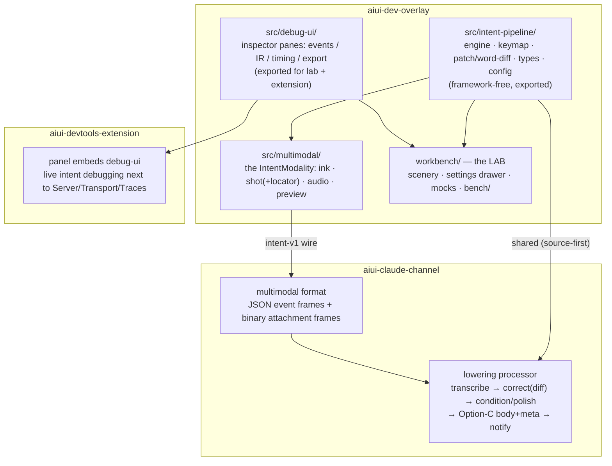

# Handoff: graduating the multimodal intent tool (workbench → overlay + channel)

> **STATUS — P0–P5 landed (2026-07-05).** The graduation is structurally complete:
> **P0** real fixtures (`workbench/fixtures/`, the regression net); **P1** pipeline →
> `src/intent-pipeline/` with `IntentPipelineConfig`; **P2** the multimodal channel format +
> server-side lowering processor; **P3** the `IntentModality` in `src/multimodal/` (default now)
> with the source-locator/`getDisplayMedia` stand-in swaps; **P4** the shared `src/debug-ui/`
> (embedded by the lab and the DevTools extension); **P5** the workbench slimmed into the lab
> (inspector → shared debug-ui; keeps scenery, settings drawer over `IntentPipelineConfig`,
> dev-proxy `openai` impls, `bench/`, `fixtures/`). Companion work (launcher OpenAI preflight +
> micro-e2e tier) landed alongside. **P6** complete: `docs/guide/intent-overlay.md`
> (sidebar-wired), web-intent-tool/getting-started/config trued to the landed widget, lab docs
> role-changed, and both screenshots retaken from live runs (`intent-tool.png` — the multimodal
> widget mid-turn; `lowering-debugger.png` — a real intent-v1 trace with the Option-C meta and
> path hover-peek). The advanced-config raw-JSON panel also shipped (gear in the widget), and a
> live-found regression (mock dictation gated on a mic permission prompt) was fixed with a
> regression test. Open items: **T1–T7 dogfooding** (the design verdict — see
> `workbench/docs/open-questions.md`); a curated visible-toggles row (deliberately waiting on
> that dogfooding); per-tool dynamic MCP registration (prior handoff); the CDP-capture
> experiment (dropped for now in favour of `getDisplayMedia`). This document is the plan of record. From the
> aiui-main session.

## The goal, in one paragraph

The workbench (`packages/aiui-dev-overlay/workbench/`) prototyped the full multimodal turn
system — hold-to-talk dictation with streaming preview, pen ink, region screenshots with
component location, and the select-and-speak correction meta-loop backed by an LLM diff
micro-pipeline. It works, but it is a bench: standalone page, mock-friendly, dev-server proxies,
self-annotated scenery. The graduation makes this the overlay's **default `IntentModality`**,
with the lowering running **in the channel** where it belongs — while replacing every workbench
stand-in with the robust mechanism that now exists in the overlay/channel (source-locator,
selection watcher, page tools, trace blobs). The workbench does **not** die: it becomes a thin,
standalone **lab** — same pipeline, imported from the overlay, plus measurement and debug UI —
and that debug UI is shared with the DevTools extension. Rule of thumb for every line of
workbench code: *pipeline → overlay, lowering → channel, instrument → stays in the lab (shared
with the extension), scenery/mocks → stay as fixtures.*

## What exists today

**Workbench (prototype, all of it unmerged):**

| Module | What it is | Fate |
| --- | --- | --- |
| `engine.ts` | event stream + modes/thread state machine + `composeIntent` (Option-C body+meta) | → overlay (pipeline core); `composeIntent` → channel processor |
| `keymap.ts` | the minimal keymap (` arm · Space talk · drag ink · D region-shot · S viewport-shot · C · E · ⏎ · Esc) + typing guard | → overlay |
| `ink.ts`, `shot.ts`, `audio.ts`, `preview.ts` | pen canvas, capture+locator, mic/segments, streaming transcript + selection-correction UI | → overlay (the modality UI) |
| `patch.ts`, `correct.ts` | V4A patch apply/word-diff; corrector seam (mock + LLM, two instruction modes) | apply+diff → overlay-shared lib; the LLM call → channel |
| `transcribe.ts` | Transcriber seam (mock + OpenAI REST via dev proxy) | seam shape survives; real call → channel; mock stays (lab + offline) |
| `inspector.ts` | events / IR / timing panes + fixture export | → shared **debug UI**, consumed by lab + DevTools panel |
| `settings.ts`, `types.ts` | toggles (localStorage) + `WorkbenchSettings` | settings → pipeline **config** (superset design below) |
| `scenery.ts`, mocks, `vite.config.ts` proxies | bench scaffolding | stay in the lab |
| `bench/` | say-based latency/WER harness | stays in the lab; grows the corpus runner |

**Overlay (robust, landed since the workbench started) — the stand-in replacements:**

- `source-locator.ts` — babel `data-source-loc="file:line:col"` stamping + cell identity +
  `window.__AIUI__.sourceRoot`. **Replaces** the scenery's hand-stamped `data-source`; the shot
  locator should hit-test `[data-source-loc]`/`[data-cell]` and emit absolute `file:line:col`.
- `selection.ts` — the selection watcher (snapshot-don't-read-through, geometry, attribution).
  **Overlaps** the preview's correction targeting *and* is itself an intent context source;
  unify rather than duplicate (open decision below).
- `tools-bridge.ts` + channel `page-tools` — page↔server tool RPC. A candidate transport for
  "server asks the page for something" (e.g. re-capture a region).
- `protocol.ts` — the binary ws framing the modality will speak (audio chunks and shot PNGs are
  binary frames; that's what the protocol was built for).
- `instrumentation.ts`, `intent.ts` — `window.__AIUI__` metrics, the `IntentModality` host the
  new modality plugs into, tab identity for prompt provenance.

**Channel (robust):** format registry (`ChannelFormat` = codec + `StreamProcessor`),
`withTracing` (stage-by-stage IRs + blob files in `.aiui-cache/traces/<id>/` — real absolute
paths for Option-C meta), `augmentTextPrompt`/`SelectionContext`, launch-info (knows the session
browser's CDP endpoint), the `/debug` viewer with path hover-previews.

## Target architecture

Workspace deps are source-first (editable installs), so the lab importing overlay source has no
build-step friction.

## Phased plan (each phase lands independently)

**P0 — gate.** Both in-flight streams merged; workbench green; graduation criteria from
`workbench/docs/open-questions.md` consulted honestly (T1–T7 — especially T6 latency and T7
corrector-worth-it want at least a real dogfooding pass). Export a handful of real interaction
fixtures (inspector → export) *before* refactoring; they are the safety net for everything below.

**P1 — extract the pipeline into the overlay.** Move `engine/keymap/patch/types` to
`src/intent-pipeline/` essentially verbatim (they're already framework-free and tested); the
workbench imports from there and stays behaviorally identical. Settings become
`IntentPipelineConfig` (below). Contracts that must not drift (see
`workbench/docs/field-notes.md`): **segments-as-lines** is the document shape shared by
composeIntent, the preview, and the corrector; **event shapes are the fixture format**; Option-C
tokens are identifier-shaped (`shot_1`, meta keys allow no hyphens).

**P2 — the wire format + channel lowering.** Define the multimodal `ChannelFormat` (name it;
e.g. `"intent-v1"`): the client streams the *event log* as JSON frames plus binary frames for
attachments (audio segments, shot PNGs), `fin` on send. The processor owns lowering:
- transcription server-side (key lives with the channel, not the page — today's `/api/transcribe`
  dev proxy was always a stand-in for this);
- the correction diff call server-side (same prompt, two instruction modes — port
  `SYSTEM_PROMPT` as-is; V4A apply already lives in P1's shared lib);
- condition/polish passes per `workbench/docs/openai-audio-stack.md` (silence trim slot, image
  downscale slot — fine to stub, but create the pass structure);
- Option-C assembly with **real paths**: shot blobs land via `withTracing`'s blob store, meta
  points at `.aiui-cache/traces/<id>/shot_1.png`, notification per
  `archive/channel-attachment-path-encoding.md` (body tokens in `content`, paths in `meta`).
Workbench-exported fixtures become the processor's tests. The trace debugger already
hover-previews the paths.

**P3 — the modality UI in the overlay.** `src/multimodal/` implements `IntentModality` hosting
keymap+ink+shot+audio+preview against the P1 pipeline and P2 socket. Stand-in swaps:
- locator → `[data-source-loc]` + `sourceRoot` (delete the scenery-attribute convention);
- correction targeting → reconcile with `selection.ts` (one selection concept, two consumers);
- shot capture: **ship `getDisplayMedia` first** (works everywhere, one grant per session); note
  the CDP alternative — the channel knows the session browser endpoint from launch-info and
  could capture server-side via page-tools round-trip — as a follow-up experiment, not a gate;
- typing-guard: port `isTypingTarget` as-is (composedPath, role=textbox; known un-closable hole
  documented in field-notes — if it bites in real apps, change the arming gesture, not the
  heuristics).
Flip the default: `aiuiDevOverlay()` mounts the multimodal modality; `format: "text-concat"`
remains the escape hatch. Mind the packaging test: new subpath exports go in both `exports` and
`publishConfig.exports`.

**P4 — shared debug UI + DevTools extension.** Extract inspector panes to `src/debug-ui/`
(framework-free DOM, like everything else) with two data sources: an in-page engine (lab) or the
channel's `/debug` API + live trace (extension). Add whatever small channel API is missing for
live-following a thread (the trace files already update per stage; an SSE or poll of
`/debug/api/traces/:id` may be enough). **The known friction — connecting the panel to the
channel** — is real but scoped: the panel discovers the port from `window.__AIUI__.port` on
instrumented pages and falls back to a manual field. Options, implementer's choice:
(a) keep page-provided port as primary and remember recent ports; (b) have the tab-identity
stamp include the channel port (the extension already stamps `data-aiui-tab`); (c) a discovery
endpoint is *not* easily possible from an extension (no disk registry access) — don't chase it.

**P5 — slim the workbench into the lab.** Delete everything P1–P4 absorbed; keep scenery,
settings drawer (now editing `IntentPipelineConfig`), mocks, `bench/` (+ the planned corpus
runner from the audio-stack notes), and the debug-ui embed. The lab's charter shrinks to:
latency/accuracy measurement, pipeline-config research, fixture capture, and offline UI
iteration. Its docs (`turn-flow.md`, `field-notes.md`, `open-questions.md`) get a role-change
pass.

**P6 — docs + screenshots.** 
- New guide page **"Using the intent overlay"** (`docs/guide/intent-overlay.md`, sidebar after
  the Web Intent Tool): the keymap table, turn lifecycle, correction meta-loop with the two
  instruction modes, the visible toggles, and the advanced-config story. Much of
  `workbench/docs/turn-flow.md` promotes into it (the evaluator framing stays in the lab doc).
- **Screenshots**: retake `docs/public/intent-tool.png` showing the multimodal widget
  (ink + preview + a shot thumbnail), and `lowering-debugger.png` showing a multimodal trace
  with Option-C meta + path hover-preview. Capture via the session browser on the demo app.
  Getting-started steps 3–4 update to the new default (text modality demoted to a sentence).
- `web-intent-tool.md`: bundled-modalities paragraph updated; the workbench paragraph reframed
  ("the lab where the pipeline is measured and tuned").

## The config design (deliberately wider than the UI)

One `IntentPipelineConfig` object, superset of today's workbench settings — talk mode, ink fade,
auto-end, transcriber/model, corrector/model, correction policy, plus research knobs that ship
**without UI**: silence-gate parameters, keyword-priming source toggles, condition/polish pass
switches, diff-flash duration. Plumbing: client-side knobs ride the modality options
(`aiuiDevOverlay({ intent: {...} })` → widget); server-side knobs live in channel config; the
hello frame carries the client's view so traces record the whole configuration. The visible UI
exposes a curated few (the workbench's toggle table is the shortlist); an **advanced panel**
(gear → raw JSON editor over the full config, validated like `config.json` — strict, typos fail
loudly) satisfies the research use without designing UI for every knob. The lab exposes
*everything* by default; the overlay exposes little by default. Same config type throughout.

## Companion work: the `aiui claude` launch experience

Once the multimodal modality is the default, `aiui claude` is the thing that must guarantee the
pipeline can actually run. Three items, to land alongside P2/P3:

1. **OpenAI key preflight.** At interactive launch (same gating as the CfT prompts: TTY, not
   CI), check the key is **present and works** — a cheap authenticated call (`GET /v1/models`,
   status only) with a clear message for each failure: missing → where to set it; invalid/expired
   → how to tell (the stale-export confusion in field-notes is exactly what this preflight
   exists to catch). Nehal's inclination, adopted as the default position: **environment
   variable only** (`OPENAI_API_KEY` in the env `aiui claude` runs in — it flows naturally to
   the spawned channel process, which is where the calls happen after P2). Weigh before
   committing: the bench's `.env.dev` convention exists precisely because stale shell exports
   bit twice (its file-beats-env rule would argue for an optional file source); `config.json`
   has strict validation but **must not** hold secrets — the project-level file is shareable,
   and a key in it will eventually be committed. Whatever is chosen: never store the key in
   config, and have launch-info record only a *boolean* (key present/valid) so the DevTools
   panel can explain a degraded pipeline without ever seeing the key.
   **Degradation, not refusal:** no/bad key → the modality still mounts, transcription and
   correction run in mock/off mode, and the launcher says so once — the same pattern as the
   browser-side degradations.

2. **A micro-e2e test tier for the real OpenAI path.** Pattern after the existing split
   (ci.yml cheap on every push; e2e.yml weekly cron + manual dispatch for the expensive live
   session): add a tier that exercises the *real* API with near-zero tokens — one ~2 s
   say-generated transcription and one correction-diff call, asserting round-trip **shape**
   (status, timing recorded, patch parses), not output quality. Fractions of a cent per run.
   Mechanics: a shared `OPENAI_API_KEY` as a GitHub Actions secret — scoped to a **dedicated
   OpenAI project with a hard, very low monthly spend limit**, so leakage or a runaway loop is
   capped at the budget, not the card. GitHub withholds secrets from fork PRs (same note as
   `CLAUDE_CODE_OAUTH_TOKEN` in ci.yml). Skip-if-no-secret so forks and offline runs stay
   green. Everything above this tier stays mocked in unit tests; everything below (quality,
   latency curves, model comparisons) stays in the lab's bench/corpus runner, run by humans.

3. **Pipeline configuration is the overlay's surface, not the command's.** Which models, which
   corrector, silence gating, priming — all `IntentPipelineConfig` (previous section), owned and
   documented by the overlay (the P6 "Using the intent overlay" page + the repo's config guide),
   **not** `aiui claude` flags. The launcher's whole job here is preflighting prerequisites and
   passing the environment through. This split is a work-in-progress and deliberately
   under-specified — recorded here so it isn't forgotten: when P2/P3 settle, the config guide
   needs an intent-pipeline section, and `aiui claude`'s docs should point at it rather than
   grow options.

## Open decisions (yours)

1. **Format name + frame layout** — one JSON event stream with interleaved binary attachment
   frames (recommended; the protocol supports it) vs separate sub-streams.
2. **Where transcription runs** — recommended channel-side (P2); counterargument is preview
   latency (extra hop). Measure with the lab before deciding; the seam makes it swappable.
3. **Selection unification** — does the preview's correction targeting become a
   `selection.ts` consumer, or stay bespoke inside the preview (it selects *widget* text, not
   page text — arguably a different thing)?
4. **Modality granularity** — one "multimodal" modality with everything, or modes the widget
   composes (text tab survives as-is?). Affects the tab UI only; the pipeline doesn't care.
5. **Keymap arming in real apps** — backtick collides less than feared (see field-notes), but a
   host-app opt-out / rebind option in the config is cheap insurance.
6. **CDP screenshots** (P3 note) — pursue or drop after `getDisplayMedia` ships.

## Risks

- **Two active streams.** Don't start P1 until both merge; the fixtures are the regression net.
- **Contract drift** — segments-as-lines and event shapes break silently if changed unilaterally
  (it happened once; field-notes has the story). Treat them as versioned wire contracts from P2.
- **Key handling moves** — `.env.dev` served the bench; the channel needs its own documented key
  story. The plan of record is the launcher preflight + env-var source in "Companion work"
  above; decide the final source before P2 and document it in the config guide.
- **Doc sprawl** — after P6, the same material must not live in three places: guide page (how to
  use), lab docs (how to measure), this handoff (delete or mark implemented, like the other
  handoffs in this folder).

## Reading list

`workbench/docs/turn-flow.md` (the interaction design + toggle rationale) ·
`workbench/docs/field-notes.md` (contracts + gotchas, **read before P1**) ·
`workbench/docs/openai-audio-stack.md` (model tiers, pass structure, cost frame) ·
`workbench/docs/open-questions.md` (graduation gate) ·
`archive/channel-attachment-path-encoding.md` (Option-C notification contract) ·
`handoff/selection-intent.md`, `handoff/frontend-tool-registry.md` (precedents: both graduated
demo prototypes into overlay/channel — same motion this plan describes at larger scale).
