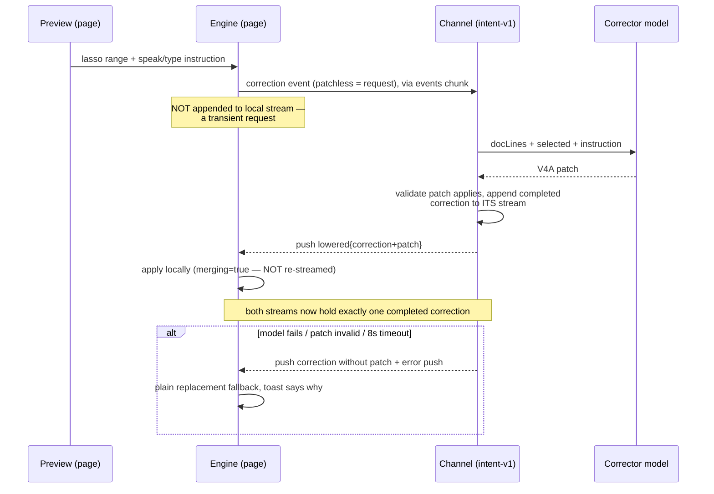
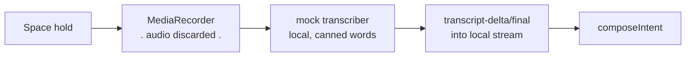
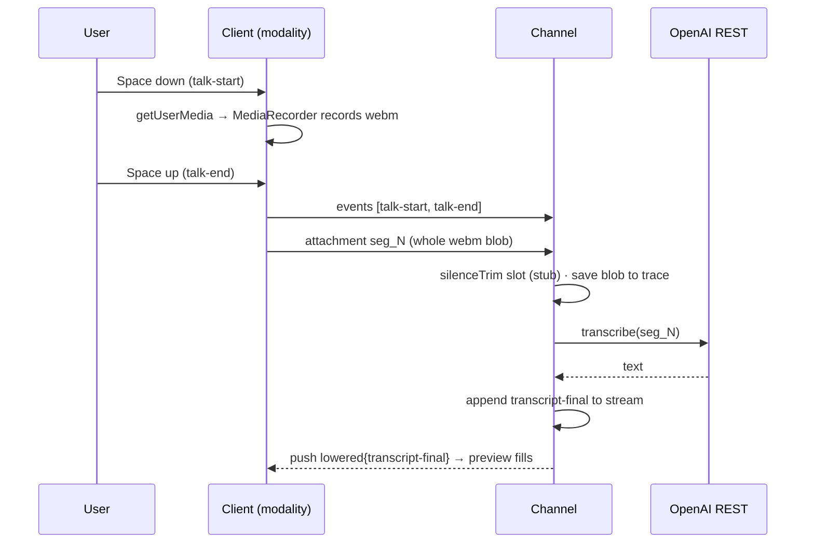
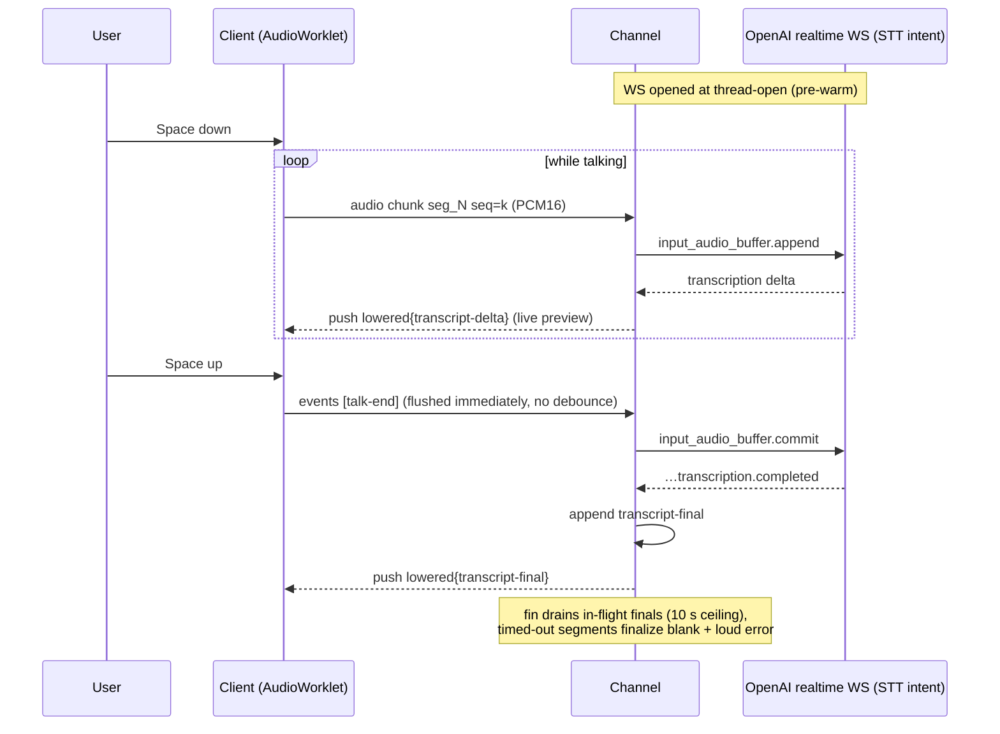
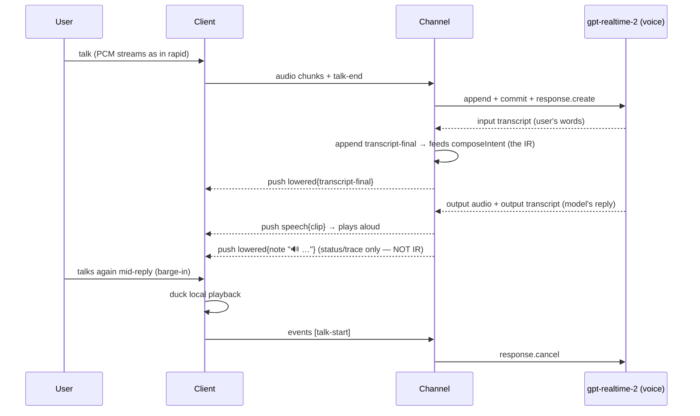

# The pipeline & interaction model — unpacking, and a work plan

*(July 2026. Written from a full read of the code as it is — `engine.ts`, `modality.ts`,
`intent.ts`, `selection.ts`, `keymap.ts`, `shot.ts`, channel `intent-v1.ts`, `prompt-context.ts`,
`realtime.ts`, `realtime-voice.ts`, `correct.ts`/`patch.ts` — not from the design docs. Where the
docs and the code disagree, this reflects the code.)*

This handoff does two jobs: **(A)** a ground-truth account of how the lowering pipeline actually
works today, in enough detail to reason about changes; **(B)** an analysis of the five open
questions (barge-in's conceptual fit, selection, prompt optimality, the mode model, tweak mode)
and a work plan.

Companion document: **[transcription-and-realtime-submodes.md](./transcription-and-realtime-submodes.md)**
— the deep dive that §B.1's conclusion opens into (the transcription/realtime submode split,
the Gemini Live / GPT-realtime vendor seam, the `submit_intent` compilation contract, and the
RT work-plan track). This document is the map; that one is the drill site.

---

## A. Ground truth: how it works today

### A.1 The one shape underneath everything

Every modality style is the *same pipeline* with different transcription transport. The core:

- **One append-only event stream** (`IntentEvent[]`) plus a small state machine (`Engine`:
  `armed`, `mode: ink|correct`, `talking`, `threadOpen`, `correctionTarget`). Every interaction
  — talk, stroke, shot, shot retraction, correction, thread open/close — is an event. UI
  surfaces call verbs on the engine and learn everything back from the stream.
- **`composeIntent` is a pure fold** over the stream (in `engine.ts`, shared by browser and
  channel via the `intent-pipeline` export). It scopes to the last `thread-open`, drops
  retracted shots, applies corrections, and produces the `ComposedIntent`: the interleave of
  text runs and shot markers, the Option-C `prompt` body (`{shot_n}` tokens), and `meta`
  (`shot_n` → path, `shot_n_info` → located components).
- **The server accumulates the *same* stream.** The client batches events over a 60 ms debounce
  into `chunk{kind:"events"}` frames; binary attachments (`shot_N` PNGs, `seg_N` audio) ride
  their own frames; the on-screen selection rides one `chunk{kind:"context"}` just before `fin`.
  Server-*produced* events (transcripts it computed, corrections it diffed) are appended to the
  server's copy in arrival order **and pushed back** (`kind:"lowered"`) for the client to merge
  — so both sides converge on the same log, and the preview shows what the server will compose.
- **`fin` is a near-empty commit.** Everything expensive is incremental: blobs are saved and
  shot paths wired on arrival; the tab/source preamble is pre-warmed at thread-open; a
  *speculative* `composeIntent` runs after each mutating batch and is fingerprinted by a
  mutation counter, so `fin` usually just reuses it, wraps it with context, pushes
  `lowered-prompt` to the client, and calls `sendPrompt`. Cancel (Esc / socket drop) → lowers
  to nothing; the invariant is that speculation never sends, pushes, or spends.

Two consequences worth internalizing:

1. **"Image deletion" is not deletion.** The preview thumb's ✕ emits `shot-drop`; the shot
   event, its uploaded bytes, and the trace blob all remain. `composeIntent` just excludes the
   marker. Append-only retraction — the trace stays honest.
2. **Corrections are patches, not string edits.** A lassoed range + a spoken/typed instruction
   go to a corrector model that sees the transcript as *segments-as-lines* and answers in V4A
   (`apply_patch`) format; the patch is validated (`applyPatch` must succeed) before it's
   accepted; failure anywhere degrades to plain first-occurrence replacement, loudly. Under
   `correctionPolicy:"note"` the correction instead rides the prompt as an instruction for the
   downstream model.

### A.2 The correction round-trip (the subtle one)

With the default `corrector:"openai"`, the correction event's lifecycle is deliberately
asymmetric to avoid double-apply:



With `corrector:"mock"` the patch is computed locally and the correction event streams
normally (the server passes it through — it already carries a patch, so it's not a request).

### A.3 The four pipeline styles

One diagram per style. The differences are entirely in the *talk* lane; ink/shots/corrections/
selection/fin are identical across all four.

**1. `mock` (offline, $0)** — no channel needed at all; canned transcription with injected typos
(fuel for correction mode). If a channel is connected, events still stream (trace), but
transcription never leaves the page.



**2. `standard` (one-off REST — today's default)** — whole-segment upload at talk-end;
transcription is channel-side (the OpenAI key never reaches the page).



Latency shape: nothing visible until the whole segment round-trips after talk-end.

**3. `rapid` / `premium` (streaming STT)** — an AudioWorklet streams PCM16 frames *during* talk;
the channel holds one upstream realtime WebSocket per thread (opened at thread-open, so the
handshake hides in the arm→talk gap). Push-to-talk is the commit boundary — the channel sends
`input_audio_buffer.commit` on talk-end; there's no server VAD. Deltas echo into the preview as
you speak; the final lands ~2× faster than REST. `premium` = same, plus a deterministic spoken
"sent" TTS ack pushed as a `speech` message after the fin commit.



**4. `flagship` (conversational voice, barge-in)** — same PCM streaming client path (the client
literally cannot tell rapid and flagship apart), but the channel-side session is a
`gpt-realtime-2` *conversational* model that answers aloud. The critical design decision as
built: **the voice model is a veneer over the same lowering.** Input transcription stays on and
feeds `composeIntent` exactly like rapid; the model's spoken replies ride `speech` messages
(client plays them) and their transcripts become `note` events (status line + trace) — **never
IR**. Barge-in is two parallel cuts: the client ducks local playback on talk-start, and the
server sends `response.cancel` upstream. A per-thread response cap (8) guards the
context-rebilling cost trap; tools are `none` in v1.



### A.4 Selection, as it actually works

- A **debounced `selectionchange` watcher** (150 ms) keeps the *last non-collapsed* selection as
  a snapshot: trimmed text (≤2000 chars), client rects (≤20), and the same DOM attribution the
  shot locator uses — `data-source-loc` / `data-cell` via `closest()` on the range's start
  element, plus TeX recovery for KaTeX. Empty/collapsed selections never clear the snapshot
  (that's what survives the focus steal into the widget); only explicit dismiss / post-send
  clear / a 120 s TTL do.
- The snapshot renders as the **chip** in the panel (`about: "…" · file:line ✕`).
- It is **read exactly once, at send time**: `finalizeThread` (multimodal) or submit (text
  modality) reads `ctx.selection()`, sends it as one `context` chunk, and clears it. The server
  normalizes it (`asSelection`) and renders it into the *preamble* (`selectionSections`), not
  the body.

So: selection is **not an event in the stream**. It's a side-channel, latest-wins, sampled at
fin. It never appears in the preview timeline or the composed body; two selections in one turn
can't both ride; a selection made early can silently TTL-expire before a slow compose ends; and
— the sharpest edge — while armed in ink mode the full-viewport ink canvas has
`pointer-events:auto`, so you *can't make a selection at all* without disarming, and disarming
**cancels the thread**.

### A.5 What the session actually receives (the lowered prompt)

For a turn with speech, one shot, and a selection, `sendPrompt` gets (with `meta`):

```
This prompt was sent from the aiui web intent tool running in a web app under development.

It was submitted from the browser tab "Morphogen" at http://127.0.0.1:5173/ (chrome tab id 421,
window id 12, tab index 3, CDP target id AB12…).
To act on that tab with the Chrome DevTools MCP: the ids above are correlation hints only — call
list_pages, match by URL/title, then select_page with the pageId list_pages returned, and verify
you selected the right page. The session-browser skill covers this workflow.

The source code of the web app in that tab is located at: /Users/nehal/src/morphogen

It concerns this on-screen selection: "gradient stops" (authored at src/Legend.tsx:41:8).

The user's prompt follows.

---

make the color legend wider <screenshot path=".aiui-cache/traces/…/shot_1.png">
  <element name="Legend" source="packages/aiui-demo/src/ui/Legend.tsx:30:2">
    <cell name="colorScale" source="packages/aiui-demo/src/ui/Legend.tsx:41:8"/>
    <cell name="ticks"/>
  </element>
</screenshot> and match the heading font
```

The preamble wording lives in exactly one place (`prompt-context.ts`) and is shared by both
formats. *(Updated July 2026: the body previously used the Option-C scheme — `{shot_1}` tokens,
paths + component info in a `meta` map, plus a hint line explaining the convention. It now
inlines each screenshot at its position as an indented `<screenshot>` XML block (default;
`shotFormat: "text"` renders a plain bracket block instead): path AND source locations
relativized against the prompt base — the channel's cwd, overridable via `AIUI_PROMPT_CWD`,
which the workbench sets to the repo root — the components the drag **fully enclosed**
(top-level only; the grid-sampling locator that put the app shell in every shot is gone), and
their direct-cell frontier (a cell without its own stamp borrows its first stamped descendant's
— where its UI is authored). Viewport shots carry no element metadata and skip the locator.
`meta` is empty; nothing downstream consumed it as structure — it only ever became text
attributes on the rendered channel tag.)*

---

## B. The analysis: five questions, five answers

### B.1 Barge-in (`flagship`) — is it conceptually a different thing? **Yes.**

The transcription styles (`standard`/`rapid`) are **document assembly**: the user composes an
artifact — interleaved text and images, patched by corrections — and Enter ships it. The
pipeline's whole design (append-only stream, pure folds, speculative compose, fin-commit) is
optimized for that.

`flagship` as built is that same assembly pipeline wearing a voice mask. The model can't see
your screenshots, your selection, or the app; its replies are structurally quarantined from the
IR; it is, in effect, a *talking status line* with good manners (that quarantine was a
deliberate v1 choice — "text stays the single source of truth" — and it kept the trace honest).
The dissonance you feel is real: a conversational partner that can hear you but not see what
you're pointing at, and whose contributions are discarded from the artifact, satisfies neither
model of the interaction.

Three coherent futures (not mutually exclusive — F1 is today, F2 is the natural next, F3 is a
vendor question inside F2):

- **F1 — keep the veneer.** Voice is ambience: spoken acks, short answers, barge-in. The
  composed document remains 100 % user-authored. Cheap, shipped, honest. Its ceiling: the
  conversation can never *improve* the prompt.
- **F2 — the model becomes the composer (interviewer pattern).** For the flagship tier only,
  invert the roles: the voice session's job is to *produce the lowered prompt*, given
  everything the turn collects. The config already reserves the hook —
  `realtimeTools: "submit_intent"` — and the GA realtime API accepts **image input** into the
  conversation, so shots can be injected as they're taken (`conversation.item.create` with an
  image part), and the selection/context likewise. The user talks, points, shoots; the model
  clarifies ("the left legend or the right one?"); on "send it", the model calls
  `submit_intent(prompt, refs)` and *that* is what lowers. The event stream keeps its role as
  the trace/IR of record; the composed-by-model prompt is one more traced stage — this is
  exactly "prompt lowering as compilation" with a model in the loop, and it's the first
  pipeline stage that genuinely needs the conversational modality.
- **F3 — a natively multimodal live model.** The "are we using the wrong model?" question.
  Gemini Live (audio+video+image+text in, audio out, function calling, continuous vision) is
  the obvious candidate; but note the gap has narrowed — OpenAI's GA realtime also takes
  images mid-conversation. So F3 is not "switch to make F2 possible"; it's "which engine runs
  F2 best", and it's empirical: grounding quality when audio references an image ("this
  slider"), interruption latency, cost per turn, tool-call reliability. The right structure is
  a **vendor seam** for the F2 session (the socket-factory pattern already used for tests
  generalizes), then a bake-off in the workbench.

**Recommendation.** Reframe this as two **submodes** of the web intent tool — *transcription
mode* (all of today's assembly tiers) and *realtime mode* (F2, with F3 as a vendor choice
inside it, optimized for Gemini Live). The full design — shared skeleton, the three real
divergences (retraction, preview, compilation), the `LiveSession` vendor seam, the
`submit_intent` tool contract with its fallback ladder, readiness gates, and the RT work-plan
track — is the companion deep-dive:
**[transcription-and-realtime-submodes.md](./transcription-and-realtime-submodes.md)**. (It
supersedes the `composer: "user"|"model"` sketch an earlier draft of this section proposed:
the submode implies the composer.) Don't build it before the mode/tweak work below — a
model-composer needs the *selection-as-event* and *app-interaction* affordances to have
anything interesting to see.

### B.2 Selection — fold it into the stream

The snapshot-at-fin design was right for the text modality (one-shot submit). For multimodal
turns it's the odd one out: the only intent-bearing input that isn't an event, isn't in the
preview, isn't patchable, and can't occur more than once. And the armed-mode pointer capture
means it can effectively only be made *before* the turn starts — which is exactly your
observation ("record the text that was selected at the beginning of the interaction").

**Proposal: `selection` becomes an `IntentEvent`.**

- New event `{ type: "selection", text, rects, sourceLoc?, cell?, tex?, url }`, emitted when a
  thread is open and the watcher captures a new snapshot (and once at thread-open if a snapshot
  already exists — the "recorded at the beginning" behavior).
- `composeIntent` gains a policy for it. Default: **latest selection wins** and renders where
  the preamble puts it today (byte-compatible output); a research knob can later try positional
  placement (`{sel_1}` tokens, Option-C-style) — the machinery is already there for shots.
- The `context` chunk stays as a compatibility path for the text modality (and old clients);
  the channel prefers selection events when present. `selectionSections` doesn't change.
- The preview shows a selection chip *in the timeline*, dismissible like a shot thumb
  (`selection-drop`, mirroring `shot-drop`).

This makes selection visible, traceable, repeatable, correctable — and it's the substrate tweak
mode needs.

### B.3 The prompt — probably over-complicated, and now measurable

Looking at A.5 with fresh eyes:

1. **The MCP routing lore rides every prompt.** Three sentences of "call list_pages, match by
   URL/title…" on *every* turn, whether or not the agent will touch the browser. That lore
   already lives in the session-browser *skill* — the prompt only needs the facts (url, title,
   ids) and one pointer. Estimated saving: ~60 % of the preamble.
2. **`shot_n_info` is duplicated context in a place agents don't reliably look.** The located
   components are arguably the *highest-value* content (rect → component → source is the whole
   point of instrumentation) yet they're exiled to meta as a comma-joined string. If they
   matter, they belong in the body next to the token ("`{shot_1}` (the `Legend` component,
   src/Legend.tsx:30)"); if they don't, they're noise. Empirical question.
3. **The trailing hint line** ("({shot_n} tokens are attached image paths — open them to
   look.)") reads as apparatus. Harness-side handling of `meta` could make it unnecessary; or
   inline `@path` references may work as well as tokens+meta. Also empirical.
4. **Ordering**: "user's prompt follows / --- " framing buries the actual ask under boilerplate;
   agents weight beginnings and ends.

**Proposal: prompt *styles* as named, pure templates** — `render(composed, context) → {prompt,
meta}` — with the current output preserved as `"verbose"` and a `"compact"` candidate (facts-only
tab line, components inline, no hint line, ask-first ordering). Style choice rides the hello like
everything else; the trace records which style rendered; the workbench compares two styles over
the same fixture stream side by side. Then the "is it optimal?" argument becomes a measurement
(does the agent open the right file first; does it act on the right tab) instead of taste.

*(Status, July 2026: points 2 and 3 are done — shots now inline path + enclosed-elements + cell
frontier at their position, no meta block, no hint line, paths relativized to the channel cwd;
see §A.5's update note. Point 1 — the per-turn MCP-routing boilerplate in the preamble — and
point 4 — ask-first ordering — remain, and are what's left of WP5 along with the style/measure
machinery.)*

### B.4 The interaction model — name the modes, show the modes

The state is currently seven-ish scattered booleans (`armed`, `mode`, `talking`, `threadOpen`,
`shooting`, `strip.open`, `correctionTarget`) surfaced as a tiny text label (`ink · REC ·
thread`). The modes are *real* — the keymap, the pointer routing, and the engine all branch on
them — they're just not presented as a model.

**Proposal: one derived `UiMode`,** a pure function of engine + flags (unit-testable, like
`keyCommand`):

```
off            not armed
ready          armed, no thread yet
composing      armed, thread open, ink mode
shooting       D held / drag in progress
talking        REC (overlays composing)
correcting     correct mode (lasso live or target pending)
tweaking       (new — B.5)
```

**Visual: a colored ring on the HUD pill** (the bottom-left oval with ✳/state/meter/keys) and
matching fab tint — border color is the cheapest peripheral signal that survives attention being
on the page, not the HUD:

| mode | ring |
|---|---|
| off | none |
| ready/composing | accent blue |
| talking | red (pulsing, matches REC) |
| shooting | amber (matches veil) |
| correcting | violet |
| tweaking | dashed gray (capture released) |

The state label stays for precision; the ring is for glanceability. Same `UiMode` feeds the
overlay's agent-facing `report()` so "what mode am I in" has one answer everywhere.

**One widget, not two corners.** Today the page hosts two separate floating elements: the HUD
pill (bottom-left: ✳ arm, state, meter, key hints) and the intent-tool widget (bottom-right:
`✳ aiui` fab + panel + toasts). They should merge into a **single anchor**: the pill becomes
`✳ | state | meter | expander`, and the expander unfolds what the fab's panel holds today
(modality body, tabs, selection chip, status line), with the toasts stacking off the same
anchor and the mode ring wrapping the whole thing. All floating surfaces are draggable as of
July 2026 (`src/drag.ts` — threshold-gated so clicks survive, grips exclude the preview's
selectable transcript body), which is what makes a single combined widget viable: it lives
wherever it doesn't cover anything. The key-hints text can then retire into the expander (or a
hover state) — it's the pill's noisiest tenant. Absorbing this into WP2 keeps the mode ring,
the merge, and the `UiMode` derivation one coherent change instead of three HUD reworks.

### B.5 Tweak mode — disengage, adjust the app, continue the turn

The missing mode. Today an armed thread owns the pointer (ink canvas) and much of the keyboard;
the only way to interact with the app is to disarm, which **cancels the thread**. The need:
mid-turn, go adjust the app (click a button, tweak a slider, select different text), then
resume composing the same turn.

**Design:**

- `Mode` grows a third value: `ink | correct | tweak` (engine-level, so it's an event
  (`mode`) in the stream and the trace shows the excursion).
- Entering tweak (key: **T**; also a HUD affordance): ink canvas → `pointer-events:none`,
  shot veil disarmed, keymap collapses to *only* T (resume) and Esc (step-out) — Space, S, D,
  C, E, Enter all fall through to the page, because the whole point is that the app gets the
  keyboard back. `isTypingTarget` guarding is no longer enough here; tweak is an explicit
  handover.
- The thread stays open; the socket stays open; the idle auto-end timer (when enabled) is
  suspended during tweak.
- **Selection updates flow while tweaking** (per B.2): the watcher is live, each new selection
  appends a `selection` event — this is your "if you change the selection, it should update it
  in the meta stream", and it falls out of B.2 for free.
- Interesting open question to prototype, not decide now: should *app interactions* during
  tweak be captured as events too (clicks with located components — "user adjusted `Slider` at
  src/Controls.tsx:12")? The instrumentation exists (same `closest('[data-source-loc]')`
  machinery). That would make tweak mode an intent-bearing modality of its own — "I did this
  by hand, do the rest" — but v1 should just release capture and track selection.
- Esc ladder becomes: `correct → ink`, `tweak → ink`, `ink+thread → cancel`, `→ disarm`
  (tweak steps back to composing, not straight to cancel).

---

## C. Work plan

Ordered so each item stands alone; sizes are relative. Items marked ⚙ are structural (want
plan-level review); items marked ✎ are small enough to just do.

| # | What | Size | Depends on |
|---|---|---|---|
| **WP0** ✎ | **Done in this pass:** D = drag shot / S = viewport shot (removes the fast-drag double-capture race); draggable floating surfaces (`src/drag.ts`: HUD, preview, fab/panel); this document. | — | — |
| **WP1** ✎ | **Docs truth-up + diagrams.** Port §A's four pipeline diagrams + the correction sequence into `docs/guide/web-intent-tool.md` (lowering section) and the tier ladder in `intent-overlay.md`; add the mode/state diagram once WP2 lands. Fix any doc/code drift found while porting (e.g. key table after WP0). | S | WP0 |
| **WP2** ⚙ | **`UiMode` + the unified widget.** Pure `uiMode()` fn + colored mode ring per B.4; merge the HUD pill and the intent-tool fab/panel into one draggable anchor with an expander (B.4 "One widget, not two corners"); feed `report()`. Pure-function tests + a jsdom render test. | M–L | — |
| **WP3** ⚙ | **Selection as an event.** New `selection` (+`selection-drop`) events, emit-on-capture while thread open + once at thread-open, `composeIntent` latest-wins policy rendering byte-identical to today's preamble, channel prefers events over the `context` chunk (which remains for text modality), preview timeline chip. | M–L | — |
| **WP4** ⚙ | **Done (July 2026) — tweak mode.** Third engine mode per B.5: capture release, reduced keymap, suspended timers, Esc ladder placement, HUD ring; selection updates ride WP3's events. Regression tests around the handover (no swallowed app keys, no stranded veil). Landed as the B2 kit's proof: one mode-table row + one keymap layer (see the proposal's execution log). | L | WP2, WP3 |
| **WP5** ⚙ | **Prompt styles + measurement.** Extract `render(composed, context)` template seam; `"verbose"` = today, byte-for-byte (golden test); add `"compact"` per B.3; style in hello + trace; workbench side-by-side over fixture streams. Decide the default only after looking. | M | — |
| **WP6** ⚙ | **The realtime submode.** Expanded into its own document and work-plan track (RT0–RT6): see [transcription-and-realtime-submodes.md](./transcription-and-realtime-submodes.md). Its RT0 API spike can start immediately; the pipeline work interleaves with WP2/WP3 (which are genuine prerequisites for its preview and injection stages). | L | WP3, WP4 |
**Considered and rejected — a CDP shot path** (`Page.captureScreenshot` server-side via the
session browser's debug endpoint, which shot.ts's module doc once floated as the follow-up). Its
motivations were the `getDisplayMedia` share picker and the picker-focus-steal bugs; both died in
July 2026 (`--auto-accept-this-tab-capture` on the session browser's launch, plus the veil/
straggler guards in the modality). Meanwhile the realtime submode makes the display-capture
stream *load-bearing*: it doubles as the ≤1 fps video source (RT3), streamed continuously
client→channel→vendor — a per-frame CDP round trip is chattier, slower, session-browser-only,
and cannot do continuous video. Don't re-propose without new facts.

Parallelization: WP2/WP3/WP5 are mutually independent (three agents); WP4 needs 2+3; WP1 can
trail any of them. WP6 is a separate research track and should start with a half-day API spike
(can gpt-realtime-2 actually take our PNGs mid-session at tolerable latency?) before any
pipeline work.

Open decisions worth settling before WP4/WP6 (cheap to decide, expensive to redo):

1. Does tweak mode capture app interactions as events (v2), or only selections (v1)? → v1
   selections-only, but stamp the design so the event shape doesn't preclude it.
2. Where does the model-composed prompt live in the trace — a new stage kind, or a `composed
   intent` sibling? (Leaning: new `ir` stage `"model-composed"` so diffing user-vs-model
   composition is a first-class debugger view.)
3. Prompt-style default flip: criteria = an agent driving the session browser picks the right
   tab/file on first action across the fixture set, compact ≥ verbose. Otherwise verbose stays.
