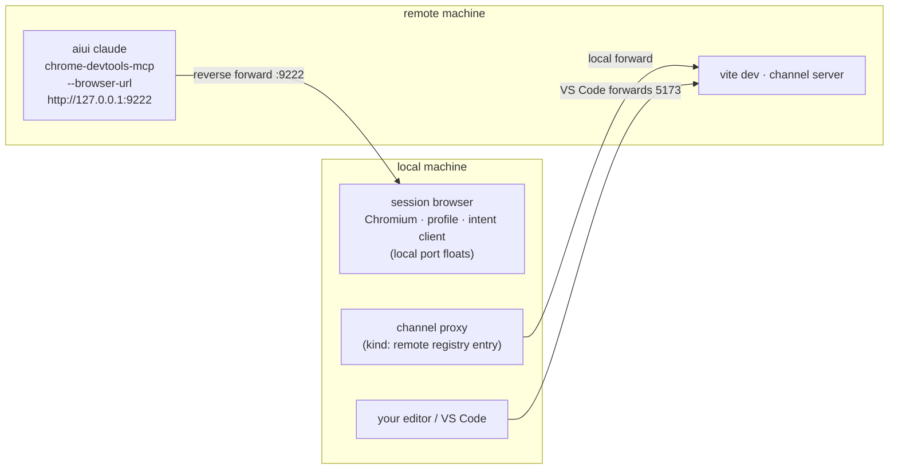

# Remote Development

The session runs on a remote box (over SSH, usually inside VS Code Remote); your display — and
therefore the [session browser](./chrome) — is local. The split that makes this work: **browser
provisioning is a local concern; the session's MCP just needs a URL.** A reverse tunnel carries
your local browser's DevTools debug port to the remote machine, and the remote `aiui claude`
attaches to it instead of managing any browser of its own.



## The one-command way

On your **local machine** (no aiui checkout needed — the packages are published, `npx` works):

```sh
aiui remote [user@]remote-host
# or: npx @habemus-papadum/aiui remote [user@]remote-host
```

That does the whole local half, over **one** ssh connection:

1. **Finds or starts the local session browser** — the same shared pipeline as `aiui claude`
   (profile marker, managed-browser sync, intent extension). It uses the shared `default`
   profile unless `--profile <name>` / `--data-dir <path>` says otherwise; `--headless` works
   too.
2. **Opens one ssh ControlMaster connection** — you authenticate exactly once; every port
   forward is added afterwards over the control socket, so a taken port never drops the
   connection and a port walk never re-prompts for auth.
3. **Reverse-forwards the browser's DevTools endpoint** to the remote box — remote port 9222 by
   default (`--browser-port <n>`), walking upward with narration if it's taken.
4. **Prints the command for the other side**, e.g.:

   ```
   on dev-box, run:

     aiui claude --aiui-browser-url http://127.0.0.1:9222 --aiui-tag <uuid>
   ```

   …then **polls the remote machine's channel registry** until that tag appears (a channel
   already attached to the browser forward also matches — the reattach case). Nobody has to
   coordinate a channel port by hand; the registry is the source of truth.
5. **Local-forwards the discovered channel port** (preferred local port 49300, walked on
   collision), health-checks it, and registers a `kind: "remote"` entry in the *local* registry
   mirroring the remote channel's tag and cwd — so local tools (`aiui channels`,
   `aiui dashboard`) address the remote session exactly like a local one. The entry lives as
   long as the command; Ctrl-C is a clean disconnect (the browser stays).

Paste the printed invocation on the remote box and you're done. With `--aiui-browser-url`, the
remote `aiui claude` skips everything local-browser-shaped — no managed-browser sync or
prompts, no profile creation, no extension loading, no browser launch — and hands
chrome-devtools-mcp the URL. `aiui chrome status` on the remote box will say exactly that.
Even `aiui open http://localhost:5173` works from the remote side: it opens a tab in *your
local* browser through the tunnel.

**Reconnect.** Every connection is recorded per host
(`~/.cache/aiui/remote/<host>.history.json`, last 20). If the ssh connection drops,
`aiui remote <host> --reconnect` replays the record — same tag, same ports — against a remote
session that is still running (a killed remote claude is a failure, not something to
resurrect). With several records, a picker chooses. `--name <label>` names the registry entry
and the history record.

**The port worth pinning is the remote one.** The local debug port can float (the tunnel
command picks up whatever the browser got); the **remote** port — 9222 by default — is what
the remote session and any [VS Code launch configuration](#bonus-breakpoints-via-vs-code)
reference. Keep it fixed and everything downstream stays copy-paste stable.

## The manual way (what the tool does for you)

Useful when the tunnel should live in your SSH config rather than a foreground process:

```sh
# 1. locally: make the session browser exist (any URL works; it starts one if needed)
aiui open about:blank
# 2. read its debug port — `aiui chrome status` prints the running endpoint
#    (Chrome writes it to DevToolsActivePort in the profile dir)
# 3. the reverse forward — one-off…
ssh -N -o ExitOnForwardFailure=yes -R 9222:localhost:<local-port> <remote-host>
```

…or persistently, in `~/.ssh/config` (VS Code Remote-SSH picks this up too — its ports UI only
does remote→local, but the underlying SSH connection honors `RemoteForward`):

```
Host my-remote
  RemoteForward 9222 localhost:<local-port>
```

Then on the remote, pass `--aiui-browser-url http://127.0.0.1:9222` on each launch. (There is
no durable config equivalent any more — the old `chrome.browserUrl` key retired with the
browser-profiles redesign; the flag is the interface. The manual way also does none of the
channel-proxy half — that convenience is `aiui remote`'s.)

## Viewing the app itself

Nothing new: VS Code (or plain `ssh -L`) forwards the remote Vite port to your local machine as
usual, so the app and the intent client run in your local session browser — which is the same
browser the agent drives. The loop closes: the agent's screenshots are of the page you're
looking at. (The channel port needs no manual forward when `aiui remote` is running — step 5
above already carries it.)

## Bonus: breakpoints, via VS Code

Not aiui-specific — just underused: VS Code's JavaScript debugger can **attach to an existing
Chrome** through the same kind of debug port the agent uses, giving you real breakpoints in your
app's source. Add to the *remote workspace's* `.vscode/launch.json`:

```json
{
  "version": "0.2.0",
  "configurations": [
    {
      "name": "Attach to aiui session browser",
      "type": "chrome",
      "request": "attach",
      "port": 9222,
      "webRoot": "${workspaceFolder}",
      "urlFilter": "http://localhost:5173/*"
    }
  ]
}
```

Why this works remotely: the debug adapter runs on the remote box (where VS Code's server lives),
and there `127.0.0.1:9222` *is* your local session browser, through the tunnel — which is exactly
why the fixed **remote** port matters: it's what `"port"` hardcodes. `"urlFilter"` picks the app
tab; `"webRoot"` + Vite's sourcemaps map compiled code back to your files. Start the config and
breakpoints set in the editor hit when the page — the one you *and* the agent are driving —
executes that line.

Fully local sessions get the same trick with no tunnel — except the local debug port is
OS-assigned, so read the running endpoint from `aiui chrome status` and put *that* port in the
launch config.

## Fallback: headless on the remote box

No tunnel, no local browser? Run on the remote box with:

```sh
aiui config set chrome.headless true
```

The session browser starts headless on the remote machine (or, for non-interactive sessions,
chrome-devtools-mcp lazily launches its own private headless browser); you watch through the
screenshots the agent takes in the transcript rather than live. Degraded, but zero setup.

## Trust, spelled out

The DevTools debug port is **unauthenticated** — whoever can reach it controls the browser (and
everything the profile is logged into). Locally it binds to loopback; the ssh tunnel extends that
to processes on the remote box, which is precisely the point — the remote agent is supposed to
drive it — but it means the remote machine's other users/processes could too. Use a dedicated
profile (`aiui remote <host> --profile <name>`), and read
[⚠️ Read before running](/guide/warning).
